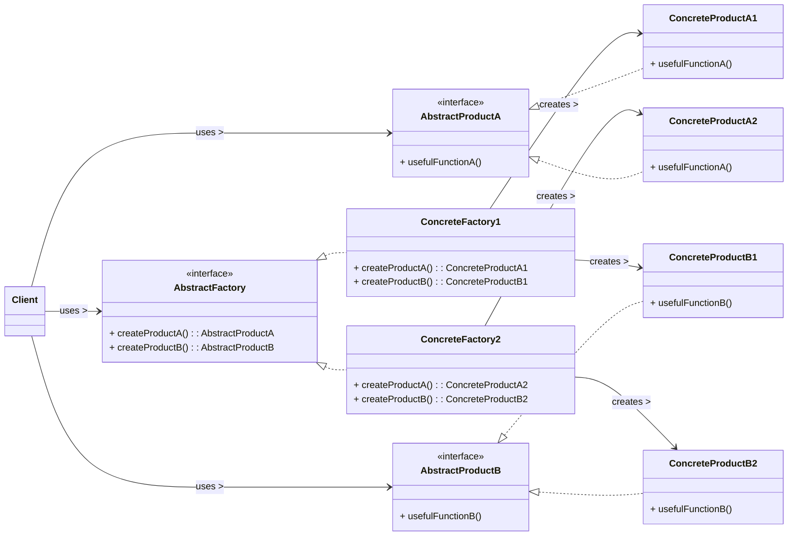

# Abstract Factory Design Pattern

The Abstract Factory pattern is a **creational design pattern** that provides an interface for creating families of related or dependent objects without specifying their concrete classes. It is often called a "factory of factories."

-----

## 1\. Problem It Solves / Intent

The Abstract Factory pattern addresses the problem of:

  * **Creating Families of Related Objects:** When a system needs to create a family of objects that are designed to work together (e.g., a set of UI elements for a specific operating system, or components for different database types).
  * **Decoupling from Concrete Classes:** To make a system independent of how its products are created, composed, and represented. The client should interact with abstract interfaces, not concrete implementations.
  * **Ensuring Product Compatibility:** To guarantee that the products created within a specific family are compatible with each other. For example, a "Windows Button" should always come with a "Windows Checkbox" and "Windows Textbox" if a "Windows GUI" theme is selected.
  * **Ease of Configuration:** To allow a system to be configured with one of multiple families of products. You can swap out an entire set of related objects by switching one factory.

## 2\. Structure & Participants

The Abstract Factory pattern typically involves five main participants:

  * **Abstract Factory (Interface/Abstract Class):** Declares an interface for methods that create abstract product objects for each product type in the family (e.g., `createButton()`, `createCheckbox()`).
  * **Concrete Factory:** Implements the methods declared in the `AbstractFactory` to create concrete product objects belonging to a specific family (e.g., `WindowsGUIFactory` creates `WindowsButton`, `WindowsCheckbox`).
  * **Abstract Product (Interface/Abstract Class):** Declares an interface for a type of product object (e.g., `Button`, `Checkbox`).
  * **Concrete Product:** Defines a product object to be created by the corresponding concrete factory. It implements the `AbstractProduct` interface (e.g., `WindowsButton`, `MacOSButton`).
  * **Client:** Uses interfaces declared by the `AbstractFactory` and `AbstractProduct` classes. It does not know or depend on the concrete factory or concrete product classes.

<!-- end list -->



## 3\. How It Works / Collaboration

1.  **Client Request:** The client needs to create a family of related products (e.g., UI elements for a specific OS).
2.  **Factory Creation:** The client decides which specific *family* of products it needs and creates an instance of the corresponding `ConcreteFactory` (e.g., `new WindowsGUIFactory()`). This is typically done once, perhaps at application startup or configuration time.
3.  **Product Creation:** The client then uses the methods provided by the `AbstractFactory` interface (e.g., `factory.createButton()`, `factory.createCheckbox()`) to get the desired products.
4.  **Internal Instantiation:** The chosen `ConcreteFactory` internally instantiates the specific `ConcreteProduct` objects that belong to its family (e.g., `WindowsGUIFactory` creates `WindowsButton`).
5.  **Client Decoupling:** The client code only sees and interacts with the `AbstractFactory` and `AbstractProduct` interfaces. It remains completely unaware of the actual `ConcreteFactory` or `ConcreteProduct` classes being used, allowing for easy swapping of entire product families.

## 4\. Applicability / When to Use

Use the Abstract Factory pattern when:

  * **A system must be independent of how its products are created, composed, and represented.** You want to manage the creation of complex object structures without tying the client code to specific concrete classes.
  * **A system needs to be configured with one of multiple families of products.** For instance, an application that supports different look-and-feel themes (e.g., Dark Mode, Light Mode) where each theme provides a family of distinct UI components.
  * **A family of related product objects is designed to be used together, and you need to enforce this constraint.** The factory ensures that all created products are from the same consistent set.
  * **You want to provide a class library of products, and you want to reveal only their interfaces, not their implementations.**

## 5\. Advantages & Disadvantages

### Advantages:

  * **Ensures Product Compatibility:** Guarantees that the products created by a factory are compatible and belong to the same family (e.g., all Windows UI elements).
  * **Abstracts Object Creation:** Client code is decoupled from the concrete product classes and concrete factory classes. This makes the system more flexible and maintainable.
  * **Easy Product Family Exchange:** Swapping entire product families (e.g., changing from a Windows GUI factory to a MacOS GUI factory) is straightforward and doesn't require modifying client code.
  * **Promotes Open/Closed Principle (OCP):** The system is "open for extension" (new product *families* can be added by creating new `ConcreteFactory` implementations) but "closed for modification" (existing client code doesn't need to change when a new family is introduced).
  * **Encapsulates Product Creation:** All creation logic for a product family is centralized within one `ConcreteFactory`.

### Disadvantages:

  * **Increased Complexity:** Introduces many interfaces and classes, which can be overkill for simpler applications or if you only have one product family.
  * **Difficulty Adding New Product Types:** Adding a *new type of product* to an existing family (e.g., adding a `Spinner` product when you currently only have `Button` and `Checkbox`) is hard. It requires modifying the `AbstractFactory` interface and *all* `ConcreteFactory` implementations to include the new product's creation method. This violates the Open/Closed Principle for new product *types*.

## 6\. Real-World / Code Examples

Let's consider a cross-platform GUI application that needs to create UI elements that look native to different operating systems (Windows, MacOS).

### Java Implementation

```java
// 1. Abstract Products
interface Button {
    void paint();
}

interface Checkbox {
    void paint();
}

// 2. Concrete Products for Windows
class WindowsButton implements Button {
    @Override
    public void paint() {
        System.out.println("Rendering a Windows Button.");
    }
}

class WindowsCheckbox implements Checkbox {
    @Override
    public void paint() {
        System.out.println("Rendering a Windows Checkbox.");
    }
}

// 2. Concrete Products for MacOS
class MacOSButton implements Button {
    @Override
    public void paint() {
        System.out.println("Rendering a MacOS Button.");
    }
}

class MacOSCheckbox implements Checkbox {
    @Override
    public void paint() {
        System.out.println("Rendering a MacOS Checkbox.");
    }
}

// 3. Abstract Factory
interface GUIFactory {
    Button createButton();
    Checkbox createCheckbox();
}

// 4. Concrete Factories
class WindowsGUIFactory implements GUIFactory {
    @Override
    public Button createButton() {
        return new WindowsButton();
    }

    @Override
    public Checkbox createCheckbox() {
        return new WindowsCheckbox();
    }
}

class MacOSGUIFactory implements GUIFactory {
    @Override
    public Button createButton() {
        return new MacOSButton();
    }

    @Override
    public Checkbox createCheckbox() {
        return new MacOSCheckbox();
    }
}

// 5. Client Code
class Application {
    private Button button;
    private Checkbox checkbox;

    public Application(GUIFactory factory) {
        this.button = factory.createButton();
        this.checkbox = factory.createCheckbox();
    }

    public void paint() {
        button.paint();
        checkbox.paint();
    }
}

public class AbstractFactoryDemo {
    public static void main(String[] args) {
        GUIFactory factory;
        String os = System.getProperty("os.name").toLowerCase();

        if (os.contains("windows")) {
            factory = new WindowsGUIFactory();
        } else if (os.contains("mac")) {
            factory = new MacOSGUIFactory();
        } else {
            System.out.println("Unknown OS, defaulting to Windows GUI.");
            factory = new WindowsGUIFactory();
        }

        Application app = new Application(factory);
        app.paint();
    }
}
```

### Python Implementation

Using `abc` (Abstract Base Classes) to define interfaces.

```python
from abc import ABC, abstractmethod

# 1. Abstract Products
class Button(ABC):
    @abstractmethod
    def paint(self):
        pass

class Checkbox(ABC):
    @abstractmethod
    def paint(self):
        pass

# 2. Concrete Products for Windows
class WindowsButton(Button):
    def paint(self):
        print("Rendering a Windows Button.")

class WindowsCheckbox(Checkbox):
    def paint(self):
        print("Rendering a Windows Checkbox.")

# 2. Concrete Products for MacOS
class MacOSButton(Button):
    def paint(self):
        print("Rendering a MacOS Button.")

class MacOSCheckbox(Checkbox):
    def paint(self):
        print("Rendering a MacOS Checkbox.")

# 3. Abstract Factory
class GUIFactory(ABC):
    @abstractmethod
    def create_button(self) -> Button:
        pass

    @abstractmethod
    def create_checkbox(self) -> Checkbox:
        pass

# 4. Concrete Factories
class WindowsGUIFactory(GUIFactory):
    def create_button(self) -> Button:
        return WindowsButton()

    def create_checkbox(self) -> Checkbox:
        return WindowsCheckbox()

class MacOSGUIFactory(GUIFactory):
    def create_button(self) -> Button:
        return MacOSButton()

    def create_checkbox(self) -> Checkbox:
        return MacOSCheckbox()

# 5. Client Code
class Application:
    def __init__(self, factory: GUIFactory):
        self.button = factory.create_button()
        self.checkbox = factory.create_checkbox()

    def paint(self):
        self.button.paint()
        self.checkbox.paint()

if __name__ == "__main__":
    import platform

    factory: GUIFactory

    # Determine OS to choose the correct factory
    os_name = platform.system().lower()

    if "windows" in os_name:
        factory = WindowsGUIFactory()
    elif "darwin" in os_name: # 'darwin' is for macOS
        factory = MacOSGUIFactory()
    else:
        print("Unknown OS, defaulting to Windows GUI.")
        factory = WindowsGUIFactory()

    app = Application(factory)
    app.paint()
```

## 7\. Related Patterns

  * **Factory Method:** Abstract Factory often uses a set of Factory Methods, one for each product in the family. Each `createProduct()` method in the `AbstractFactory` is essentially a Factory Method.
  * **Builder:** While Abstract Factory focuses on creating *families* of products, Builder is used to construct a *single complex object* step-by-step. An Abstract Factory could return a Builder if one of its products is particularly complex.
  * **Singleton:** `ConcreteFactory` classes are often implemented as Singletons because typically only one instance of a specific factory is needed throughout the application.
  * **Bridge:** Can sometimes be used in conjunction with Abstract Factory to separate the abstraction from its implementation in a more complex product hierarchy.

## 8\. Underlying Principles

The Abstract Factory pattern strongly adheres to:

  * **Dependency Inversion Principle (DIP):** The client code depends on abstractions (`AbstractFactory`, `AbstractProduct` interfaces) rather than concrete implementations. This promotes loose coupling and makes the system more flexible.
  * **Open/Closed Principle (OCP):** The system is "open for extension" as new product *families* can be introduced (by creating new `ConcreteFactory` classes) without requiring modifications to the existing client code. However, it's "closed for modification" for new product *types* within existing families (see disadvantages).
  * **Single Responsibility Principle (SRP):** Each concrete factory is responsible for creating a specific family of products, centralizing that creation logic.

## 9\. Variations & Idioms

  * **Singleton Concrete Factories:** It's very common for `ConcreteFactory` implementations to be Singletons, as an application usually only needs one instance of a particular GUI factory, database factory, etc.
  * **Parameterized Creation:** Less common for the strict GoF pattern, but some variations might involve an `AbstractFactory` method that takes an argument to select a specific variation of a product within its family. However, this can sometimes lead towards a Simple Factory if not carefully managed.

## 10\. When NOT to Use / Potential Misuses

  * **When only one product type or no families of products are involved:** If your system only needs to create one type of object, or if products are not related in families, the complexity of Abstract Factory is unnecessary. A Factory Method or even a simple constructor would suffice.
  * **When adding new product *types* is a frequent requirement:** As noted in the disadvantages, extending the *types* of products (e.g., adding `RadioButton` to `Button` and `Checkbox`) requires modifying the `AbstractFactory` interface and *all* existing `ConcreteFactory` implementations, which can be cumbersome and violate OCP for that axis of change.
  * **Overkill for simple applications:** The pattern introduces a significant number of interfaces and classes, which might not be justified for small applications where flexibility in swapping product families is not a primary concern.

-----
