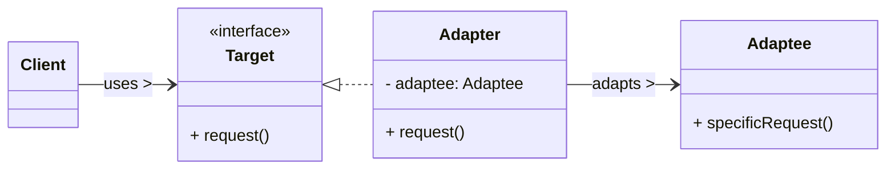
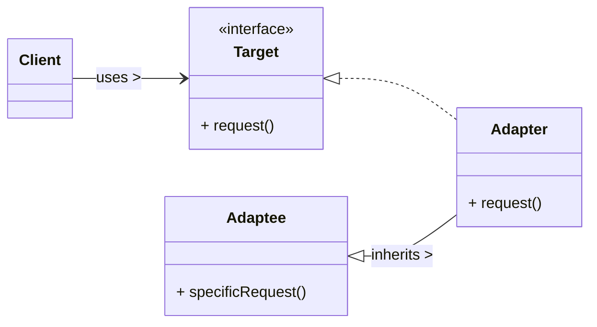

# Adapter Design Pattern

The Adapter pattern is a **structural design pattern** that allows objects with incompatible interfaces to collaborate. It converts the interface of a class into another interface that clients expect, enabling classes to work together that couldn't otherwise due to interface mismatches.

-----

## 1\. Problem It Solves / Intent

The Adapter pattern addresses the problem of:

  * **Interface Incompatibility:** You have an existing class (the `Adaptee`) that provides useful functionality, but its interface (its methods' names, signatures, or parameters) doesn't match the interface that your client code expects (`Target`).
  * **Reusability of Legacy Code/Third-Party Libraries:** You want to reuse an existing class or library without modifying its source code, but its API doesn't fit your current design.
  * **Integrating Disparate Systems:** When you need to make two or more independently developed systems work together, but they were designed with different interfaces.

Essentially, the Adapter acts as a "translator" or a "wrapper" that allows an object to fulfill a contract it normally wouldn't.

## 2\. Structure & Participants

The Adapter pattern typically involves four main participants:

  * **Target (Interface/Abstract Class):** Defines the domain-specific interface that the `Client` uses. This is the interface that the `Adaptee` needs to conform to.
  * **Client:** Collaborates with objects conforming to the `Target` interface. It's the code that needs to use the `Adaptee` but can't directly due to interface mismatch.
  * **Adaptee:** The existing class whose interface doesn't match the `Target`. It's the "legacy" or "third-party" component you want to use.
  * **Adapter:** Implements the `Target` interface and *contains an instance of* (for Object Adapter) or *inherits from* (for Class Adapter) the `Adaptee`. It translates requests from the `Client` (via the `Target` interface) into calls that the `Adaptee` can understand and execute.

### Object Adapter (Composition) Diagram:



### Class Adapter (Inheritance) Diagram (Java-specific, not common in Python):



## 3\. How It Works / Collaboration

1.  The **Client** makes a request to the **Adapter** by calling a method on the `Target` interface.
2.  The **Adapter** receives this request.
3.  Inside the **Adapter**, the request is translated (or "adapted") into one or more calls to the `Adaptee`'s specific interface. The `Adapter` effectively "wraps" the `Adaptee`.
4.  The **Adaptee** performs the actual work using its existing methods.
5.  If necessary, the `Adapter` might translate the `Adaptee`'s result back into a format expected by the `Target` interface before returning it to the `Client`.

The client is completely unaware that an adaptation is taking place; it simply interacts with the `Target` interface as expected.

## 4\. Applicability / When to Use

Use the Adapter pattern when:

  * **You want to use an existing class, but its interface doesn't match the one you need.** This is the primary use case.
  * **You want to create a reusable class that cooperates with unrelated or unforeseen classes** (i.e., those that don't necessarily have compatible interfaces). This is common in frameworks where you want to allow integration of third-party components.
  * **You need to integrate a legacy system with new code** that expects a different, more modern interface.
  * **Your existing object structure is fixed**, and you cannot (or do not want to) modify the `Adaptee`'s source code to change its interface.

## 5\. Advantages & Disadvantages

### Advantages:

  * **Interoperability:** Allows otherwise incompatible classes to work together, promoting code reuse.
  * **Reusability:** You can reuse existing functionality (the `Adaptee`) without modifying its source code, which is especially valuable for third-party libraries or legacy systems.
  * **Loose Coupling:** Decouples the client from the concrete implementation of the `Adaptee`. The client only relies on the `Target` interface.
  * **Transparency to Client:** The client interacts only with the `Target` interface and doesn't need to know that an adaptation is happening.
  * **Improved Flexibility:** By isolating interface conversion in a separate adapter class, you can switch between different `Adaptee` implementations (provided they can all be adapted) without affecting the client.

### Disadvantages:

  * **Increased Complexity:** Introduces a new class (the `Adapter`) for each adaptation, which can increase the overall number of classes in the system.
  * **Potential Performance Overhead:** There might be a negligible performance overhead due to the extra layer of indirection (method calls going through the adapter first).
  * **Not a Solution for Fundamental Mismatches:** The Adapter pattern only works for interface mismatches. If the `Adaptee`'s core behavior or conceptual model is fundamentally different from what the `Target` expects, an Adapter won't solve the problem; a re-architecture might be needed.
  * **Class Adapter Limitations (Java-specific):** The Class Adapter (inheritance-based) can only adapt classes, not interfaces, and ties the adapter to a specific `Adaptee` class, making it less flexible than the Object Adapter.

## 6\. Real-World / Code Examples

Let's imagine a scenario where your application has a modern media player that expects a `MediaPlayer` interface, but you have an old, external `AdvancedAudioPlayer` that can play specific formats but has a different API.

### Java Implementation

We'll use the **Object Adapter** (composition) approach, which is generally preferred in Java.

```java
// 1. Target Interface (What the client expects)
interface MediaPlayer {
    void play(String audioType, String fileName);
}

// 2. Adaptee (The existing class with incompatible interface)
class AdvancedAudioPlayer {
    public void playVlc(String fileName) {
        System.out.println("Playing VLC file. Name: " + fileName);
    }

    public void playMp4(String fileName) {
        System.out.println("Playing MP4 file. Name: " + fileName);
    }

    // This player doesn't natively support MP3 or other types directly
}

// 3. Adapter (Implements Target and uses Adaptee)
class MediaAdapter implements MediaPlayer {
    AdvancedAudioPlayer advancedAudioPlayer;

    public MediaAdapter(String audioType) {
        if (audioType.equalsIgnoreCase("vlc")) {
            advancedAudioPlayer = new AdvancedAudioPlayer(); // Adaptee
        } else if (audioType.equalsIgnoreCase("mp4")) {
            advancedAudioPlayer = new AdvancedAudioPlayer(); // Adaptee
        } else {
            System.out.println("Invalid media type for adapter: " + audioType);
        }
    }

    @Override
    public void play(String audioType, String fileName) {
        if (audioType.equalsIgnoreCase("vlc")) {
            advancedAudioPlayer.playVlc(fileName);
        } else if (audioType.equalsIgnoreCase("mp4")) {
            advancedAudioPlayer.playMp4(fileName);
        } else {
            System.out.println("Invalid audio type: " + audioType + ". Cannot play.");
        }
    }
}

// Client (The main audio player that uses the Target interface)
class AudioPlayer implements MediaPlayer {
    MediaAdapter mediaAdapter;

    @Override
    public void play(String audioType, String fileName) {
        // Inbuilt support to play mp3 music files
        if (audioType.equalsIgnoreCase("mp3")) {
            System.out.println("Playing MP3 file. Name: " + fileName);
        }
        // mediaAdapter is providing support to play other file formats
        else if (audioType.equalsIgnoreCase("vlc") || audioType.equalsIgnoreCase("mp4")) {
            mediaAdapter = new MediaAdapter(audioType); // Create adapter as needed
            mediaAdapter.play(audioType, fileName);
        } else {
            System.out.println("Invalid audio type: " + audioType + ". Format not supported.");
        }
    }
}

public class AdapterDemo {
    public static void main(String[] args) {
        AudioPlayer audioPlayer = new AudioPlayer();

        audioPlayer.play("mp3", "beyond the horizon.mp3");
        audioPlayer.play("mp4", "alone.mp4");
        audioPlayer.play("vlc", "far far away.vlc");
        audioPlayer.play("avi", "mind me.avi"); // This will be unsupported by adapter
    }
}
```

**Common Java Library Examples:**

  * `java.util.Arrays.asList()`: Adapts an array (which doesn't have `List` methods like `add`, `remove` in a modifiable way) into a `List` interface.
  * `java.io.InputStreamReader`: Adapts a byte stream (`InputStream`) to a character stream (`Reader`).
  * Swing/AWT listeners: Often involve adapters where you implement an interface with many methods, but only override the ones you need.

### Python Implementation

In Python, due to duck typing and flexible inheritance, an Object Adapter is almost always preferred. Class Adapters are rare and less idiomatic.

```python
# 1. Target Interface (What the client expects)
# In Python, interfaces are often implicit or defined using ABCs
class MediaPlayer:
    def play(self, audio_type: str, file_name: str):
        raise NotImplementedError("Subclasses must implement play method")

# 2. Adaptee (The existing class with incompatible interface)
class AdvancedAudioPlayer:
    def play_vlc(self, file_name: str):
        print(f"Playing VLC file. Name: {file_name}")

    def play_mp4(self, file_name: str):
        print(f"Playing MP4 file. Name: {file_name}")

# 3. Adapter (Implements Target and uses Adaptee via composition)
class MediaAdapter(MediaPlayer):
    def __init__(self, audio_type: str):
        self._advanced_audio_player = None
        if audio_type.lower() == "vlc" or audio_type.lower() == "mp4":
            self._advanced_audio_player = AdvancedAudioPlayer() # Adaptee
        else:
            print(f"Invalid media type for adapter: {audio_type}")

    def play(self, audio_type: str, file_name: str):
        if not self._advanced_audio_player:
            print(f"Adapter not configured for type: {audio_type}. Cannot play.")
            return

        if audio_type.lower() == "vlc":
            self._advanced_audio_player.play_vlc(file_name)
        elif audio_type.lower() == "mp4":
            self._advanced_audio_player.play_mp4(file_name)
        else:
            print(f"Invalid audio type: {audio_type}. Cannot play.")


# Client (The main audio player that uses the Target interface)
class AudioPlayer(MediaPlayer):
    def play(self, audio_type: str, file_name: str):
        if audio_type.lower() == "mp3":
            print(f"Playing MP3 file. Name: {file_name}")
        elif audio_type.lower() in ["vlc", "mp4"]:
            # Dynamically create adapter as needed
            media_adapter = MediaAdapter(audio_type)
            media_adapter.play(audio_type, file_name)
        else:
            print(f"Invalid audio type: {audio_type}. Format not supported.")

if __name__ == "__main__":
    audio_player = AudioPlayer()

    audio_player.play("mp3", "beyond the horizon.mp3")
    audio_player.play("mp4", "alone.mp4")
    audio_player.play("vlc", "far far away.vlc")
    audio_player.play("avi", "mind me.avi") # This will be unsupported by adapter
```

## 7\. Related Patterns

  * **Bridge:** Both Adapter and Bridge are concerned with connecting different components. However, their intent differs. Bridge separates an abstraction from its implementation, allowing them to vary independently, *designing for future compatibility*. Adapter makes two *existing, incompatible* interfaces work together. Bridge's changes are usually planned; Adapter's are usually reactive.
  * **Decorator:** Both patterns wrap an object. Decorator adds *new behavior* or responsibilities to an object without changing its interface. Adapter changes the *interface* of an object to match an expected one.
  * **Proxy:** Both patterns wrap an object. Proxy controls *access* to an object, adding a layer of control (e.g., lazy loading, security). Adapter changes the *interface* of the wrapped object.
  * **Facade:** Provides a *simplified* interface to a complex subsystem. Adapter converts an interface to *another specific* interface. A Facade might internally use Adapters to integrate different components of the subsystem.

## 8\. Underlying Principles

The Adapter pattern aligns with several key design principles:

  * **Single Responsibility Principle (SRP):** The `Adapter` class has the single responsibility of performing the interface conversion. It doesn't contain the `Adaptee`'s business logic or the `Client`'s logic.
  * **Open/Closed Principle (OCP):** You can integrate new `Adaptee` classes without modifying the `Client` code, simply by creating a new `Adapter` class that conforms to the `Target` interface. The client code (closed for modification) can continue to use the `Target` interface, while the system is open for extension with new adapted components.
  * **Dependency Inversion Principle (DIP):** The `Client` depends on the `Target` interface (an abstraction) rather than on the concrete `Adaptee` class. This leads to more flexible and robust systems.

## 9\. Variations & Idioms

  * **Object Adapter (Preferred):** The `Adapter` class holds an instance of the `Adaptee` (composition). This is more flexible because:
      * A single adapter can work with multiple `Adaptee` instances.
      * It can adapt an `Adaptee` interface that is a class or an interface.
      * It's more extensible as the adapter is not tied to a specific inheritance hierarchy.
  * **Class Adapter (Less Common, Java-specific):** The `Adapter` class inherits from both the `Target` interface and the `Adaptee` class. This is only possible in languages that support multiple inheritance of types (interfaces) and single inheritance of implementation (classes), like Java. It's less flexible because:
      * It only works if the `Adaptee` is a class, not an interface.
      * It ties the adapter to a specific `Adaptee` class, making it harder to adapt `Adaptee` subclasses.
      * Python's inheritance model makes this less relevant as methods can be overridden directly.
  * **Two-Way Adapter:** An adapter that can convert requests in both directions (e.g., `Target` to `Adaptee` and `Adaptee` to `Target`). This can be useful for peer-to-peer communication between systems with different interfaces.

## 10\. When NOT to Use / Potential Misuses

  * **When interfaces are already compatible:** If the `Adaptee` already provides an interface that the `Client` can use, an Adapter is unnecessary overhead.
  * **When you need to fundamentally change the object's behavior or add significant new functionality:** If the goal is not just interface conversion but adding new features or altering core behavior, then patterns like Decorator, Bridge, or even re-architecting the component might be more appropriate.
  * **When the `Adaptee` is conceptually completely unsuitable for the `Target` interface:** An Adapter can't magically make a `Car` behave like a `Bird`. It's for interface mismatches, not conceptual mismatches.
  * **For minor interface mismatches that can be solved with simple helper functions:** If only one or two method names/parameters need adjustment, a few small wrapper methods directly in the client or a simple utility function might be more pragmatic than a full-fledged Adapter.

-----
