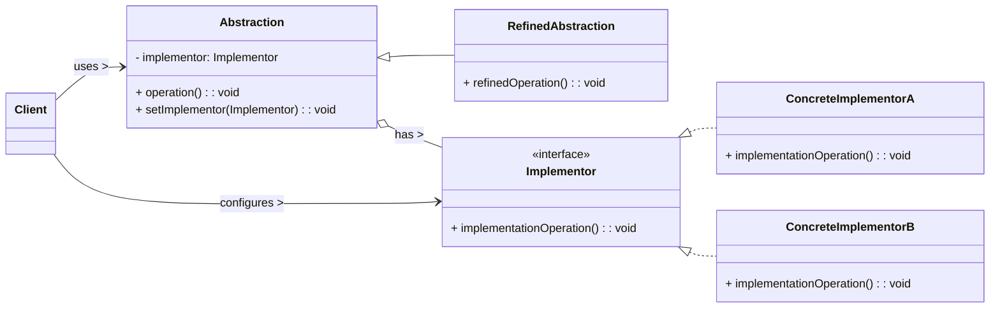

# Bridge Design Pattern

The Bridge pattern is a **structural design pattern** that decouples an abstraction from its implementation, allowing the two to vary independently. It's particularly useful when you have a hierarchy of abstractions and a hierarchy of implementations, and you want to be able to combine them flexibly without creating a combinatorial explosion of classes.

-----

## 1\. Problem It Solves / Intent

The Bridge pattern addresses the problem of:

  * **Avoiding a Permanent Binding:** When you want to avoid a permanent binding between an abstraction and its implementation. If you use inheritance to extend both abstraction and implementation, you end up with a rigid, tightly coupled structure.
  * **Preventing a "Cartesian Product" of Classes:** When both the abstraction and its implementation can vary independently. Without Bridge, you might end up with a large, unmanageable class hierarchy (e.g., `SquareRed`, `SquareBlue`, `CircleRed`, `CircleBlue` if you combined shapes and colors via inheritance).
  * **Allowing Independent Evolution:** When changes in the implementation of an abstraction should have no impact on clients. Clients should only interact with the abstraction.
  * **Sharing Implementations:** When you want to share an implementation among multiple objects, and this fact should be hidden from the client.

Essentially, the Bridge pattern shifts from "inheritance" to "composition" for implementation details, making the system more flexible.

## 2\. Structure & Participants

The Bridge pattern typically involves four main participants:

  * **Abstraction:** Defines the abstraction's interface (what the client sees). It maintains a reference to an `Implementor` object.
  * **Refined Abstraction:** Extends the `Abstraction` interface, providing more specialized functionality to the client.
  * **Implementor (Interface/Abstract Class):** Defines the interface for implementation classes. It doesn't have to correspond exactly to `Abstraction`'s interface; it provides fundamental operations.
  * **Concrete Implementor:** Implements the `Implementor` interface and defines the concrete implementation.

<!-- end list -->



## 3\. How It Works / Collaboration

1.  **Client interacts with Abstraction:** The client code uses the `Abstraction` (or `RefinedAbstraction`) interface, unaware of the underlying implementation.
2.  **Delegation:** The `Abstraction` object doesn't perform the low-level operations itself. Instead, it delegates its implementation-specific operations to its contained `Implementor` object.
3.  **Implementor performs work:** The `Implementor` object (specifically a `ConcreteImplementor`) carries out the actual work using its concrete methods.
4.  **Independent Variation:** Both the `Abstraction` hierarchy (e.g., `RemoteControl`, `AdvancedRemoteControl`) and the `Implementor` hierarchy (e.g., `TV`, `Radio`) can be extended independently. You can add new remote control types or new device types without affecting the other hierarchy or the client code.

## 4\. Applicability / When to Use

Use the Bridge pattern when:

  * **You want to avoid a permanent binding between an abstraction and its implementation.** This is often the case when both could evolve independently.
  * **Both the abstraction and their implementations might vary independently.** For example, you have different types of shapes (circle, square) and different rendering engines (OpenGL, DirectX, SVG).
  * **Changes in the implementation of an abstraction should have no impact on clients.** Clients should only depend on the abstraction.
  * **You have a proliferation of classes from a combinatorial explosion.** This occurs when you try to combine different features using inheritance (e.g., `LongFormHTMLFormatter`, `ShortFormPDFFormatter`, `LongFormPDFFormatter`, etc.). The Bridge pattern helps to decompose such structures.
  * **You want to share an implementation among multiple objects**, and this fact should be hidden from the client.

## 5\. Advantages & Disadvantages

### Advantages:

  * **Decoupling:** Decouples abstraction and implementation, allowing them to vary independently. This is the core benefit.
  * **Increased Extensibility:** Both the abstraction hierarchy and the implementation hierarchy can be extended independently without affecting the other or the client code. This adheres strongly to the Open/Closed Principle.
  * **Reduces Complexity:** Avoids the "Cartesian product" explosion of classes that would arise from trying to combine multiple independent dimensions using monolithic inheritance.
  * **Hides Implementation Details:** Client code only interacts with the abstraction, remaining unaware of the specific implementation details.
  * **Improved Maintainability:** Changes in implementation usually only affect the `Implementor` hierarchy, not the `Abstraction` or client code.

### Disadvantages:

  * **Increased Initial Complexity:** Introduces more interfaces and classes (for both abstraction and implementation, plus concrete classes), which can make the initial design more complex to grasp.
  * **Higher Upfront Design Effort:** Requires more upfront thought to properly identify and separate the two independent hierarchies. If the separation isn't clear, the pattern can be misapplied and actually increase complexity.
  * **Runtime Overhead:** A slight runtime overhead due to the extra layer of indirection (delegation from abstraction to implementor).

## 6\. Real-World / Code Examples

Let's consider a scenario of remote controls for different types of devices (TV, Radio).

### Java Implementation

```java
// 1. Implementor Interface
interface Device {
    void turnOn();
    void turnOff();
    void setChannel(int channel);
    void setVolume(int volume);
    void printStatus();
}

// 2. Concrete Implementors
class Tv implements Device {
    private boolean on = false;
    private int volume = 30;
    private int channel = 1;

    @Override
    public void turnOn() {
        on = true;
        System.out.println("TV is ON.");
    }

    @Override
    public void turnOff() {
        on = false;
        System.out.println("TV is OFF.");
    }

    @Override
    public void setChannel(int channel) {
        if (on) {
            this.channel = channel;
            System.out.println("TV Channel set to " + channel);
        } else {
            System.out.println("TV is OFF. Cannot change channel.");
        }
    }

    @Override
    public void setVolume(int volume) {
        if (on) {
            this.volume = volume;
            System.out.println("TV Volume set to " + volume);
        } else {
            System.out.println("TV is OFF. Cannot change volume.");
        }
    }

    @Override
    public void printStatus() {
        System.out.println("------------------------------------");
        System.out.println("TV Status:");
        System.out.println("Is ON: " + on);
        System.out.println("Volume: " + volume);
        System.out.println("Channel: " + channel);
        System.out.println("------------------------------------\n");
    }
}

class Radio implements Device {
    private boolean on = false;
    private int volume = 50;
    private int station = 99;

    @Override
    public void turnOn() {
        on = true;
        System.out.println("Radio is ON.");
    }

    @Override
    public void turnOff() {
        on = false;
        System.out.println("Radio is OFF.");
    }

    @Override
    public void setChannel(int station) { // Using 'channel' for station
        if (on) {
            this.station = station;
            System.out.println("Radio Station set to " + station);
        } else {
            System.out.println("Radio is OFF. Cannot change station.");
        }
    }

    @Override
    public void setVolume(int volume) {
        if (on) {
            this.volume = volume;
            System.out.println("Radio Volume set to " + volume);
        } else {
            System.out.println("Radio is OFF. Cannot change volume.");
        }
    }

    @Override
    public void printStatus() {
        System.out.println("------------------------------------");
        System.out.println("Radio Status:");
        System.out.println("Is ON: " + on);
        System.out.println("Volume: " + volume);
        System.out.println("Station: " + station);
        System.out.println("------------------------------------\n");
    }
}

// 3. Abstraction
abstract class RemoteControl {
    protected Device device;

    public RemoteControl(Device device) {
        this.device = device;
    }

    public void togglePower() {
        if (device.on) { // Assuming 'on' state is accessible or via a getter
            device.turnOff();
        } else {
            device.turnOn();
        }
    }

    public abstract void volumeUp();
    public abstract void volumeDown();
    public abstract void channelUp();
    public abstract void channelDown();
}

// 4. Refined Abstraction
class BasicRemote extends RemoteControl {
    public BasicRemote(Device device) {
        super(device);
    }

    @Override
    public void volumeUp() {
        device.setVolume(device.volume + 10); // Assuming 'volume' is accessible
    }

    @Override
    public void volumeDown() {
        device.setVolume(device.volume - 10);
    }

    @Override
    public void channelUp() {
        device.setChannel(device.channel + 1); // Assuming 'channel' is accessible
    }

    @Override
    public void channelDown() {
        device.setChannel(device.channel - 1);
    }
}

class AdvancedRemote extends BasicRemote {
    public AdvancedRemote(Device device) {
        super(device);
    }

    public void mute() {
        System.out.println("Remote: Mute command.");
        device.setVolume(0);
    }
}

// Client Code
public class BridgeDemo {
    public static void main(String[] args) {
        System.out.println("Tests with Basic Remote:");
        Device tv = new Tv();
        RemoteControl basicRemoteTv = new BasicRemote(tv);
        basicRemoteTv.togglePower();
        basicRemoteTv.volumeUp();
        basicRemoteTv.channelUp();
        tv.printStatus();

        Device radio = new Radio();
        RemoteControl basicRemoteRadio = new BasicRemote(radio);
        basicRemoteRadio.togglePower();
        basicRemoteRadio.volumeDown();
        basicRemoteRadio.channelDown();
        radio.printStatus();

        System.out.println("\nTests with Advanced Remote:");
        Device newTv = new Tv();
        AdvancedRemote advancedRemoteTv = new AdvancedRemote(newTv);
        advancedRemoteTv.togglePower();
        advancedRemoteTv.volumeUp();
        advancedRemoteTv.mute();
        newTv.printStatus();
    }
}
```

*Note: For simplicity, I've made `on`, `volume`, `channel` fields directly accessible in `Device` interface for `RemoteControl`. In a real scenario, these would be private with getters/setters in the `Device` implementations, and `RemoteControl` would use those getters/setters.*

### Python Implementation

Using `abc` (Abstract Base Classes) for both abstractions and implementors.

```python
from abc import ABC, abstractmethod

# 1. Implementor Abstract Base Class
class Device(ABC):
    def __init__(self):
        self.on = False
        self.volume = 0
        self.channel = 0 # Or station for radio

    @abstractmethod
    def turn_on(self):
        pass

    @abstractmethod
    def turn_off(self):
        pass

    @abstractmethod
    def set_channel(self, channel: int):
        pass

    @abstractmethod
    def set_volume(self, volume: int):
        pass

    @abstractmethod
    def print_status(self):
        pass

# 2. Concrete Implementors
class Tv(Device):
    def __init__(self):
        super().__init__()
        self.volume = 30
        self.channel = 1

    def turn_on(self):
        self.on = True
        print("TV is ON.")

    def turn_off(self):
        self.on = False
        print("TV is OFF.")

    def set_channel(self, channel: int):
        if self.on:
            self.channel = channel
            print(f"TV Channel set to {channel}")
        else:
            print("TV is OFF. Cannot change channel.")

    def set_volume(self, volume: int):
        if self.on:
            self.volume = volume
            print(f"TV Volume set to {volume}")
        else:
            print("TV is OFF. Cannot change volume.")

    def print_status(self):
        print("------------------------------------")
        print("TV Status:")
        print(f"Is ON: {self.on}")
        print(f"Volume: {self.volume}")
        print(f"Channel: {self.channel}")
        print("------------------------------------\n")

class Radio(Device):
    def __init__(self):
        super().__init__()
        self.volume = 50
        self.station = 99 # Renaming channel for radio clarity

    def turn_on(self):
        self.on = True
        print("Radio is ON.")

    def turn_off(self):
        self.on = False
        print("Radio is OFF.")

    def set_channel(self, station: int): # Using 'channel' for station to match interface
        if self.on:
            self.station = station
            print(f"Radio Station set to {station}")
        else:
            print("Radio is OFF. Cannot change station.")

    def set_volume(self, volume: int):
        if self.on:
            self.volume = volume
            print(f"Radio Volume set to {volume}")
        else:
            print("Radio is OFF. Cannot change volume.")

    def print_status(self):
        print("------------------------------------")
        print("Radio Status:")
        print(f"Is ON: {self.on}")
        print(f"Volume: {self.volume}")
        print(f"Station: {self.station}")
        print("------------------------------------\n")

# 3. Abstraction Abstract Base Class
class RemoteControl(ABC):
    def __init__(self, device: Device):
        self._device = device

    def toggle_power(self):
        if self._device.on:
            self._device.turn_off()
        else:
            self._device.turn_on()

    @abstractmethod
    def volume_up(self):
        pass

    @abstractmethod
    def volume_down(self):
        pass

    @abstractmethod
    def channel_up(self):
        pass

    @abstractmethod
    def channel_down(self):
        pass

# 4. Refined Abstraction
class BasicRemote(RemoteControl):
    def __init__(self, device: Device):
        super().__init__(device)

    def volume_up(self):
        self._device.set_volume(self._device.volume + 10)

    def volume_down(self):
        self._device.set_volume(self._device.volume - 10)

    def channel_up(self):
        self._device.set_channel(self._device.channel + 1)

    def channel_down(self):
        self._device.set_channel(self._device.channel - 1)

class AdvancedRemote(BasicRemote):
    def __init__(self, device: Device):
        super().__init__(device)

    def mute(self):
        print("Remote: Mute command.")
        self._device.set_volume(0)

# Client Code
if __name__ == "__main__":
    print("Tests with Basic Remote:")
    tv = Tv()
    basic_remote_tv = BasicRemote(tv)
    basic_remote_tv.toggle_power()
    basic_remote_tv.volume_up()
    basic_remote_tv.channel_up()
    tv.print_status()

    radio = Radio()
    basic_remote_radio = BasicRemote(radio)
    basic_remote_radio.toggle_power()
    basic_remote_radio.volume_down()
    basic_remote_radio.channel_down()
    radio.print_status()

    print("\nTests with Advanced Remote:")
    new_tv = Tv()
    advanced_remote_tv = AdvancedRemote(new_tv)
    advanced_remote_tv.toggle_power()
    advanced_remote_tv.volume_up()
    advanced_remote_tv.mute()
    new_tv.print_status()
```

## 7\. Related Patterns

  * **Adapter:** Both Adapter and Bridge are about connecting things. The key difference is their intent. Adapter makes two *existing, incompatible* interfaces work together. Bridge separates an abstraction from its implementation, allowing both to vary independently, *designing for future compatibility and extensibility*. Adapter is usually reactive to existing designs; Bridge is proactive for future flexibility.
  * **Abstract Factory:** An `AbstractFactory` might be used to create and configure the specific `Implementor` objects used by an `Abstraction`.
  * **Strategy:** Both Bridge and Strategy use composition to change behavior. Bridge focuses on separating an abstraction from its implementation, dealing with *what* something is and *how* it's implemented. Strategy focuses on different *algorithms* or behaviors that can be swapped at runtime for a single problem. The crucial distinction is that Bridge is for *two orthogonal hierarchies* (e.g., shapes and renderers), while Strategy is for *interchangeable algorithms* (e.g., sorting algorithms).
  * **Composite:** A `Composite` object could be used as an `Abstraction` or `Implementor` to represent complex, tree-like structures.

## 8\. Underlying Principles

The Bridge pattern strongly adheres to:

  * **Dependency Inversion Principle (DIP):** Both the `Abstraction` and the `Client` depend on the `Implementor` interface (an abstraction) rather than concrete implementations. This leads to extremely loose coupling.
  * **Open/Closed Principle (OCP):** Both the `Abstraction` hierarchy and the `Implementor` hierarchy can be extended independently without modifying existing code. You can add new remote control types or new device types without touching the other hierarchy or the client code.
  * **Single Responsibility Principle (SRP):** The `Abstraction` focuses on high-level control, while the `Implementor` focuses on low-level details. This clear separation makes each component more cohesive.

## 9\. Variations & Idioms

  * **Abstract vs. Concrete Implementor:** The `Implementor` can be an interface (as shown above) if all implementations are entirely distinct, or an abstract class if there's some common default behavior or state among concrete implementors.
  * **Default Implementor:** The `Abstraction` might provide a default `Implementor` if one isn't explicitly provided by the client, offering convenience.
  * **Director in Bridge:** While not typically a named role, a component similar to a Director from the Builder pattern could be responsible for assembling the `Abstraction` with the correct `Implementor` based on configuration.

## 10\. When NOT to Use / Potential Misuses

  * **When you have a simple hierarchy that is unlikely to change in two orthogonal dimensions:** The added complexity of Bridge (more classes, interfaces) might not be justified for straightforward designs.
  * **When the added complexity outweighs the benefits of flexibility:** For very small projects or systems where independent evolution is not a significant concern, simpler patterns or direct inheritance might be more pragmatic.
  * **When the implementation hierarchy is not truly independent:** If changes in one dimension *always* necessitate changes in the other, then the separation provided by Bridge isn't truly beneficial and might just add overhead.
  * **When you're dealing with existing incompatible interfaces:** That's the domain of the Adapter pattern, not Bridge. Bridge is about designing for future flexibility in separate hierarchies.

-----
