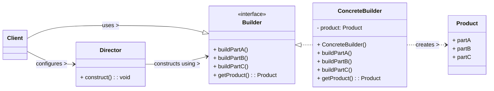

# Builder Design Pattern

The Builder pattern is a **creational design pattern** that separates the construction of a complex object from its representation. This allows the same construction process to create different representations of the object.

-----

## 1\. Problem It Solves / Intent

The Builder pattern addresses several issues related to constructing complex objects:

  * **"Telescoping Constructors"**: When an object can be created with many optional parameters, leading to a proliferation of constructors with different combinations of parameters (e.g., `Product(arg1)`, `Product(arg1, arg2)`, `Product(arg1, arg2, arg3)`...). This makes constructors hard to read and use.
  * **Complex Construction Logic**: When the process of building an object is intricate and involves multiple steps or specific ordering of parts.
  * **Immutability**: When you want to create an immutable object (an object whose state cannot be changed after it's created) with a clear and flexible construction process.
  * **Separation of Concerns**: To decouple the construction logic from the object's representation, allowing different construction algorithms to build different products, or different types of products using the same building steps.

## 2\. Structure & Participants

The Builder pattern typically involves four main participants:

  * **Product:** The complex object that is being built. It often has many parts or attributes.
  * **Builder (Interface/Abstract Class):** Declares a step-by-step interface for building parts of the Product object. It defines methods for adding each component.
  * **Concrete Builder:** Implements the `Builder` interface. It constructs and assembles parts of the product by implementing the building steps defined in the `Builder` interface, and it provides a method to retrieve the finished product.
  * **Director (Optional):** Orchestrates the construction process. It contains a standard algorithm for constructing a product using the `Builder` interface. The `Director` can build several variations of the product by using the same builder steps but in different orders or with different parameters. The Client can also directly use the Builder without a Director.
  * **Client:** Interacts with the `Director` (if present) and the `Builder` to initiate the construction process and retrieve the final product.

<!-- end list -->



## 3\. How It Works / Collaboration

1.  **Client initiates construction:** The client creates a `ConcreteBuilder` object (and potentially a `Director` if complex construction algorithms are predefined).
2.  **Building Steps:** The client (or the `Director`) calls various building methods on the `Builder` object in a specific sequence. Each method adds a component or sets a property of the `Product` being built.
3.  **Internal Assembly:** The `ConcreteBuilder` handles the internal details of constructing the `Product`. It might hold a reference to the `Product` instance it's building and add parts to it.
4.  **Retrieval:** Once all necessary building steps are complete, the client calls a final method (e.g., `getProduct()` or `build()`) on the `Builder` to retrieve the fully assembled `Product` object.

Crucially, the `Product` class itself does not need to know about the complex construction process, and the client doesn't need to know the specific details of `ConcreteProduct` parts or their assembly.

## 4\. Applicability / When to Use

Use the Builder pattern when:

  * **The construction process of a complex object should be independent of its parts and how they are assembled.** This allows you to easily change the internal representation of the product without affecting the client code.
  * **The construction process needs to allow different representations for the object that is constructed.** For example, a `ComputerBuilder` could construct a `GamingPC`, `OfficePC`, or `Server` using the same building steps but with different parts.
  * **An object has many optional parameters**, and using "telescoping constructors" (many overloaded constructors) becomes unwieldy, hard to read, and error-prone. The Builder pattern offers a more readable and self-documenting way to create such objects.
  * **You want to create immutable objects:** The Builder allows you to set all properties of an object in a step-by-step fashion and then create the immutable object in a single final `build()` call.

## 5\. Advantages & Disadvantages

### Advantages:

  * **Separation of Concerns:** Clearly separates the construction of a complex object from its actual representation. The `Product` class is clean, and its construction logic resides in the `Builder`.
  * **Fine-Grained Control over Construction:** Allows you to build the product step by step, giving you complete control over the construction process.
  * **Creation of Different Representations:** The same `Director` (or building process) can be used with different `ConcreteBuilder`s to produce different types or variations of the product.
  * **Supports Immutability:** Ideal for constructing objects that are immutable once created, as all parameters can be set via the builder before the final object is instantiated.
  * **Improved Readability and Usability:** Client code becomes much cleaner and more readable, especially for objects with many optional parameters, compared to long constructor calls. Method chaining (fluent interface) further enhances this.
  * **Avoids "Telescoping Constructors":** Eliminates the need for multiple overloaded constructors, making the class easier to maintain.

### Disadvantages:

  * **Increased Complexity:** Introduces more classes (Builder interface, Concrete Builders, Product, optional Director) than a simple constructor or factory method. This can be overkill for simpler objects.
  * **Verbosity:** For objects with very few parameters or simple construction, the Builder pattern can lead to more verbose code than direct instantiation.
  * **Learning Curve:** Developers unfamiliar with the pattern might find it slightly less intuitive initially.

## 6\. Real-World / Code Examples

Let's imagine building a `Computer` with various optional components.

### Java Implementation

A common idiom in Java is to use a static nested `Builder` class inside the `Product` class, often with method chaining (fluent interface).

```java
// 1. Product (The complex object to be built)
public class Computer {
    private String cpu;
    private String ram;
    private String storage;
    private String gpu;      // Optional
    private String os;       // Optional

    // Private constructor, only accessible by the Builder
    private Computer(Builder builder) {
        this.cpu = builder.cpu;
        this.ram = builder.ram;
        this.storage = builder.storage;
        this.gpu = builder.gpu;
        this.os = builder.os;
        System.out.println("Computer instance created!");
    }

    // Getters for properties (making the object effectively immutable after creation)
    public String getCpu() { return cpu; }
    public String getRam() { return ram; }
    public String getStorage() { return storage; }
    public String getGpu() { return gpu; }
    public String getOs() { return os; }

    @Override
    public String toString() {
        return "Computer [CPU=" + cpu + ", RAM=" + ram + ", Storage=" + storage +
               ", GPU=" + (gpu != null ? gpu : "N/A") + ", OS=" + (os != null ? os : "N/A") + "]";
    }

    // 2. Builder (Static inner class is common idiom)
    public static class Builder {
        private String cpu;
        private String ram;
        private String storage;
        private String gpu;
        private String os;

        // Required parameters can be set in the Builder's constructor
        public Builder(String cpu, String ram, String storage) {
            this.cpu = cpu;
            this.ram = ram;
            this.storage = storage;
        }

        // Methods for setting optional parameters (return 'this' for chaining)
        public Builder withGpu(String gpu) {
            this.gpu = gpu;
            return this;
        }

        public Builder withOs(String os) {
            this.os = os;
            return this;
        }

        // 3. Build method to create the Computer instance
        public Computer build() {
            // Optional: Add validation logic here before building
            if (cpu == null || ram == null || storage == null) {
                throw new IllegalStateException("CPU, RAM, and Storage are required!");
            }
            return new Computer(this);
        }
    }

    // Client Code
    public static void main(String[] args) {
        // Build a gaming PC
        Computer gamingPC = new Computer.Builder("Intel i9", "32GB DDR4", "1TB NVMe SSD")
                                      .withGpu("RTX 4090")
                                      .withOs("Windows 11")
                                      .build();
        System.out.println(gamingPC);

        System.out.println("\n---");

        // Build an office PC (without GPU and different OS)
        Computer officePC = new Computer.Builder("Intel i5", "16GB DDR4", "512GB SSD")
                                     .withOs("Ubuntu Linux")
                                     .build();
        System.out.println(officePC);

        System.out.println("\n---");

        // Build a basic PC (only required parts)
        Computer basicPC = new Computer.Builder("AMD Ryzen 3", "8GB DDR4", "256GB SSD")
                                    .build();
        System.out.println(basicPC);
    }
}
```

**Common Java Library Examples:**

  * `StringBuilder` and `StringBuffer`: Although not strictly a "Builder" in the GoF sense (as they modify themselves directly), they offer a fluent API for building strings step-by-step.
  * `java.time.LocalDate.Builder` (though `LocalDate.of()` is more common for fixed sets of params).
  * Many third-party libraries use builders, e.g., `HttpClient.newBuilder()` in Java 11+, `Spring's RestTemplateBuilder`, and various ORM query builders.

### Python Implementation

Python also commonly uses method chaining for builders. The `__init__` method of the product can be made to accept the builder's attributes.

```python
# 1. Product (The complex object to be built)
class Computer:
    def __init__(self, builder):
        self.cpu = builder.cpu
        self.ram = builder.ram
        self.storage = builder.storage
        self.gpu = builder.gpu
        self.os = builder.os
        print("Computer instance created!")

    def __str__(self):
        gpu_info = self.gpu if self.gpu else "N/A"
        os_info = self.os if self.os else "N/A"
        return (f"Computer [CPU={self.cpu}, RAM={self.ram}, Storage={self.storage}, "
                f"GPU={gpu_info}, OS={os_info}]")

# 2. Builder
class ComputerBuilder:
    def __init__(self, cpu, ram, storage):
        # Required parameters
        self.cpu = cpu
        self.ram = ram
        self.storage = storage

        # Optional parameters (initialize to None)
        self.gpu = None
        self.os = None
        print("ComputerBuilder created.")

    def with_gpu(self, gpu):
        self.gpu = gpu
        return self # Return self for method chaining

    def with_os(self, os):
        self.os = os
        return self # Return self for method chaining

    # 3. Build method to create the Computer instance
    def build(self):
        # Optional: Add validation logic here before building
        if not all([self.cpu, self.ram, self.storage]):
            raise ValueError("CPU, RAM, and Storage are required!")
        return Computer(self)

# Client Code
if __name__ == "__main__":
    # Build a gaming PC
    gaming_pc = ComputerBuilder("Intel i9", "32GB DDR4", "1TB NVMe SSD") \
        .with_gpu("RTX 4090") \
        .with_os("Windows 11") \
        .build()
    print(gaming_pc)

    print("\n---")

    # Build an office PC (without GPU and different OS)
    office_pc = ComputerBuilder("Intel i5", "16GB DDR4", "512GB SSD") \
        .with_os("Ubuntu Linux") \
        .build()
    print(office_pc)

    print("\n---")

    # Build a basic PC (only required parts)
    basic_pc = ComputerBuilder("AMD Ryzen 3", "8GB DDR4", "256GB SSD") \
        .build()
    print(basic_pc)
```

## 7\. Related Patterns

  * **Abstract Factory:** Builders are excellent for creating complex `Product` objects. An `AbstractFactory` might return a `Builder` to create complex parts of a family of products.
  * **Factory Method:** While both create objects, Factory Method focuses on creating a *single* object (deciding *which* class to instantiate), whereas Builder focuses on constructing a *complex* object step-by-step (deciding *how* to assemble parts).
  * **Composite:** The `Product` being built by the Builder often uses the Composite pattern to represent complex, hierarchical structures.
  * **Singleton:** A `Director` or a `ConcreteBuilder` could potentially be a `Singleton` if only one instance of them is needed globally.

## 8\. Underlying Principles

The Builder pattern strongly adheres to:

  * **Single Responsibility Principle (SRP):**
      * The `Product` class is responsible only for its data and core behavior.
      * The `Builder` (and `ConcreteBuilder`) classes are responsible solely for the construction logic.
      * The `Director` (if present) is responsible for the sequence of construction steps.
  * **Open/Closed Principle (OCP):**
      * The `Director` (if used) can be "closed for modification" as it operates on the `Builder` interface. It can work with new `ConcreteBuilder`s without requiring changes.
      * The `Product` and `Builder` interfaces are also extensible.

## 9\. Variations & Idioms

  * **Fluent Interface (Method Chaining):** As seen in the Java and Python examples, builder methods typically return `this` (Java) or `self` (Python), allowing for concise chained calls (e.g., `builder.withPartA().withPartB().build()`).
  * **Static Nested Builder Class (Java):** A very common and recommended idiom in Java, where the `Builder` class is a static inner class of the `Product` it builds. This keeps the builder tightly coupled to the product and allows access to the product's private constructor.
  * **Director-less Builder:** Often, the `Director` is omitted, and the client directly calls the builder's methods. This simplifies the pattern for less complex construction sequences.
  * **Lombok's `@Builder` (Java):** A popular annotation from the Project Lombok library that automatically generates boilerplate builder code for Java classes, significantly reducing manual effort.

## 10\. When NOT to Use / Potential Misuses

  * **When the object being built is simple:** If an object has only a few parameters or its construction is straightforward, the overhead of introducing the Builder pattern's additional classes might not be justified. A simple constructor or a factory method would be sufficient.
  * **When the construction process doesn't vary:** If there's only one way to construct the object and no need for different representations or step-by-step control, the Builder adds unnecessary complexity.
  * **For very small projects:** In very small projects or throwaway scripts, the benefits of the Builder (maintainability, scalability) might not outweigh the initial setup cost.

-----
