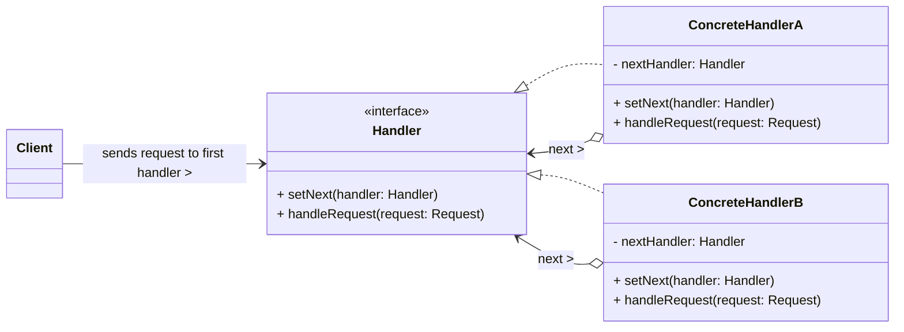

# Chain of Responsibility Design Pattern

The Chain of Responsibility pattern is a **behavioral design pattern** that allows you to pass requests along a chain of handlers. Upon receiving a request, each handler decides either to process the request or to pass it to the next handler in the chain.

-----

## 1\. Problem It Solves / Intent

The Chain of Responsibility pattern addresses the problem of:

  * **Decoupling Sender and Receiver:** Avoiding coupling the sender of a request to its receiver. The sender doesn't need to know which specific object in a group will handle the request; it just sends it to the first handler in the chain.
  * **Multiple Potential Handlers:** Giving more than one object a chance to handle a request. The request propagates along a chain of potential handlers until one of them processes it.
  * **Configurable Handling:** Allowing the set of objects that can handle a request to be configured or changed dynamically at runtime.
  * **Flexible Order:** Defining the order in which objects process the request.

Essentially, it provides a flexible way to process requests by chaining objects, where each object has a chance to handle the request or pass it on.

## 2\. Structure & Participants

The Chain of Responsibility pattern typically involves three main participants:

  * **Handler (Interface/Abstract Class):**
      * Declares an interface for handling requests.
      * Implements methods for setting the successor (the next handler in the chain).
      * (Often) Implements a default method for passing the request to the successor.
  * **ConcreteHandler:**
      * Implements the `Handler` interface.
      * Handles requests it is responsible for.
      * If it cannot handle the request, it passes it to its successor.
      * It maintains a reference to its successor (the next `Handler` in the chain).
  * **Client:**
      * Initiates the request by sending it to the first `ConcreteHandler` in the chain.
      * It is unaware of which specific handler (or handlers) will process the request.

<!-- end list -->



## 3\. How It Works / Collaboration

1.  **Client Initiates Request:** The `Client` creates a chain of handlers (often by linking them in a specific order) and then sends a request to the first `Handler` in the chain.
2.  **Handler Decision:** When a `ConcreteHandler` receives a request, it makes one of three decisions:
      * **Handle it:** If it is capable and responsible for handling the request, it processes the request directly. The request often terminates here.
      * **Pass it on:** If it cannot or chooses not to handle the request, it delegates the request to its successor in the chain.
      * **Do nothing:** If it is the last handler in the chain and cannot handle the request, the request might go unhandled (or a default action/exception might occur).
3.  **Propagation:** The request propagates along the chain until a `ConcreteHandler` handles it, or the end of the chain is reached. The sender remains decoupled from the specific receiver.

## 4\. Applicability / When to Use

Use the Chain of Responsibility pattern when:

  * **More than one object may handle a request, and the actual handler is not known until runtime.**
  * **You want to issue a request to one of several objects without explicitly specifying the receiver.** This gives you flexibility in how requests are processed.
  * **The set of objects that can handle a request should be configurable.** You can add, remove, or reorder handlers dynamically.
  * **The order of handling is important and should be easily changeable.** For example, processing different types of requests in a specific sequence.
  * **You need to process requests that have varying levels of detail or importance**, and different handlers specialize in different levels.

## 5\. Advantages & Disadvantages

### Advantages:

  * **Reduced Coupling:** Decouples the sender of a request from its receiver. The sender only knows about the first handler, not all potential handlers, promoting flexibility.
  * **Increased Flexibility:** The chain of responsibility can be modified at runtime (e.g., adding, removing, or reordering handlers) without affecting the client code.
  * **Simplified Handler Logic:** Each handler has a focused responsibility: either process a specific type of request or pass it to the next handler.
  * **Adherence to Open/Closed Principle:** New handler types can be added to the chain without modifying existing client code or existing handlers (as long as they conform to the `Handler` interface).

### Disadvantages:

  * **Request Not Guaranteed to Be Handled:** There is no guarantee that the request will be handled by any handler in the chain. If no handler is configured or capable of processing a specific request, it might simply go unhandled. This requires careful design to prevent silent failures.
  * **Debugging Difficulty:** Debugging can be trickier, as the flow of control is not immediately obvious from looking at a single handler. You have to trace the request through the entire chain.
  * **Potential Performance Overhead:** Requests may traverse a long chain before being handled, leading to slight performance overhead, especially in very high-throughput systems or with very long chains.
  * **Chain Configuration Complexity:** Setting up and maintaining the chain correctly can sometimes be complex, especially in systems with many different types of requests and handlers.

## 6\. Real-World / Code Examples

Let's consider an expense approval system where different managers (Manager, Director, CEO) can approve expenses based on the amount.

### Java Implementation

```java
// 1. Handler Interface
interface ExpenseHandler {
    void setNextHandler(ExpenseHandler nextHandler);
    void handleRequest(double amount);
}

// Abstract base class to simplify concrete handlers
abstract class AbstractExpenseHandler implements ExpenseHandler {
    protected ExpenseHandler nextHandler;

    @Override
    public void setNextHandler(ExpenseHandler nextHandler) {
        this.nextHandler = nextHandler;
    }

    // Default implementation to pass to the next handler
    protected void passToNext(double amount) {
        if (nextHandler != null) {
            nextHandler.handleRequest(amount);
        } else {
            System.out.println("Expense of $" + amount + " cannot be handled. No more handlers in the chain.");
        }
    }
}

// 2. Concrete Handlers
class Manager extends AbstractExpenseHandler {
    private final double MAX_APPROVAL_AMOUNT = 1000.0;

    @Override
    public void handleRequest(double amount) {
        if (amount <= MAX_APPROVAL_AMOUNT) {
            System.out.println("Manager: Approved expense of $" + amount);
        } else {
            System.out.println("Manager: Expense of $" + amount + " is too high for me. Passing to Director.");
            passToNext(amount);
        }
    }
}

class Director extends AbstractExpenseHandler {
    private final double MAX_APPROVAL_AMOUNT = 5000.0;

    @Override
    public void handleRequest(double amount) {
        if (amount <= MAX_APPROVAL_AMOUNT) {
            System.out.println("Director: Approved expense of $" + amount);
        } else {
            System.out.println("Director: Expense of $" + amount + " is too high for me. Passing to CEO.");
            passToNext(amount);
        }
    }
}

class CEO extends AbstractExpenseHandler {
    // CEO can approve any amount
    @Override
    public void handleRequest(double amount) {
        System.out.println("CEO: Approved expense of $" + amount);
    }
}

// 3. Client Code
public class ChainOfResponsibilityDemo {
    public static void main(String[] args) {
        // Build the chain of handlers
        ExpenseHandler manager = new Manager();
        ExpenseHandler director = new Director();
        ExpenseHandler ceo = new CEO();

        manager.setNextHandler(director);
        director.setNextHandler(ceo); // CEO has no next handler, so it terminates the chain

        System.out.println("Requesting approval for $500:");
        manager.handleRequest(500); // Handled by Manager

        System.out.println("\nRequesting approval for $2500:");
        manager.handleRequest(2500); // Handled by Director

        System.out.println("\nRequesting approval for $7000:");
        manager.handleRequest(7000); // Handled by CEO

        System.out.println("\nRequesting approval for $1200 (if Director's next is null):");
        director.setNextHandler(null); // Temporarily break chain for demonstration
        manager.handleRequest(1200); // Manager passes to director, director fails
    }
}
```

### Python Implementation

Using `abc` (Abstract Base Classes) for the `Handler` interface.

```python
from abc import ABC, abstractmethod

# 1. Handler Abstract Base Class
class ExpenseHandler(ABC):
    def __init__(self):
        self._next_handler = None

    def set_next_handler(self, handler: 'ExpenseHandler'):
        self._next_handler = handler
        return handler # Allows for fluid chain building

    @abstractmethod
    def handle_request(self, amount: float):
        pass

    def _pass_to_next(self, amount: float):
        if self._next_handler:
            self._next_handler.handle_request(amount)
        else:
            print(f"Expense of ${amount:.2f} cannot be handled. No more handlers in the chain.")

# 2. Concrete Handlers
class Manager(ExpenseHandler):
    MAX_APPROVAL_AMOUNT = 1000.0

    def handle_request(self, amount: float):
        if amount <= self.MAX_APPROVAL_AMOUNT:
            print(f"Manager: Approved expense of ${amount:.2f}")
        else:
            print(f"Manager: Expense of ${amount:.2f} is too high for me. Passing to Director.")
            self._pass_to_next(amount)

class Director(ExpenseHandler):
    MAX_APPROVAL_AMOUNT = 5000.0

    def handle_request(self, amount: float):
        if amount <= self.MAX_APPROVAL_AMOUNT:
            print(f"Director: Approved expense of ${amount:.2f}")
        else:
            print(f"Director: Expense of ${amount:.2f} is too high for me. Passing to CEO.")
            self._pass_to_next(amount)

class CEO(ExpenseHandler):
    # CEO can approve any amount
    def handle_request(self, amount: float):
        print(f"CEO: Approved expense of ${amount:.2f}")

# 3. Client Code
if __name__ == "__main__":
    # Build the chain of handlers
    manager = Manager()
    director = Director()
    ceo = CEO()

    # Using fluid interface
    manager.set_next_handler(director).set_next_handler(ceo)

    print("Requesting approval for $500:")
    manager.handle_request(500) # Handled by Manager

    print("\nRequesting approval for $2500:")
    manager.handle_request(2500) # Manager passes to Director; Director handles

    print("\nRequesting approval for $7000:")
    manager.handle_request(7000) # Manager -> Director -> CEO; CEO handles

    print("\nRequesting approval for $1200 (if Director's next is null):")
    # Resetting the chain for this specific test case
    manager_test = Manager()
    director_test = Director()
    manager_test.set_next_handler(director_test) # Director is the last in this test chain
    manager_test.handle_request(1200) # Manager passes to director, director fails (no next)
```

## 7\. Related Patterns

  * **Command:** A request can be encapsulated as a Command object, which is then passed along the Chain of Responsibility. This combines the "what" (Command) with the "who/how" (Chain of Responsibility).
  * **Composite:** Handlers in a chain can sometimes be arranged in a Composite structure, especially in UI event handling where events might "bubble" up through a hierarchy of components.
  * **Mediator:** Both Mediator and Chain of Responsibility deal with communication between objects. Mediator centralizes control, making it the single point of contact for objects to communicate through. Chain of Responsibility *distributes* control among a sequence of handlers. A Mediator might use a Chain of Responsibility internally to decide which component handles a specific message.
  * **Strategy:** While CoR determines *who* handles a request, Strategy determines *how* a specific behavior is implemented. A handler in a chain might use different strategies to process a request.

## 8\. Underlying Principles

The Chain of Responsibility pattern strongly adheres to:

  * **Decoupling:** Decouples the sender of a request from its receiver, making the system more flexible and maintainable.
  * **Open/Closed Principle (OCP):** New handler types can be added to the chain without modifying existing client code or existing handler classes (as long as they conform to the `Handler` interface). The system is open for extension but closed for modification.
  * **Single Responsibility Principle (SRP):** Each `ConcreteHandler` has a specific, focused responsibility: either to handle a particular type of request or to pass it on.

## 9\. Variations & Idioms

  * **Chain Termination:** How to handle requests that are not processed by any handler in the chain. Options include:
      * **Returning `null` or `false`:** Indicate that the request was unhandled.
      * **Throwing an exception:** Signal an error condition.
      * **Having a default "Null Handler" or "Fall-through Handler":** A final handler in the chain that provides a default response or logs the unhandled request.
  * **Linked List Implementation:** The chain is most commonly implemented as a simple linked list of handler objects.
  * **Hierarchical Chains:** Handlers can sometimes be arranged in a more complex tree or hierarchical structure, especially in UI event propagation.
  * **Middleware (Web Frameworks):** A very common real-world application. In many web frameworks (e.g., Express.js, Django, ASP.NET Core), requests pass through a series of "middleware" components, each of which can process the request, modify it, or pass it to the next middleware or the final route handler.
  * **Event Bubbling/Capturing:** In GUI programming, events often propagate through a hierarchy of components, allowing different components to handle or intercept events.

## 10\. When NOT to Use / Potential Misuses

  * **When there's a clear, single receiver for every request:** If the receiver is always known at compile time or is easily determined, the overhead and complexity of a chain are unnecessary.
  * **When the order of processing is always fixed and simple:** If the processing logic is sequential and doesn't require dynamic reordering or selection of handlers, a simple sequence of method calls might be clearer.
  * **When you absolutely require guaranteed delivery of every request to *some* handler:** If unhandled requests are a critical error condition, you must explicitly design for termination (e.g., a final default handler that always processes or throws an exception). If not handled, requests might silently disappear.
  * **If the chain can become excessively long:** A very long chain can lead to performance overhead as requests traverse many handlers, and it can also make debugging more challenging.
  * **When the handlers are tightly coupled to each other's specific logic:** If handlers heavily depend on the internal state or specific implementation details of their predecessors or successors, the loose coupling benefit of CoR is lost.

-----
