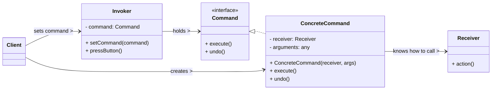

# Command Design Pattern

The Command pattern is a **behavioral design pattern** that encapsulates a request as an object, thereby allowing for parameterization of clients with different requests, queuing of requests, and logging of requests. It also provides support for undoable operations.

-----

## 1\. Problem It Solves / Intent

The Command pattern addresses the problem of:

  * **Decoupling Sender and Receiver:** When you need to parameterize objects with an action to perform, not just with data. This means the object that initiates a request (sender/invoker) doesn't need to know the details of *what* action will be performed or *who* will perform it (receiver).
  * **Undo/Redo Functionality:** To support operations that can be undone and redone. By encapsulating requests as objects, you can easily store them, reverse their execution, and replay them.
  * **Queueing and Logging Requests:** To queue requests for execution at a later time, or to log requests for auditing, persistence, or recovery in case of system crashes.
  * **Macro Functionality:** To record sequences of operations and execute them as a single command (a "macro").
  * **Asynchronous Execution:** To execute commands in a separate thread or at a different time.

Essentially, it turns a request into a stand-alone object, allowing you to treat method invocations as objects.

## 2\. Structure & Participants

The Command pattern typically involves five main participants:

  * **Command (Interface/Abstract Class):**
      * Declares an interface for executing an operation. This usually involves a single `execute()` method.
      * (Optionally) Can declare an `undo()` method for reversible commands.
  * **ConcreteCommand:**
      * Implements the `Command` interface.
      * It binds a `Receiver` object to an action.
      * It contains all information necessary to perform the action, including the `Receiver` and the parameters for the `Receiver`'s method(s).
      * Its `execute()` method typically calls the appropriate method(s) on the `Receiver`.
  * **Receiver:**
      * The object that performs the actual action when the `ConcreteCommand`'s `execute()` method is called.
      * It contains the actual business logic to carry out the request. A `Receiver` can be any class in the application, and it doesn't need to implement any special interface for the Command pattern itself.
  * **Invoker:**
      * Asks the `Command` to carry out the request.
      * It holds a `Command` object (or a list of `Command` objects for queuing).
      * It doesn't know the `ConcreteCommand` type or the `Receiver`. It just knows how to trigger the `execute()` method of a generic `Command`.
  * **Client:**
      * Creates a `ConcreteCommand` object.
      * Sets its `Receiver` (i.e., specifies the object that will perform the action).
      * Associates the `ConcreteCommand` with an `Invoker`.

<!-- end list -->



## 3\. How It Works / Collaboration

1.  **Client Setup:** The `Client` first creates an instance of a `Receiver` (the object that knows how to perform the actual work). Then, it creates a `ConcreteCommand` instance, configuring it with a reference to this `Receiver` and any necessary parameters for the action.
2.  **Command to Invoker:** The `Client` then hands this `ConcreteCommand` object to an `Invoker`. The `Invoker` stores the command but remains completely oblivious to the `Receiver` or the specific action the command will perform. It just knows it has a generic `Command` object that it can tell to `execute()`.
3.  **Execution Trigger:** At some point, the `Invoker` decides it's time to execute the command. This might be in response to a user pressing a button, a timer going off, or an event occurring. It does this by simply calling the `execute()` method on the `Command` object it holds.
4.  **Command Delegates:** The `execute()` method of the `ConcreteCommand` then calls the appropriate method(s) on its `Receiver` to perform the requested action, using any parameters that were stored during its creation.
5.  **Action Performed:** The `Receiver` carries out the actual business logic.

## 4\. Applicability / When to Use

Use the Command pattern when:

  * **You need to decouple the object that invokes an operation from the object that knows how to perform it.** This is useful when you want to parameterize objects by an action to perform, not just by data.
  * **You want to support undo and redo capabilities.** By storing a history of executed `Command` objects (and their inverse operations), you can easily revert or reapply actions.
  * **You need to queue, log, or dispatch requests at different times.** Commands can be stored in a queue (for asynchronous execution), written to a log (for persistence or crash recovery), or scheduled for later execution.
  * **You want to implement "macros"** — sequences of operations that can be recorded and executed as a single unit.
  * **You want to abstract the execution of an action,** making it possible to change the action without changing the invoker.

## 5\. Advantages & Disadvantages

### Advantages:

  * **Decoupling:** Decouples the object that invokes the operation (`Invoker`) from the object that knows how to perform it (`Receiver`), leading to more flexible and reusable code.
  * **Undo/Redo Capability:** Easily supports undo/redo functionality by storing `Command` objects in a history list and implementing an `undo()` method for each command.
  * **Queueing & Logging:** Allows commands to be queued, logged, or executed at different times (e.g., batch processing, transaction logging, asynchronous operations).
  * **Extensibility:** It's easy to add new commands without changing existing `Invoker` or `Client` code, adhering to the Open/Closed Principle.
  * **Composability (Macro Commands):** Commands can be composed into higher-level macro commands (using the Composite pattern), allowing a group of actions to be treated as a single action.
  * **Testing:** Makes it easier to test the `Invoker` and `Receiver` components independently.

### Disadvantages:

  * **Increased Complexity:** Introduces additional classes (`Command` interface, `ConcreteCommand` classes for each action, `Invoker`), which can make the code base more complex for very simple operations where the benefits of decoupling are not strongly needed.
  * **Overhead:** There's a slight runtime overhead due to the creation of extra objects and additional method calls compared to direct method invocation, though this is usually negligible.
  * **Tight Coupling (Command to Receiver):** While the invoker and receiver are decoupled, a `ConcreteCommand` is often tightly coupled to its specific `Receiver` and its methods, as it's responsible for knowing how to interact with that receiver.

## 6\. Real-World / Code Examples

Let's use a simple home automation system where a `RemoteControl` can turn a `Light` on or off.

### Java Implementation

```java
// 1. Command Interface
interface Command {
    void execute();
    void undo(); // For undoable operations
}

// 2. Receiver
class Light {
    private String location;

    public Light(String location) {
        this.location = location;
    }

    public void on() {
        System.out.println(location + " Light is ON");
    }

    public void off() {
        System.out.println(location + " Light is OFF");
    }
}

// 3. Concrete Commands
class LightOnCommand implements Command {
    private Light light; // Reference to the Receiver

    public LightOnCommand(Light light) {
        this.light = light;
    }

    @Override
    public void execute() {
        light.on(); // Delegate to Receiver
    }

    @Override
    public void undo() {
        light.off(); // Inverse operation for undo
    }
}

class LightOffCommand implements Command {
    private Light light; // Reference to the Receiver

    public LightOffCommand(Light light) {
        this.light = light;
    }

    @Override
    public void execute() {
        light.off(); // Delegate to Receiver
    }

    @Override
    public void undo() {
        light.on(); // Inverse operation for undo
    }
}

// Optional: A "No Command" for empty slots or default behavior
class NoCommand implements Command {
    @Override
    public void execute() {
        System.out.println("No command assigned.");
    }

    @Override
    public void undo() {
        System.out.println("No command to undo.");
    }
}

// 4. Invoker
class RemoteControl {
    private Command[] onCommands;
    private Command[] offCommands;
    private Command lastCommand; // For undo

    public RemoteControl() {
        onCommands = new Command[7];
        offCommands = new Command[7];

        Command noCommand = new NoCommand();
        for (int i = 0; i < 7; i++) {
            onCommands[i] = noCommand;
            offCommands[i] = noCommand;
        }
        lastCommand = noCommand;
    }

    public void setCommand(int slot, Command onCommand, Command offCommand) {
        onCommands[slot] = onCommand;
        offCommands[slot] = offCommand;
    }

    public void onButtonWasPushed(int slot) {
        onCommands[slot].execute();
        lastCommand = onCommands[slot]; // Store for undo
    }

    public void offButtonWasPushed(int slot) {
        offCommands[slot].execute();
        lastCommand = offCommands[slot]; // Store for undo
    }

    public void undoButtonWasPushed() {
        lastCommand.undo();
    }
}

// 5. Client Code
public class CommandDemo {
    public static void main(String[] args) {
        // Create Invoker
        RemoteControl remote = new RemoteControl();

        // Create Receiver
        Light livingRoomLight = new Light("Living Room");
        Light kitchenLight = new Light("Kitchen");

        // Create Concrete Commands and set their Receivers
        Command livingRoomLightOn = new LightOnCommand(livingRoomLight);
        Command livingRoomLightOff = new LightOffCommand(livingRoomLight);
        Command kitchenLightOn = new LightOnCommand(kitchenLight);
        Command kitchenLightOff = new LightOffCommand(kitchenLight);

        // Client loads commands into the Invoker slots
        remote.setCommand(0, livingRoomLightOn, livingRoomLightOff);
        remote.setCommand(1, kitchenLightOn, kitchenLightOff);

        System.out.println("--- Test Remote Control ---");

        remote.onButtonWasPushed(0); // Living Room Light On
        remote.offButtonWasPushed(0); // Living Room Light Off
        remote.undoButtonWasPushed(); // Undo: Living Room Light On

        remote.onButtonWasPushed(1); // Kitchen Light On
        remote.undoButtonWasPushed(); // Undo: Kitchen Light Off

        remote.offButtonWasPushed(1); // Kitchen Light Off
        remote.undoButtonWasPushed(); // Undo: Kitchen Light On
    }
}
```

### Python Implementation

Using `abc` (Abstract Base Classes) for the `Command` interface.

```python
from abc import ABC, abstractmethod

# 1. Command Abstract Base Class
class Command(ABC):
    @abstractmethod
    def execute(self):
        pass

    @abstractmethod
    def undo(self):
        pass

# 2. Receiver
class Light:
    def __init__(self, location: str):
        self._location = location

    def on(self):
        print(f"{self._location} Light is ON")

    def off(self):
        print(f"{self._location} Light is OFF")

# 3. Concrete Commands
class LightOnCommand(Command):
    def __init__(self, light: Light):
        self._light = light # Reference to the Receiver

    def execute(self):
        self._light.on() # Delegate to Receiver

    def undo(self):
        self._light.off() # Inverse operation for undo

class LightOffCommand(Command):
    def __init__(self, light: Light):
        self._light = light # Reference to the Receiver

    def execute(self):
        self._light.off() # Delegate to Receiver

    def undo(self):
        self._light.on() # Inverse operation for undo

# Optional: A "No Command" for empty slots or default behavior
class NoCommand(Command):
    def execute(self):
        print("No command assigned.")
    def undo(self):
        print("No command to undo.")

# 4. Invoker
class RemoteControl:
    def __init__(self):
        self._on_commands = [NoCommand()] * 7
        self._off_commands = [NoCommand()] * 7
        self._last_command = NoCommand() # For undo

    def set_command(self, slot: int, on_command: Command, off_command: Command):
        self._on_commands[slot] = on_command
        self._off_commands[slot] = off_command

    def on_button_pushed(self, slot: int):
        self._on_commands[slot].execute()
        self._last_command = self._on_commands[slot] # Store for undo

    def off_button_pushed(self, slot: int):
        self._off_commands[slot].execute()
        self._last_command = self._off_commands[slot] # Store for undo

    def undo_button_pushed(self):
        self._last_command.undo()

# 5. Client Code
if __name__ == "__main__":
    # Create Invoker
    remote = RemoteControl()

    # Create Receiver
    living_room_light = Light("Living Room")
    kitchen_light = Light("Kitchen")

    # Create Concrete Commands and set their Receivers
    living_room_light_on = LightOnCommand(living_room_light)
    living_room_light_off = LightOffCommand(living_room_light)
    kitchen_light_on = LightOnCommand(kitchen_light)
    kitchen_light_off = LightOffCommand(kitchen_light)

    # Client loads commands into the Invoker slots
    remote.set_command(0, living_room_light_on, living_room_light_off)
    remote.set_command(1, kitchen_light_on, kitchen_light_off)

    print("--- Test Remote Control ---")

    remote.on_button_pushed(0) # Living Room Light On
    remote.off_button_pushed(0) # Living Room Light Off
    remote.undo_button_pushed() # Undo: Living Room Light On

    remote.on_button_pushed(1) # Kitchen Light On
    remote.undo_button_pushed() # Undo: Kitchen Light Off

    remote.off_button_pushed(1) # Kitchen Light Off
    remote.undo_button_pushed() # Undo: Kitchen Light On
```

## 7\. Related Patterns

  * **Memento:** Often used in conjunction with the Command pattern to implement robust undo/redo functionality. The `Command` object saves the `Receiver`'s state in a `Memento` before executing the operation, and restores it from the `Memento` during `undo()`.
  * **Chain of Responsibility:** A `Command` object can be passed along a chain of responsibility for different handlers to potentially process it.
  * **Strategy:** Both encapsulate algorithms. Command encapsulates an *action* (what to do and on whom). Strategy encapsulates *how* to do something (an interchangeable algorithm). While related, their primary intents differ.
  * **Observer:** An `Invoker` might notify observers (using the Observer pattern) after executing a command, or a `Command` might notify observers about the result of its execution.
  * **Composite:** Commands can be composed into higher-level macro commands using the Composite pattern, where a `CompositeCommand` acts as an `Invoker` for a list of other `Command` objects.
  * **Factory Method / Abstract Factory:** Can be used to create `Command` objects, especially when the type of command to create depends on certain conditions.

## 8\. Underlying Principles

The Command pattern strongly adheres to:

  * **Decoupling:** Decouples the sender of a request (`Invoker`) from the object that knows how to perform it (`Receiver`). The `Invoker` knows nothing about the `Receiver`'s interface or the specifics of the action.
  * **Open/Closed Principle (OCP):** New commands can be added to the system by creating new `ConcreteCommand` classes without modifying existing `Invoker` or `Client` code. The system is open for extension but closed for modification.
  * **Single Responsibility Principle (SRP):** Each `ConcreteCommand` has the single responsibility of encapsulating a single request to a `Receiver`. The `Invoker`'s responsibility is to execute commands, and the `Receiver`'s is to perform the actual work.

## 9\. Variations & Idioms

  * **Macro Commands (Composite Commands):** A `CompositeCommand` is a `Command` implementation that holds a list of other `Command` objects. Its `execute()` method simply iterates through its list and calls `execute()` on each contained command. This allows treating a sequence of operations as a single unit.
  * **Undo/Redo Stack:** Commands (often along with Mementos) are pushed onto a history stack after execution. An "undo" operation pops the last command and calls its `undo()` method. A "redo" stack can store undone commands.
  * **Command Queues / Transaction Logging:** Commands can be placed in a queue for asynchronous processing or stored in a persistent log to support system recovery or auditing by replaying commands.
  * **Parameterization:** The `Command` object effectively parameters a request with its `Receiver` and arguments, allowing clients to configure operations flexibly.
  * **"Smart" Commands:** Commands that perform additional logic before or after delegating to the receiver (e.g., logging, validation, error handling).

## 10\. When NOT to Use / Potential Misuses

  * **When the number of commands is very small and static:** If you only have a few simple, unchanging actions and don't require undo/redo, queuing, or other advanced features, the overhead of creating multiple command classes might not be justified. Direct method calls might be simpler.
  * **When the `Receiver` has only one relevant method:** If the `Command` object simply wraps a single method call on a single object, the indirection might be excessive.
  * **If the primary goal is just to execute an action immediately:** If the benefits of decoupling and the additional features of Command are not truly required, and you just need to execute an action right away, direct invocation is simpler.
  * **For very simple, generic callbacks:** For simple cases where you just need to pass a piece of executable code, language features like function pointers, delegates, or lambda expressions might be more lightweight than a full Command pattern.

-----
