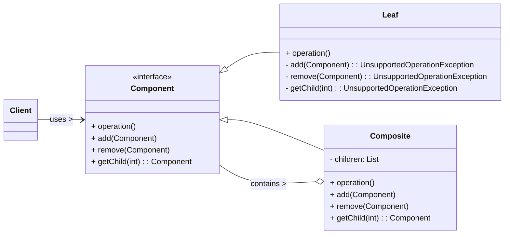

# Composite Design Pattern

The Composite pattern is a **structural design pattern** that allows you to compose objects into tree structures to represent part-whole hierarchies. It enables clients to treat individual objects (leaves) and compositions of objects (composites) uniformly.

-----

## 1\. Problem It Solves / Intent

The Composite pattern addresses the problem of:

  * **Representing Part-Whole Hierarchies:** When you have objects that can be grouped into tree-like structures, where individual objects and groups of objects should be treated similarly (e.g., a file system with files and directories, an organizational chart with employees and departments).
  * **Uniformity for Clients:** To allow clients to treat individual objects and compositions of objects uniformly. This simplifies client code because it doesn't need to distinguish between a single object and a collection of objects when performing operations.
  * **Simplifying Code with Recursion:** To easily apply operations recursively over the entire hierarchy.

Essentially, it's about providing a single interface for both "simple" and "complex" versions of an object.

## 2\. Structure & Participants

The Composite pattern typically involves three main participants:

  * **Component (Interface/Abstract Class):**
      * Declares the interface for objects in the composition.
      * Implements default behavior for the interface common to all classes, as appropriate.
      * Declares an interface for accessing and managing its children (for `Composite` objects).
      * (Optional) Defines an interface for accessing a component's parent in the hierarchy and other related methods.
  * **Leaf:**
      * Represents leaf objects in the composition. Leaves have no children.
      * Implements the `Component` interface.
  * **Composite:**
      * Defines behavior for components having children.
      * Stores child components.
      * Implements child-related operations (like `add`, `remove`, `getChild`) in the `Component` interface.
      * Implements the operations from the `Component` interface by typically delegating them to its children, often performing some additional logic before or after.
  * **Client:**
      * Manipulates objects in the composition through the `Component` interface.
      * Treats individual objects and compositions uniformly.

<!-- end list -->



## 3\. How It Works / Collaboration

1.  **Client interacts with Component:** The client code interacts with objects (both `Leaf` and `Composite`) solely through the generic `Component` interface.
2.  **Operation Delegation:**
      * If the `Component` is a `Leaf`, the requested operation is handled directly by the `Leaf` object itself.
      * If the `Component` is a `Composite`, it typically delegates the operation to all its child `Component`s. The `Composite` may perform some pre- or post-processing logic related to its own responsibilities.
3.  **Recursive Behavior:** This delegation mechanism allows operations to be applied recursively over the entire hierarchy. An operation called on the root of the tree will propagate down to all its children, grandchildren, and so on, until it reaches the leaves.

## 4\. Applicability / When to Use

Use the Composite pattern when:

  * **You want to represent part-whole hierarchies of objects.** Common examples include file systems (files and folders), UI widget trees (buttons, text fields within panels), or organizational charts (employees within departments).
  * **Clients need to ignore the difference between individual objects and compositions of objects.** The goal is to make client code simpler and more uniform, avoiding conditional logic (`if object is a group then... else if object is individual then...`).
  * **The structure can be recursive:** A composite object can contain other composite objects, forming arbitrary complex nested structures.

## 5\. Advantages & Disadvantages

### Advantages:

  * **Uniformity (Transparency):** Clients can treat individual objects (`Leaf`s) and compositions of objects (`Composite`s) uniformly through the common `Component` interface. This greatly simplifies client code.
  * **Flexibility:** Makes it easy to add new types of components (both new `Leaf` types and new `Composite` types) as long as they adhere to the `Component` interface, without modifying existing client code. This aligns with the Open/Closed Principle.
  * **Natural Recursion:** Naturally supports recursive structures and operations. Algorithms that work on individual objects will work just as well on collections of objects.
  * **Simplified Client Code:** Reduces the complexity of client code by eliminating the need for `if/else` statements to differentiate between simple and complex objects.

### Disadvantages:

  * **Design Complexity (Over-generalization):** It can make the design overly general. Sometimes it's hard to restrict the types of components a composite can contain (e.g., ensuring a "LineItem" composite only contains "Product" leaves, not other "LineItem" composites, if that's a business rule).
  * **Runtime Safety (for Transparent approach):** If the `Component` interface declares methods for managing children (e.g., `addChild()`, `removeChild()`), `Leaf` objects might have to provide dummy implementations (e.g., throwing `UnsupportedOperationException`). This provides client uniformity but introduces a risk of runtime errors if the client attempts invalid operations on a `Leaf`. (This is often referred to as the "Transparent Composite" problem.)
  * **Performance Overhead:** For very large hierarchies, recursive traversal might have a performance impact, though typically negligible for most applications.

## 6\. Real-World / Code Examples

Let's model a file system, which is a classic example of a part-whole hierarchy. `File`s are `Leaf` components, and `Directory`s are `Composite` components.

### Java Implementation

```java
import java.util.ArrayList;
import java.util.List;

// 1. Component Interface
interface FileSystemComponent {
    void display(int indent); // Operation common to both files and directories
}

// 2. Leaf
class File implements FileSystemComponent {
    private String name;

    public File(String name) {
        this.name = name;
    }

    @Override
    public void display(int indent) {
        System.out.println("  ".repeat(indent) + "File: " + name);
    }
}

// 3. Composite
class Directory implements FileSystemComponent {
    private String name;
    private List<FileSystemComponent> children;

    public Directory(String name) {
        this.name = name;
        this.children = new ArrayList<>();
    }

    public void addComponent(FileSystemComponent component) {
        children.add(component);
    }

    public void removeComponent(FileSystemComponent component) {
        children.remove(component);
    }

    @Override
    public void display(int indent) {
        System.out.println("  ".repeat(indent) + "Directory: " + name);
        for (FileSystemComponent component : children) {
            component.display(indent + 1); // Recursively call display on children
        }
    }
}

// 4. Client Code
public class CompositeDemo {
    public static void main(String[] args) {
        // Create files
        File file1 = new File("document.txt");
        File file2 = new File("image.jpg");
        File file3 = new File("report.pdf");
        File file4 = new File("config.ini");

        // Create directories
        Directory root = new Directory("Root");
        Directory documents = new Directory("Documents");
        Directory pictures = new Directory("Pictures");
        Directory settings = new Directory("Settings");

        // Build the directory structure
        root.addComponent(documents);
        root.addComponent(pictures);
        root.addComponent(settings);
        root.addComponent(file4); // A file directly in root

        documents.addComponent(file1);
        documents.addComponent(file3);

        pictures.addComponent(file2);

        // Display the entire file system hierarchy
        System.out.println("--- File System Structure ---");
        root.display(0);
        System.out.println("--- End of Structure ---");

        System.out.println("\n--- Removing a file ---");
        documents.removeComponent(file1);
        root.display(0);
        System.out.println("--- End of Structure ---");
    }
}
```

### Python Implementation

Using `abc` (Abstract Base Classes) for the `Component` interface.

```python
from abc import ABC, abstractmethod

# 1. Component Abstract Base Class
class FileSystemComponent(ABC):
    @abstractmethod
    def display(self, indent: int):
        """Displays the component's structure."""
        pass

    # Optional: Methods for child management can be defined here (Transparent Composite)
    # Or only in Composite class (Safe Composite)
    # For transparency, we include them here, but Leaf will raise NotImplementedError
    def add_component(self, component):
        raise NotImplementedError("Cannot add component to a Leaf.")

    def remove_component(self, component):
        raise NotImplementedError("Cannot remove component from a Leaf.")

# 2. Leaf
class File(FileSystemComponent):
    def __init__(self, name: str):
        self.name = name

    def display(self, indent: int):
        print("  " * indent + f"File: {self.name}")

# 3. Composite
class Directory(FileSystemComponent):
    def __init__(self, name: str):
        self.name = name
        self.children = []

    def add_component(self, component: FileSystemComponent):
        self.children.append(component)
        print(f"Added '{component.name if hasattr(component, 'name') else 'component'}' to '{self.name}'.")

    def remove_component(self, component: FileSystemComponent):
        self.children.remove(component)
        print(f"Removed '{component.name if hasattr(component, 'name') else 'component'}' from '{self.name}'.")

    def display(self, indent: int):
        print("  " * indent + f"Directory: {self.name}")
        for component in self.children:
            component.display(indent + 1) # Recursively call display on children

# 4. Client Code
if __name__ == "__main__":
    # Create files
    file1 = File("document.txt")
    file2 = File("image.jpg")
    file3 = File("report.pdf")
    file4 = File("config.ini")

    # Create directories
    root = Directory("Root")
    documents = Directory("Documents")
    pictures = Directory("Pictures")
    settings = Directory("Settings")

    # Build the directory structure
    root.add_component(documents)
    root.add_component(pictures)
    root.add_component(settings)
    root.add_component(file4) # A file directly in root

    documents.add_component(file1)
    documents.add_component(file3)

    pictures.add_component(file2)

    # Display the entire file system hierarchy
    print("--- File System Structure ---")
    root.display(0)
    print("--- End of Structure ---")

    print("\n--- Removing a file ---")
    documents.remove_component(file1)
    root.display(0)
    print("--- End of Structure ---")

    # This would cause an error for a File (Leaf) if add_component was called:
    # try:
    #     file1.add_component(file2)
    # except NotImplementedError as e:
    #     print(f"\nAttempted to add component to a file: {e}")
```

## 7\. Related Patterns

  * **Decorator:** Both Composite and Decorator use recursive composition. However, Decorator is about adding *additional responsibilities* to individual objects dynamically while maintaining the same interface. Composite is about treating individual objects and *collections of objects* uniformly. They can be used together: a component in a Composite structure might be decorated.
  * **Chain of Responsibility:** Often used with Composite. A request might travel up or down a composite structure (e.g., event propagation in a UI hierarchy).
  * **Iterator:** Can be used to traverse the components of a composite structure, providing a way to iterate over both leaves and composites without exposing the internal structure.
  * **Visitor:** Can be used to perform operations on all components of a composite structure without embedding those operations in the components themselves. This is useful when you need to add new operations frequently without modifying the existing component classes.

## 8\. Underlying Principles

The Composite pattern strongly adheres to:

  * **Single Responsibility Principle (SRP):** Each component (Leaf or Composite) has the responsibility to manage its own part of the hierarchy and perform its specific operation.
  * **Open/Closed Principle (OCP):** New types of `Leaf` or `Composite` classes can be added without modifying the existing client code, as long as they implement the `Component` interface. The system is open for extension but closed for modification.
  * **Liskov Substitution Principle (LSP):** Clients can substitute `Leaf` objects for `Composite` objects and vice versa, as long as they interact via the `Component` interface, because both types behave uniformly when accessed through that interface.

## 9\. Variations & Idioms

  * **Transparent Composite (More Common):** The `Component` interface declares *all* methods, including child management operations (e.g., `addChild`, `removeChild`). This provides maximum uniformity for the client, allowing it to treat all components generically. The downside is that `Leaf` objects must provide dummy implementations or throw `UnsupportedOperationException` for child-related methods, which can lead to runtime errors if misused.
  * **Safe Composite:** Child management operations are declared only in the `Composite` class (or an interface/abstract class that `Composite` implements, which `Leaf` does not). This provides runtime safety (no invalid operations on leaves) but sacrifices some client uniformity, as the client needs to know if it's interacting with a `Composite` to perform child-related operations.
  * **Parent References:** Components often hold a reference to their parent in the hierarchy to allow for upward traversal or specific parent-child interactions.
  * **Shared Components:** In some cases, leaf objects (or even composite objects) can be shared between different composite structures using flyweight pattern principles, to save memory.

## 10\. When NOT to Use / Potential Misuses

  * **When you don't have a part-whole hierarchy:** If your objects don't naturally form a tree-like structure where individual items and groups should be treated uniformly, the Composite pattern is not appropriate.
  * **When the distinction between individual objects and groups is significant to the client:** If your client code frequently needs to differentiate between `Leaf` and `Composite` to apply different logic, the uniformity provided by the pattern might add unnecessary complexity rather than simplifying it. In such cases, direct differentiation might be clearer.
  * **When the uniformity provided by the pattern adds unnecessary complexity for a simple, flat structure:** For very simple collections that are not hierarchical, a standard collection (like a list or set) might be sufficient.
  * **When the `UnsupportedOperationException` (in Transparent Composite) becomes a frequent problem:** If clients are constantly trying to add children to leaves or perform other invalid operations, the "transparent" approach might lead to more runtime errors than benefits. Consider the Safe Composite variation or a different pattern.

-----
