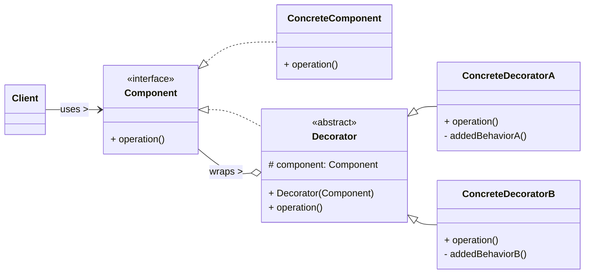

# Decorator Design Pattern

The Decorator pattern is a **structural design pattern** that allows behavior to be added to individual objects dynamically, without affecting the behavior of other objects from the same class. It provides a flexible alternative to subclassing for extending functionality.

-----

## 1\. Problem It Solves / Intent

The Decorator pattern addresses the problem of:

  * **Adding Responsibilities Dynamically:** When you need to add responsibilities to individual objects, not to an entire class. Subclassing adds responsibilities to *all* instances of a class, and it's static at compile time.
  * **Avoiding Class Explosion:** When extending functionality using inheritance leads to a combinatorial explosion of subclasses. For example, if you have a `Window` and want to add `Scrollbar`, `Border`, `StatusBar` in various combinations (e.g., `WindowWithScrollbar`, `WindowWithBorder`, `WindowWithScrollbarAndBorder`, `WindowWithScrollbarAndBorderAndStatusBar`, etc.), this quickly becomes unmanageable.
  * **Flexible Functionality Combination:** To enable combining several behaviors in different ways.
  * **Maintaining Interface:** To add functionality while keeping the object's interface unchanged, so clients can use the decorated object in the same way they would use an undecorated one.

Essentially, the Decorator pattern provides a way to "wrap" an object to enhance its behavior without changing its core structure.

## 2\. Structure & Participants

The Decorator pattern typically involves four main participants:

  * **Component (Interface/Abstract Class):**
      * Defines the interface for objects that can have responsibilities added to them. This is the common interface that both concrete components and decorators will implement.
  * **Concrete Component:**
      * The original object to which responsibilities can be added.
      * Implements the `Component` interface.
  * **Decorator (Abstract Class):**
      * Maintains a reference to a `Component` object (the "wrapped" object).
      * Conforms to the `Component` interface.
      * It's a `Component` itself, allowing for recursive wrapping (a decorator can wrap another decorator).
  * **Concrete Decorator:**
      * Implements specific added responsibilities.
      * It overrides the `Component` methods and typically delegates to the wrapped `Component`'s method, adding its own behavior before or after the delegation.

<!-- end list -->



## 3\. How It Works / Collaboration

1.  **Client creates Concrete Component:** The client code instantiates a `Concrete Component` object, which is the basic object that will be decorated.
2.  **Client wraps with Decorators:** The client then wraps this `Concrete Component` with one or more `Concrete Decorator` instances. Each `Decorator` is initialized with the `Component` (or another `Decorator`) it is supposed to wrap.
3.  **Request Delegation and Enhancement:** When the client calls a method on the outermost `Decorator`:
      * The `Decorator` performs its specific added behavior.
      * It then delegates the call to its wrapped `Component` (which could be another `Decorator` or the original `Concrete Component`).
      * This process continues down the chain until the original `Concrete Component` performs its basic operation.
      * Results can be processed back up the chain.
4.  **Recursive Wrapping:** Because `Decorators` and `Concrete Components` all conform to the `Component` interface, they can be nested recursively, allowing for arbitrary combinations of behaviors.

## 4\. Applicability / When to Use

Use the Decorator pattern when:

  * **You need to add responsibilities to individual objects dynamically and transparently, without affecting other objects from the same class.**
  * **It's impractical to extend functionality by subclassing.** This happens when:
      * The number of possible independent extensions is large, leading to a "class explosion" (many subclasses for every combination of features).
      * The extension needs to be added at runtime.
  * **An object's responsibilities might need to be removed.** Decorators can be "unwrapped" if the reference to the original component is maintained.
  * **You want to combine several behaviors in different ways.**

## 5\. Advantages & Disadvantages

### Advantages:

  * **Flexible Functionality Extension:** Adds responsibilities to individual objects dynamically at runtime, providing much more flexibility than static inheritance.
  * **Avoids Class Explosion:** Provides a powerful alternative to inheritance for combining behaviors, significantly reducing the number of classes needed compared to creating a subclass for every possible feature combination.
  * **Adheres to Single Responsibility Principle (SRP):** Each concrete decorator typically focuses on a single concern or responsibility, making classes smaller and more maintainable.
  * **Transparency:** Clients can use decorated objects just like undecorated ones, as they both conform to the `Component` interface. The client doesn't need to know about the decorators.
  * **Loose Coupling:** Components are loosely coupled from their decorators.

### Disadvantages:

  * **Increased Complexity:** Can result in a large number of small, similar classes, especially if many decorators are involved, which might make the system harder to understand and debug.
  * **Order Dependency:** The order in which decorators are wrapped around a component can matter if their added responsibilities are order-dependent.
  * **Difficulty of Identity:** Two decorated objects with the same original component and the same set of decorators might not be considered equal if equality is based on object identity (reference equality) rather than value equality.
  * **Initialization Overhead:** If an object requires many layers of decorators, its creation can involve many lines of code and nested constructor calls.
  * **Breaking `==` or `hashCode()`/`equals()`:** If these methods are not carefully managed, decorators can inadvertently break their contracts.

## 6\. Real-World / Code Examples

Let's use the classic example of a coffee ordering system, where you start with a basic coffee and add various condiments.

### Java Implementation

```java
// 1. Component Interface
interface Coffee {
    String getDescription();
    double getCost();
}

// 2. Concrete Component
class BasicCoffee implements Coffee {
    @Override
    public String getDescription() {
        return "Simple Coffee";
    }

    @Override
    public double getCost() {
        return 5.0;
    }
}

// 3. Decorator Abstract Class
abstract class CoffeeDecorator implements Coffee {
    protected Coffee decoratedCoffee;

    public CoffeeDecorator(Coffee coffee) {
        this.decoratedCoffee = coffee;
    }

    // Default implementations that delegate to the decorated object
    @Override
    public String getDescription() {
        return decoratedCoffee.getDescription();
    }

    @Override
    public double getCost() {
        return decoratedCoffee.getCost();
    }
}

// 4. Concrete Decorators
class MilkDecorator extends CoffeeDecorator {
    public MilkDecorator(Coffee coffee) {
        super(coffee);
    }

    @Override
    public String getDescription() {
        return super.getDescription() + ", with Milk";
    }

    @Override
    public double getCost() {
        return super.getCost() + 1.5; // Add cost of milk
    }
}

class SugarDecorator extends CoffeeDecorator {
    public SugarDecorator(Coffee coffee) {
        super(coffee);
    }

    @Override
    public String getDescription() {
        return super.getDescription() + ", with Sugar";
    }

    @Override
    public double getCost() {
        return super.getCost() + 0.5; // Add cost of sugar
    }
}

class WhippedCreamDecorator extends CoffeeDecorator {
    public WhippedCreamDecorator(Coffee coffee) {
        super(coffee);
    }

    @Override
    public String getDescription() {
        return super.getDescription() + ", with Whipped Cream";
    }

    @Override
    public double getCost() {
        return super.getCost() + 2.0; // Add cost of whipped cream
    }
}

// Client Code
public class DecoratorDemo {
    public static void main(String[] args) {
        // Order a basic coffee
        Coffee coffee = new BasicCoffee();
        System.out.println("Order 1: " + coffee.getDescription() + " - $" + coffee.getCost());

        System.out.println("---");

        // Order a coffee with milk
        Coffee coffeeWithMilk = new MilkDecorator(new BasicCoffee());
        System.out.println("Order 2: " + coffeeWithMilk.getDescription() + " - $" + coffeeWithMilk.getCost());

        System.out.println("---");

        // Order a coffee with milk and sugar (nested decorators)
        Coffee coffeeWithMilkAndSugar = new SugarDecorator(new MilkDecorator(new BasicCoffee()));
        System.out.println("Order 3: " + coffeeWithMilkAndSugar.getDescription() + " - $" + coffeeWithMilkAndSugar.getCost());

        System.out.println("---");

        // Order a coffee with milk, sugar, and whipped cream
        Coffee fancyCoffee = new WhippedCreamDecorator(
                                new SugarDecorator(
                                    new MilkDecorator(
                                        new BasicCoffee()
                                    )
                                )
                            );
        System.out.println("Order 4: " + fancyCoffee.getDescription() + " - $" + fancyCoffee.getCost());
    }
}
```

**Common Java Library Examples:**

  * **`java.io` package:** This is the quintessential example. `InputStream`, `OutputStream`, `Reader`, `Writer` are `Component` interfaces. `FileInputStream`, `ByteArrayInputStream` are `Concrete Components`. `BufferedInputStream`, `GZIPInputStream`, `CipherInputStream` are `Concrete Decorators` that wrap other `InputStreams` to add buffering, compression, or encryption functionality.
  * `javax.swing.JScrollPane` (conceptually similar, though not a strict GoF Decorator class-wise, it wraps a component to add scrollability).

### Python Implementation

Using `abc` (Abstract Base Classes) for the Component and Decorator interfaces.

```python
from abc import ABC, abstractmethod

# 1. Component Abstract Base Class
class Coffee(ABC):
    @abstractmethod
    def get_description(self) -> str:
        pass

    @abstractmethod
    def get_cost(self) -> float:
        pass

# 2. Concrete Component
class BasicCoffee(Coffee):
    def get_description(self) -> str:
        return "Simple Coffee"

    def get_cost(self) -> float:
        return 5.0

# 3. Decorator Abstract Base Class
class CoffeeDecorator(Coffee, ABC): # Inherit from Coffee to maintain interface
    def __init__(self, coffee: Coffee):
        self._decorated_coffee = coffee

    # Default implementations that delegate to the decorated object
    def get_description(self) -> str:
        return self._decorated_coffee.get_description()

    def get_cost(self) -> float:
        return self._decorated_coffee.get_cost()

# 4. Concrete Decorators
class MilkDecorator(CoffeeDecorator):
    def __init__(self, coffee: Coffee):
        super().__init__(coffee)

    def get_description(self) -> str:
        return super().get_description() + ", with Milk"

    def get_cost(self) -> float:
        return super().get_cost() + 1.5

class SugarDecorator(CoffeeDecorator):
    def __init__(self, coffee: Coffee):
        super().__init__(coffee)

    def get_description(self) -> str:
        return super().get_description() + ", with Sugar"

    def get_cost(self) -> float:
        return super().get_cost() + 0.5

class WhippedCreamDecorator(CoffeeDecorator):
    def __init__(self, coffee: Coffee):
        super().__init__(coffee)

    def get_description(self) -> str:
        return super().get_description() + ", with Whipped Cream"

    def get_cost(self) -> float:
        return super().get_cost() + 2.0

# Client Code
if __name__ == "__main__":
    # Order a basic coffee
    coffee = BasicCoffee()
    print(f"Order 1: {coffee.get_description()} - ${coffee.get_cost():.2f}")

    print("---")

    # Order a coffee with milk
    coffee_with_milk = MilkDecorator(BasicCoffee())
    print(f"Order 2: {coffee_with_milk.get_description()} - ${coffee_with_milk.get_cost():.2f}")

    print("---")

    # Order a coffee with milk and sugar (nested decorators)
    coffee_with_milk_and_sugar = SugarDecorator(MilkDecorator(BasicCoffee()))
    print(f"Order 3: {coffee_with_milk_and_sugar.get_description()} - ${coffee_with_milk_and_sugar.get_cost():.2f}")

    print("---")

    # Order a coffee with milk, sugar, and whipped cream
    fancy_coffee = WhippedCreamDecorator(
                        SugarDecorator(
                            MilkDecorator(
                                BasicCoffee()
                            )
                        )
                    )
    print(f"Order 4: {fancy_coffee.get_description()} - ${fancy_coffee.get_cost():.2f}")

```

## 7\. Related Patterns

  * **Adapter:** Both wrap an object. Adapter *changes the interface* of an object to match another one. Decorator *adds behavior* to an object while maintaining the *same interface*.
  * **Composite:** Both use recursive composition to organize a changing number of objects. Composite builds *tree structures* of simple and complex objects and allows clients to treat them uniformly. Decorator focuses on *adding responsibilities* to individual objects dynamically. Often, a component within a Composite structure might itself be decorated.
  * **Strategy:** Both involve changing behavior. Strategy focuses on interchangeable *algorithms* or behaviors that can be swapped out at runtime. Decorator focuses on adding *new features* or responsibilities that enhance an object's existing behavior.
  * **Proxy:** Both wrap an object and have the same interface as the wrapped object. Proxy controls *access* to an object (e.g., lazy loading, security, remote access). Decorator adds *behavior* to an object.
  * **Facade:** Provides a *simplified* interface to a complex subsystem. A Decorator enhances a single object; a Facade simplifies interaction with a system of multiple objects.

## 8\. Underlying Principles

The Decorator pattern strongly adheres to:

  * **Single Responsibility Principle (SRP):** Each concrete decorator typically focuses on adding one specific responsibility or feature. This keeps classes small, focused, and easier to maintain.
  * **Open/Closed Principle (OCP):** New responsibilities can be added by creating new `Concrete Decorator` classes without modifying existing `Component` or `Decorator` classes. The system is open for extension with new features but closed for modification of existing code.
  * **Liskov Substitution Principle (LSP):** Clients can use decorated objects anywhere an undecorated `Component` is expected, because both adhere to the `Component` interface.

## 9\. Variations & Idioms

  * **`java.io` Package:** As mentioned, this is a prime example of the Decorator pattern in practice, demonstrating how various functionalities (buffering, compression, encryption) can be layered on top of basic input/output streams.
  * **Fluent API for Decorators:** While not inherently part of the Decorator pattern, some implementations might combine it with a Fluent Interface (method chaining) to make the wrapping process more concise, though this is more typical for Builder patterns.
  * **Order of Decorators:** The sequence in which decorators are applied can significantly impact the final behavior and might be crucial for correct functionality. For example, encrypting data *before* compressing it.
  * **Function Decorators (Python-specific):** Python's `@decorator` syntax provides a built-in language feature that implements a form of the Decorator pattern for functions or methods, allowing them to be wrapped and have their behavior modified or enhanced.

## 10\. When NOT to Use / Potential Misuses

  * **When functionality needs to be added to *all* instances of a class:** If a responsibility is truly common to all instances, adding it via inheritance (if feasible) or a mixin (in languages like Python) might be simpler.
  * **When adding behavior is simple and static:** For very simple, unchanging additions, a subclass might be sufficient and less verbose.
  * **When the order of decorator application is always fixed and simple:** If there's no need for dynamic reordering or selection, a simpler approach might be adequate.
  * **When too many layers of decorators lead to complex debugging or performance issues:** A deep chain of decorators can sometimes make it harder to trace method calls and might introduce a slight performance overhead for each layer.
  * **When you need to access a specific method of a specific decorator:** The transparency of the Decorator pattern means the client typically only interacts with the `Component` interface. If you need to call a method *specific* to a certain decorator in the chain, you would have to downcast, defeating some of the pattern's benefits.

-----
