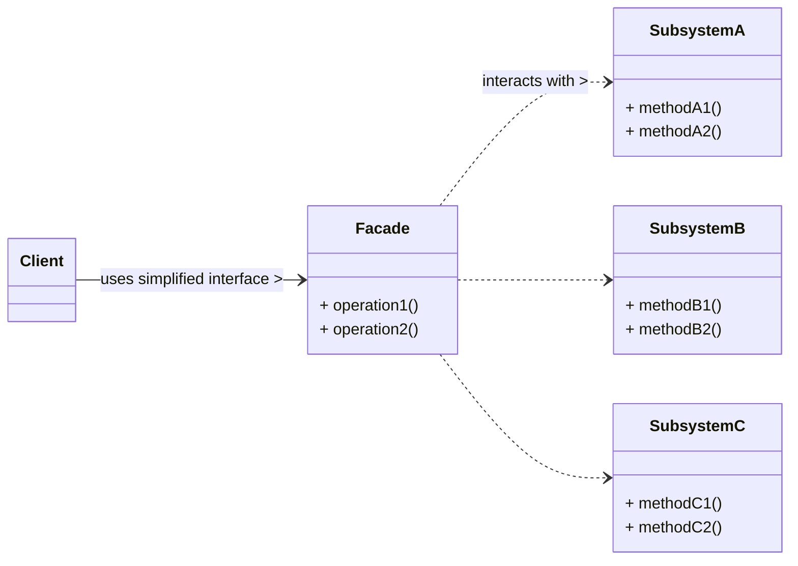

# Facade Design Pattern

The Facade pattern is a **structural design pattern** that provides a simplified, unified interface to a complex subsystem. It acts as a "front-facing" object that hides the complexities of the subsystem from the client, making the system easier to use.

-----

## 1\. Problem It Solves / Intent

The Facade pattern addresses the problem of:

  * **Hiding Complexity:** When a system is composed of a large number of interconnected classes (a "subsystem"), and direct interaction with all these classes is complex, error-prone, or overwhelming for the client.
  * **Decoupling:** To decouple the client from the implementation details of a subsystem. The client should not need to know about the internal workings, dependencies, or interactions of the subsystem's components.
  * **Simplifying Usage:** To provide a simple, high-level interface that is easy to understand and use for common tasks, without exposing all the low-level functionalities.
  * **Layering:** To organize a system into layers, where a facade can define the entry point to each layer, thus enforcing architectural separation.

Essentially, the Facade provides a "single window" to a complex set of operations, reducing cognitive load on the client.

## 2\. Structure & Participants

The Facade pattern typically involves three main participants:

  * **Facade:**
      * Provides a simple, high-level interface to the complex subsystem.
      * It knows which subsystem classes are responsible for a client's request.
      * It delegates client requests to appropriate objects within the subsystem, orchestrating their interactions.
      * It does *not* add new functionality but rather simplifies existing functionality.
  * **Subsystem Classes:**
      * The individual classes that make up the complex subsystem.
      * They perform the actual work, but they are not aware of the facade.
      * Clients do not interact with these classes directly; all communication goes through the `Facade`.
  * **Client:**
      * Uses the `Facade` to interact with the subsystem.
      * It remains unaware of the complexities and individual components of the subsystem.

<!-- end list -->



## 3\. How It Works / Collaboration

1.  **Client interacts with Facade:** The `Client` creates an instance of the `Facade` and makes requests by calling its simplified methods.
2.  **Facade Delegates:** The `Facade` intercepts these high-level requests.
3.  **Facade Orchestrates:** The `Facade` then translates these requests into calls to the appropriate `Subsystem Classes`. It orchestrates the interactions between multiple subsystem objects to fulfill the client's single high-level request. This might involve calling several methods on several different subsystem objects in a specific sequence.
4.  **Client Decoupled:** The `Client` never directly interacts with the `Subsystem Classes`. This means the client is decoupled from the internal structure and complexity of the subsystem. If the subsystem's internal implementation changes, only the `Facade` needs to be updated, not the client code.

## 4\. Applicability / When to Use

Use the Facade pattern when:

  * **You want to provide a simple, unified interface to a complex or sprawling set of classes in a subsystem.** This is the most common reason.
  * **You want to decouple the client from the implementation details of a subsystem.** This reduces dependencies and makes the subsystem more independent and reusable.
  * **You want to layer a system.** A facade can define an entry point to each layer, helping to enforce clean architectural boundaries and prevent components from one layer directly accessing components from deeper layers.
  * **You want to provide a limited or specific view of the subsystem's capabilities.** The facade can expose only a subset of the subsystem's full functionality.

## 5\. Advantages & Disadvantages

### Advantages:

  * **Simplifies Client Interface:** Reduces complexity for the client by hiding the intricacies of the subsystem. Clients only interact with a single, easy-to-use interface.
  * **Decouples Client from Subsystem:** Reduces coupling between the client and the subsystem's many components. This makes the subsystem easier to manage, modify, and even replace without impacting client code.
  * **Promotes Layering:** Helps organize a system into distinct layers, improving the overall structure and maintainability.
  * **Improved Readability and Maintainability:** The system becomes easier to understand and use for new developers, and changes within the subsystem are less likely to break client code.
  * **Reduces Learning Curve:** New developers can quickly start using the system through the simplified facade without needing to understand all the underlying components.

### Disadvantages:

  * **Potential for "God Object":** If the facade tries to do too much and takes on responsibilities that go beyond simply delegating to the subsystem (e.g., adding business logic), it can become a large, overly complex "God Object," violating the Single Responsibility Principle.
  * **Reduced Flexibility (for advanced users):** For clients who require fine-grained control or direct access to specific subsystem components, the simplified interface of the facade might be too restrictive. They would have to bypass the facade, which might defeat its purpose.
  * **Can Obscure Subsystem Design:** While it simplifies for basic users, it might hide the underlying design and full capabilities of the subsystem from those who need to understand it deeply for maintenance or extension.
  * **Maintenance Bottleneck:** If the complexity of the subsystem frequently changes in ways that require constant updates to the facade, the facade itself can become a maintenance bottleneck.

## 6\. Real-World / Code Examples

Let's consider a home theater system with various components (projector, amplifier, lights, DVD player, screen). A client wants to perform high-level actions like "watch movie" or "end movie."

### Java Implementation

```java
// Subsystem Classes
class Amplifier {
    public void on() { System.out.println("Amplifier On"); }
    public void off() { System.out.println("Amplifier Off"); }
    public void setDvd(DvdPlayer dvd) { System.out.println("Amplifier set to DVD Player"); }
    public void setVolume(int volume) { System.out.println("Amplifier volume set to " + volume); }
}

class DvdPlayer {
    public void on() { System.out.println("DVD Player On"); }
    public void off() { System.out.println("DVD Player Off"); }
    public void play(String movie) { System.out.println("Playing movie: " + movie); }
    public void stop() { System.out.println("DVD Player stopped"); }
    public void eject() { System.out.println("DVD Player ejected disc"); }
}

class Projector {
    public void on() { System.out.println("Projector On"); }
    public void off() { System.out.println("Projector Off"); }
    public void wideScreenMode() { System.out.println("Projector in widescreen mode"); }
}

class TheaterLights {
    public void dim(int level) { System.out.println("Theater lights dimming to " + level + "%"); }
    public void on() { System.out.println("Theater lights On"); }
}

class Screen {
    public void down() { System.out.println("Theater Screen Down"); }
    public void up() { System.out.println("Theater Screen Up"); }
}

// Facade
class HomeTheaterFacade {
    Amplifier amp;
    DvdPlayer dvd;
    Projector projector;
    TheaterLights lights;
    Screen screen;

    public HomeTheaterFacade(Amplifier amp, DvdPlayer dvd,
                             Projector projector, TheaterLights lights, Screen screen) {
        this.amp = amp;
        this.dvd = dvd;
        this.projector = projector;
        this.lights = lights;
        this.screen = screen;
    }

    public void watchMovie(String movie) {
        System.out.println("\nGet ready to watch a movie...");
        lights.dim(10);
        screen.down();
        projector.on();
        projector.wideScreenMode();
        amp.on();
        amp.setDvd(dvd);
        amp.setVolume(5);
        dvd.on();
        dvd.play(movie);
    }

    public void endMovie() {
        System.out.println("\nShutting down movie theater...");
        dvd.stop();
        dvd.eject();
        dvd.off();
        amp.off();
        projector.off();
        screen.up();
        lights.on();
    }
}

// Client Code
public class FacadeDemo {
    public static void main(String[] args) {
        Amplifier amp = new Amplifier();
        DvdPlayer dvd = new DvdPlayer();
        Projector projector = new Projector();
        TheaterLights lights = new TheaterLights();
        Screen screen = new Screen();

        HomeTheaterFacade homeTheater = new HomeTheaterFacade(amp, dvd, projector, lights, screen);

        homeTheater.watchMovie("Inception");
        homeTheater.endMovie();
    }
}
```

### Python Implementation

```python
# Subsystem Classes
class Amplifier:
    def on(self):
        print("Amplifier On")
    def off(self):
        print("Amplifier Off")
    def set_dvd(self, dvd_player):
        print("Amplifier set to DVD Player")
    def set_volume(self, volume: int):
        print(f"Amplifier volume set to {volume}")

class DvdPlayer:
    def on(self):
        print("DVD Player On")
    def off(self):
        print("DVD Player Off")
    def play(self, movie: str):
        print(f"Playing movie: {movie}")
    def stop(self):
        print("DVD Player stopped")
    def eject(self):
        print("DVD Player ejected disc")

class Projector:
    def on(self):
        print("Projector On")
    def off(self):
        print("Projector Off")
    def wide_screen_mode(self):
        print("Projector in widescreen mode")

class TheaterLights:
    def dim(self, level: int):
        print(f"Theater lights dimming to {level}%")
    def on(self):
        print("Theater lights On")

class Screen:
    def down(self):
        print("Theater Screen Down")
    def up(self):
        print("Theater Screen Up")

# Facade
class HomeTheaterFacade:
    def __init__(self, amp: Amplifier, dvd: DvdPlayer, projector: Projector, lights: TheaterLights, screen: Screen):
        self._amp = amp
        self._dvd = dvd
        self._projector = projector
        self._lights = lights
        self._screen = screen

    def watch_movie(self, movie: str):
        print("\nGet ready to watch a movie...")
        self._lights.dim(10)
        self._screen.down()
        self._projector.on()
        self._projector.wide_screen_mode()
        self._amp.on()
        self._amp.set_dvd(self._dvd)
        self._amp.set_volume(5)
        self._dvd.on()
        self._dvd.play(movie)

    def end_movie(self):
        print("\nShutting down movie theater...")
        self._dvd.stop()
        self._dvd.eject()
        self._dvd.off()
        self._amp.off()
        self._projector.off()
        self._screen.up()
        self._lights.on()

# Client Code
if __name__ == "__main__":
    amp = Amplifier()
    dvd = DvdPlayer()
    projector = Projector()
    lights = TheaterLights()
    screen = Screen()

    home_theater = HomeTheaterFacade(amp, dvd, projector, lights, screen)

    home_theater.watch_movie("Inception")
    home_theater.end_movie()
```

## 7\. Related Patterns

  * **Adapter:** Both simplify interaction. Adapter *changes the interface* of an existing class to match a *different* expected interface. Facade provides a *simplified, high-level* interface to an *entire subsystem* without changing the original interfaces of subsystem classes. Adapter is about incompatibility; Facade is about simplification.
  * **Mediator:** Both patterns try to centralize control over collaborating objects. Mediator centralizes communication between *peers* to avoid direct dependencies between them. Facade simplifies the interface *from clients to a subsystem*. Facade is about simplifying the *structure* for clients; Mediator is about simplifying *behavioral interactions* between internal components.
  * **Singleton:** A `Facade` class might be implemented as a Singleton if only one instance is needed to manage a particular subsystem or if it represents a global point of access.
  * **Abstract Factory:** A `Facade` might be used in conjunction with an Abstract Factory to provide a simplified interface for creating families of related objects within a complex subsystem.
  * **Composite:** A Facade might be used to simplify interaction with a complex object composite structure.

## 8\. Underlying Principles

The Facade pattern strongly adheres to:

  * **Law of Demeter (Principle of Least Knowledge):** The client interacts only with the facade, not directly with the many complex subsystem objects. This reduces knowledge dependencies and promotes loose coupling.
  * **Single Responsibility Principle (SRP):** The facade has the single responsibility of providing a simplified interface to the subsystem. It delegates the actual work to the subsystem classes, which maintain their own responsibilities.
  * **Loose Coupling:** Decouples the client from the many components within the subsystem. Changes within the subsystem are less likely to impact the client.

## 9\. Variations & Idioms

  * **Multiple Facades:** A very complex system might have multiple facades, each providing a different view or set of operations tailored for different client needs or different layers of the system.
  * **Configurable Facades:** Facades can be made more flexible by allowing them to be configured with different subsystem components at runtime, often using Dependency Injection.
  * **Internal Facades:** Sometimes, facades are used internally within a large system to manage inter-module dependencies and provide clean interfaces between major modules, even if these are not directly exposed to external clients.
  * **Simplified API for an SDK/Library:** Many SDKs or libraries use a Facade to provide an easy-to-use entry point for common operations, while still allowing advanced users to access the underlying complex API.

## 10\. When NOT to Use / Potential Misuses

  * **When the subsystem is already simple:** If the underlying system doesn't have significant complexity or a large number of interacting classes, introducing a facade adds unnecessary overhead without providing much benefit.
  * **When clients frequently need fine-grained control:** If a significant portion of clients regularly need direct access to individual subsystem components or their low-level functionalities, the facade might only get in the way. In such cases, provide direct access alongside an optional facade for common use cases.
  * **When the facade becomes too large ("God Object"):** If the facade starts accumulating too many unrelated responsibilities or becomes a dumping ground for all interactions with the subsystem, it violates SRP and becomes a maintenance nightmare.
  * **When the complexity of the subsystem changes frequently in ways that require constant updates to the facade:** If the facade becomes a bottleneck for changes due to frequent updates to the underlying subsystem's interfaces, its benefits might be negated.

-----
