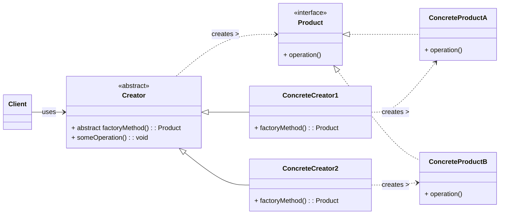

# Factory Method Design Pattern

The Factory Method pattern is a **creational design pattern** that defines an interface for creating an object, but lets subclasses decide which class to instantiate. The Factory Method lets a class defer instantiation to subclasses.

-----

## 1\. Problem It Solves / Intent

The Factory Method pattern addresses the problem of:

  * **Decoupling Object Creation:** When a class cannot anticipate the class of objects it must create, or when a class wants its subclasses to specify the objects it creates.
  * **Avoiding Tight Coupling:** Prevents the client code from being tightly coupled to specific concrete product classes. Instead of instantiating concrete classes directly using `new`, the client relies on a factory method that a subclass implements.
  * **Enabling Extensibility:** Allows you to introduce new types of products without altering the client code that uses the factory.

Essentially, it solves the problem of "how do I create objects where the exact type to be created is determined at runtime or by a subclass, without changing the client code?"

## 2\. Structure & Participants

The Factory Method pattern consists of four main participants:

  * **Product (Interface/Abstract Class):** Defines the interface of objects the factory method creates. This is what the client works with.
  * **Concrete Product:** Implements the `Product` interface. These are the actual objects created by the factory method.
  * **Creator (Abstract Class/Interface):**
      * Declares the factory method, which returns an object of type `Product`.
      * May also define default implementations for the factory method or other operations that call the factory method.
  * **Concrete Creator:** Overrides the factory method to return an instance of a `Concrete Product`.

<!-- end list -->



## 3\. How It Works / Collaboration

1.  The `Creator` (or `ConcreteCreator`) defines an operation (`someOperation` in the diagram) that requires an object of `Product` type. Instead of directly instantiating a `ConcreteProduct`, it calls its `factoryMethod()`.
2.  The `factoryMethod()` is declared in the `Creator` (often as an abstract method) but its actual implementation is left to `ConcreteCreator` subclasses.
3.  Each `ConcreteCreator` subclass overrides `factoryMethod()` to return a specific `ConcreteProduct` instance that it is responsible for creating.
4.  The client code interacts only with the `Creator` and `Product` interfaces, remaining unaware of the specific `ConcreteCreator` or `ConcreteProduct` being used. This provides flexibility and extensibility.

## 4\. Applicability / When to Use

Use the Factory Method pattern when:

  * **A class can't anticipate the class of objects it must create.** For example, a framework that processes documents might not know in advance what specific document types (e.g., PDF, Word, Spreadsheet) it needs to handle.
  * **A class wants its subclasses to specify the objects it creates.** This allows the subclasses to customize the object creation process.
  * **Classes delegate responsibility for object creation to one of several helper subclasses, and you want to localize the knowledge of which helper subclass is the delegate.** This centralizes creation logic for specific product types.
  * **You want to separate object creation from the client code** to promote loose coupling and adhere to the Open/Closed Principle.

## 5\. Advantages & Disadvantages

### Advantages:

  * **Loose Coupling:** The client code is decoupled from the concrete product classes. It only depends on the `Product` interface and the `Creator` interface. This makes the system more flexible.
  * **Extensibility:** New `ConcreteProduct` types can be added without modifying the existing `Creator` classes or client code. You just create a new `ConcreteProduct` and a new `ConcreteCreator`.
  * **Adherence to Open/Closed Principle (OCP):** The system is "open for extension" (new products/creators can be added) but "closed for modification" (existing client code or `Creator` logic doesn't need to change).
  * **Adherence to Single Responsibility Principle (SRP):** Each creator subclass is responsible for creating its specific product, separating creation logic from other business logic.
  * **Framework Creation:** It's a cornerstone for building extensible frameworks where a framework defines the common logic, but application-specific details (like object creation) are delegated to concrete implementations.

### Disadvantages:

  * **Increased Complexity:** Introduces more classes (a `Product` interface, multiple `ConcreteProduct` classes, a `Creator` interface/abstract class, and multiple `ConcreteCreator` classes) even for simple scenarios.
  * **Parallel Class Hierarchies:** Often requires maintaining parallel class hierarchies for `Creator`s and `Product`s, which can be cumbersome as the number of product types grows.
  * **Overkill for Simple Cases:** For a very small number of product types that are unlikely to change, the overhead of the Factory Method might not be justified; a simple static factory method might suffice.

## 6\. Real-World / Code Examples

### Java Implementation

Consider a logging framework where different loggers (e.g., File Logger, Console Logger, Database Logger) need to be created based on configuration or runtime conditions.

```java
// 1. Product Interface
interface Logger {
    void log(String message);
}

// 2. Concrete Products
class FileLogger implements Logger {
    @Override
    public void log(String message) {
        System.out.println("Logging to File: " + message);
        // Logic to write to a file
    }
}

class ConsoleLogger implements Logger {
    @Override
    public void log(String message) {
        System.out.println("Logging to Console: " + message);
    }
}

class DatabaseLogger implements Logger {
    @Override
    public void log(String message) {
        System.out.println("Logging to Database: " + message);
        // Logic to write to a database
    }
}

// 3. Creator Abstract Class
abstract class LoggerFactory {
    // The factory method
    public abstract Logger createLogger();

    // An operation that uses the factory method
    public void writeLog(String message) {
        Logger logger = createLogger(); // Calls the factory method
        logger.log(message);
    }
}

// 4. Concrete Creators
class FileLoggerFactory extends LoggerFactory {
    @Override
    public Logger createLogger() {
        return new FileLogger();
    }
}

class ConsoleLoggerFactory extends LoggerFactory {
    @Override
    public Logger createLogger() {
        return new ConsoleLogger();
    }
}

class DatabaseLoggerFactory extends LoggerFactory {
    @Override
    public Logger createLogger() {
        return new DatabaseLogger();
    }
}

// Client Code
public class LoggerFactoryDemo {
    public static void main(String[] args) {
        LoggerFactory factory1 = new FileLoggerFactory();
        factory1.writeLog("This is a file log message.");

        LoggerFactory factory2 = new ConsoleLoggerFactory();
        factory2.writeLog("This is a console log message.");

        LoggerFactory factory3 = new DatabaseLoggerFactory();
        factory3.writeLog("This is a database log message.");
    }
}
```

**Common Java Library Examples:**

  * `java.util.Calendar.getInstance()`: Returns a `Calendar` object based on the default locale and time zone, but the exact subclass (e.g., `GregorianCalendar`) is determined at runtime.
  * `java.text.NumberFormat.getInstance()`: Returns a `NumberFormat` object, whose concrete type depends on the locale.
  * `java.sql.DriverManager.getConnection()`: Returns a `Connection` object, where the concrete implementation depends on the registered JDBC driver.

### Python Implementation

In Python, interfaces are often implemented implicitly using Abstract Base Classes (`abc` module) or simply by convention (duck typing).

```python
from abc import ABC, abstractmethod

# 1. Product Abstract Base Class
class Logger(ABC):
    @abstractmethod
    def log(self, message: str):
        pass

# 2. Concrete Products
class FileLogger(Logger):
    def log(self, message: str):
        print(f"Logging to File: {message}")
        # Logic to write to a file

class ConsoleLogger(Logger):
    def log(self, message: str):
        print(f"Logging to Console: {message}")

class DatabaseLogger(Logger):
    def log(self, message: str):
        print(f"Logging to Database: {message}")
        # Logic to write to a database

# 3. Creator Abstract Base Class
class LoggerFactory(ABC):
    @abstractmethod
    def create_logger(self) -> Logger:
        """The factory method"""
        pass

    def write_log(self, message: str):
        """An operation that uses the factory method"""
        logger = self.create_logger() # Calls the factory method
        logger.log(message)

# 4. Concrete Creators
class FileLoggerFactory(LoggerFactory):
    def create_logger(self) -> Logger:
        return FileLogger()

class ConsoleLoggerFactory(LoggerFactory):
    def create_logger(self) -> Logger:
        return ConsoleLogger()

class DatabaseLoggerFactory(LoggerFactory):
    def create_logger(self) -> Logger:
        return DatabaseLogger()

# Client Code
if __name__ == "__main__":
    factory1 = FileLoggerFactory()
    factory1.write_log("This is a file log message.")

    factory2 = ConsoleLoggerFactory()
    factory2.write_log("This is a console log message.")

    factory3 = DatabaseLoggerFactory()
    factory3.write_log("This is a database log message.")
```

## 7\. Related Patterns

  * **Abstract Factory:** Often implemented using a set of Factory Methods. An Abstract Factory creates *families* of related products, while a Factory Method creates *a single* product type. You might have an `ApplicationFactory` (Abstract Factory) that has `createDocument()` and `createToolbar()` (both Factory Methods).
  * **Template Method:** The `factoryMethod()` can be a step in a larger `templateMethod()`, allowing subclasses to hook into the algorithm's object creation step.
  * **Strategy:** Can be used to select which concrete factory to use.
  * **Builder:** While both create objects, Builder focuses on constructing a complex object step-by-step, often for a single type of object, whereas Factory Method focuses on creating one of several related objects.
  * **Simple Factory (or Static Factory Method):** A non-pattern specific convention where a single class has a static method that returns instances of various product types based on a parameter. It's simpler but lacks the extensibility of the Gang of Four (GoF) Factory Method pattern.

## 8\. Underlying Principles

The Factory Method pattern primarily champions:

  * **Open/Closed Principle (OCP):** It is open for extension (new `ConcreteProduct`s and `ConcreteCreator`s can be added) but closed for modification (existing client code doesn't need to change when new products are introduced).
  * **Dependency Inversion Principle (DIP):** Clients depend on abstractions (`Product` and `Creator` interfaces) rather than concrete implementations (`ConcreteProduct` and `ConcreteCreator`). This leads to more flexible and robust systems.
  * **Single Responsibility Principle (SRP):** The `Creator` class is responsible for its own logic, and the `ConcreteCreator` classes are responsible for their specific object creation, effectively separating concerns.

## 9\. Variations & Idioms

  * **Parameterized Factory Method:** Sometimes, a single `Creator` might have a factory method that takes a parameter to decide which `ConcreteProduct` to instantiate (e.g., `createLogger(String type)`). While this can work for a small, stable set of products, it blurs the line with a Simple Factory and might violate OCP if new types require modifying the method. The "GoF" Factory Method prefers distinct `ConcreteCreator` classes.
  * **Default Implementation:** The abstract `Creator` can provide a default implementation for the `factoryMethod()`, allowing subclasses to override it only when they need to provide a different product.

## 10\. When NOT to Use / Potential Misuses

  * **When the product hierarchy is simple and stable:** If you only have one or two product types and they are unlikely to change, the added complexity of the Factory Method might be unnecessary. A direct constructor call or a simple static factory method (which is not a design pattern, but a common idiom) might be more appropriate.
  * **When you don't need to defer instantiation:** If the creating class knows exactly what objects it needs to create, and there's no benefit to decoupling, then direct instantiation is fine.
  * **When the number of product types is extremely large and dynamic:** In such cases, managing a parallel hierarchy of `ConcreteCreator`s might become cumbersome. Other patterns or configuration-driven approaches might be more suitable.

-----
