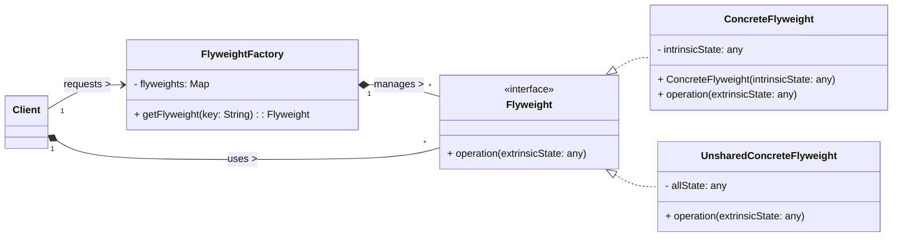

# Flyweight Design Pattern

The Flyweight pattern is a **structural design pattern** that aims to minimize memory usage and improve performance by sharing as much data as possible among similar objects. It achieves this by separating the "intrinsic" (sharable, context-independent) state from the "extrinsic" (unique, context-dependent) state of an object.

-----

## 1\. Problem It Solves / Intent

The Flyweight pattern addresses the problem of:

  * **Excessive Object Creation:** When an application needs to create a huge number of fine-grained objects (e.g., millions of character objects in a word processor, thousands of tree objects in a game). Creating and managing so many distinct objects can consume vast amounts of memory and degrade performance.
  * **Memory Optimization:** To reduce the total number of objects created and thus the memory footprint by sharing common parts of objects.
  * **Performance Improvement:** By reducing memory usage, it can also lead to better performance due to less memory allocation/deallocation overhead and improved cache utilization.
  * **Separating State:** To clearly distinguish between an object's inherent, unchanging properties (intrinsic state) and its contextual, changing properties (extrinsic state).

The core idea is to share object instances whenever their intrinsic state is identical.

## 2\. Structure & Participants

The Flyweight pattern typically involves five main participants:

  * **Flyweight (Interface/Abstract Class):**
      * Declares an interface through which flyweights can receive and act on extrinsic state.
      * This interface usually includes an `operation()` method that takes extrinsic state as a parameter.
  * **Concrete Flyweight:**
      * Implements the `Flyweight` interface.
      * Stores the **intrinsic state** (the shareable, context-independent data). `Concrete Flyweight` objects must be shareable and immutable (or effectively immutable) for their intrinsic state.
  * **Unshared Concrete Flyweight (Optional):**
      * Not all `Flyweight` subclasses need to be shared. It might represent complex objects that cannot be easily shared but still conceptually fit within the `Flyweight` hierarchy (e.g., a `Paragraph` in a text editor might reference `Character` flyweights but be unique itself).
  * **Flyweight Factory:**
      * Creates and manages `Flyweight` objects.
      * It maintains a pool (e.g., a hash map) of existing `Concrete Flyweight` instances.
      * When a client requests a `Flyweight`, the factory looks up an existing instance with the requested intrinsic state; if none exists, it creates a new one and stores it in the pool. This ensures flyweights are shared properly.
  * **Client:**
      * Maintains references to `Flyweight`s.
      * Computes or stores the **extrinsic state** (the unique, context-dependent data) of `Flyweight`s and passes it to the `Flyweight`'s operations at runtime.

<!-- end list -->



## 3\. How It Works / Collaboration

1.  **Client Request:** The `Client` needs an object with a specific intrinsic state. Instead of creating a new object directly, it requests the `Flyweight` object from the `Flyweight Factory`.
2.  **Factory Lookup/Creation:** The `Flyweight Factory` checks its pool (e.g., a hash map keyed by intrinsic state) to see if a `Concrete Flyweight` with the requested intrinsic state already exists.
      * If it exists, the factory returns the existing `Concrete Flyweight` instance.
      * If it doesn't exist, the factory creates a new `Concrete Flyweight` with the specified intrinsic state, adds it to the pool, and then returns it.
3.  **Extrinsic State Passed:** The `Client` receives the `Flyweight` instance. When the `Client` wants the `Flyweight` to perform an operation, it passes the necessary *extrinsic state* (contextual information) as parameters to the `Flyweight`'s method.
4.  **Operation Execution:** The `Flyweight` uses its stored intrinsic state along with the provided extrinsic state to perform the operation. This allows a single `Flyweight` instance to behave differently depending on the context provided by the client, without storing that context within itself.

## 4\. Applicability / When to Use

Use the Flyweight pattern when:

  * **An application uses a huge number of objects** (e.g., hundreds of thousands or millions).
  * **The majority of an object's state can be made extrinsic** (i.e., externalized and passed to the object when needed), leaving only a small portion as intrinsic (sharable).
  * **Many groups of objects share common intrinsic data.**
  * **The cost of removing extrinsic state and making objects sharable is less than the cost of creating and managing a massive number of unshared objects.**
  * You need to reduce memory consumption to avoid out-of-memory errors or to improve performance by reducing garbage collection overhead.

## 5\. Advantages & Disadvantages

### Advantages:

  * **Memory Savings:** The primary benefit. Significant reduction in memory consumption, especially when dealing with a very large number of objects that share common data.
  * **Performance Improvement:** Can lead to better performance due to less memory allocation/deallocation, reduced garbage collection cycles, and improved cache utilization because fewer distinct objects are created and accessed.
  * **Centralized State Management:** The `Flyweight Factory` centralizes the creation and management of shared objects.

### Disadvantages:

  * **Increased Complexity:** Introduces new classes (`FlyweightFactory`, `Flyweight` interface, `ConcreteFlyweight`) and requires careful separation of intrinsic and extrinsic state, making the design more complex to implement and understand initially.
  * **Runtime State Management:** The client code must explicitly manage or compute the extrinsic state and pass it to the flyweight's operations at runtime. This can complicate the client's logic and make method signatures more complex.
  * **Difficulty in Debugging:** Debugging can be harder as object identity might not be unique (multiple "logical" objects might map to the same `Flyweight` instance), and state is passed around dynamically, making it harder to inspect an object's full "state" at any given moment.
  * **Loss of Object Identity:** For the `Client`, it's not truly dealing with unique objects but rather shared representations that change behavior based on passed-in context. This might feel less intuitive in some scenarios.

## 6\. Real-World / Code Examples

Let's illustrate with a character object in a simple text editor. Each character (e.g., 'A', 'B', 'c') is intrinsically the same regardless of its position, font, or color. Its position, font, and color are extrinsic properties.

### Java Implementation

```java
import java.util.HashMap;
import java.util.Map;

// 1. Flyweight Interface
interface CharacterFlyweight {
    void display(int x, int y, String font, String color, int size);
}

// 2. Concrete Flyweight
class ConcreteCharacter implements CharacterFlyweight {
    private char character; // Intrinsic state (sharable)

    public ConcreteCharacter(char character) {
        this.character = character;
        System.out.println("Creating Flyweight for character: " + character);
    }

    @Override
    public void display(int x, int y, String font, String color, int size) {
        // Extrinsic state (x, y, font, color, size) passed at runtime
        System.out.println(
            "Displaying Character '" + character +
            "' at (" + x + "," + y +
            ") with Font: " + font +
            ", Color: " + color +
            ", Size: " + size
        );
    }
}

// 3. Flyweight Factory
class CharacterFlyweightFactory {
    private static Map<Character, CharacterFlyweight> flyweights = new HashMap<>();

    public static CharacterFlyweight getCharacter(char character) {
        if (!flyweights.containsKey(character)) {
            flyweights.put(character, new ConcreteCharacter(character));
        }
        return flyweights.get(character);
    }

    public static int getNumberOfFlyweights() {
        return flyweights.size();
    }
}

// Client Code
public class FlyweightDemo {
    public static void main(String[] args) {
        String document = "Hello World! This is a simple document to demonstrate the Flyweight pattern.";

        // Simulate displaying characters with varying extrinsic properties
        int xOffset = 0;
        int yOffset = 0;

        for (char charCode : document.toCharArray()) {
            CharacterFlyweight charFlyweight = CharacterFlyweightFactory.getCharacter(charCode);

            // Extrinsic state for each character
            String font = "Arial";
            String color = "Black";
            int size = 12;

            if (charCode == 'H' || charCode == 'W') {
                font = "Times New Roman";
                size = 14;
                color = "Blue";
            } else if (Character.isDigit(charCode)) {
                color = "Red";
            }

            charFlyweight.display(xOffset, yOffset, font, color, size);
            xOffset += 8; // Simulate character spacing
            if (xOffset > 100) { // New line
                xOffset = 0;
                yOffset += 15;
            }
        }

        System.out.println("\n----------------------------------------------------");
        System.out.println("Total unique Flyweight objects created: " + CharacterFlyweightFactory.getNumberOfFlyweights());
        System.out.println("Total characters processed: " + document.length());
        System.out.println("----------------------------------------------------");
    }
}
```

**Common Java Library Examples:**

  * **`java.lang.String` pool (String Interning):** When you create `String` literals (e.g., `String s = "hello";`), Java's JVM often interns them, meaning identical string literal values share the same object instance in the string pool. This saves memory. `String.intern()` method explicitly puts a string into the pool.
  * **`java.lang.Boolean.TRUE` and `java.lang.Boolean.FALSE`:** These are canonical instances that are always reused.
  * **`Integer.valueOf(int i)` (for small integers):** For integers typically in the range -128 to 127, `Integer.valueOf()` often returns cached `Integer` objects, preventing new object creation for common values.

### Python Implementation

Python's immutability of certain types (like strings, integers, tuples) naturally lends itself to flyweight-like behavior, as these are often "interned" or cached by the interpreter. We'll simulate a general Flyweight scenario for something like game sprites or trees.

```python
from abc import ABC, abstractmethod

# 1. Flyweight Abstract Base Class
class Sprite(ABC):
    @abstractmethod
    def draw(self, x: int, y: int, scale: float, rotation: float):
        """Draws the sprite with extrinsic state."""
        pass

# 2. Concrete Flyweight (e.g., for a Tree Model)
class TreeModel(Sprite):
    def __init__(self, model_id: str, texture_path: str):
        self._model_id = model_id          # Intrinsic state
        self._texture_path = texture_path  # Intrinsic state
        print(f"Creating Flyweight Tree Model: {model_id} (Texture: {texture_path})")

    def draw(self, x: int, y: int, scale: float, rotation: float):
        # Extrinsic state (x, y, scale, rotation) passed at runtime
        print(
            f"Drawing Tree Model '{self._model_id}' "
            f"with texture '{self._texture_path}' "
            f"at ({x},{y}), scale {scale}, rotation {rotation}°"
        )

# 3. Flyweight Factory
class SpriteFactory:
    _sprite_pool = {} # Dictionary to store shared flyweights

    @classmethod
    def get_sprite(cls, model_id: str, texture_path: str) -> Sprite:
        key = (model_id, texture_path) # Use a tuple as key for intrinsic state
        if key not in cls._sprite_pool:
            cls._sprite_pool[key] = TreeModel(model_id, texture_path)
        return cls._sprite_pool[key]

    @classmethod
    def get_pool_size(cls) -> int:
        return len(cls._sprite_pool)

# Client Code
if __name__ == "__main__":
    # Simulate a game world with many trees
    tree_configs = [
        {"model": "oak", "texture": "oak_tex_1"},
        {"model": "pine", "texture": "pine_tex_1"},
        {"model": "oak", "texture": "oak_tex_1"}, # Duplicate intrinsic state
        {"model": "birch", "texture": "birch_tex_1"},
        {"model": "pine", "texture": "pine_tex_1"}, # Duplicate intrinsic state
        {"model": "oak", "texture": "oak_tex_2"}, # Same model, different texture
    ]

    # Client code generates and uses tree instances
    for i, config in enumerate(tree_configs):
        model_id = config["model"]
        texture_path = config["textu
re"]

        # Request flyweight from the factory
        tree_sprite = SpriteFactory.get_sprite(model_id, texture_path)

        # Extrinsic state for each tree instance (unique position, scale, rotation)
        x_pos = i * 10
        y_pos = i * 5
        scale = 1.0 + (i * 0.1) % 0.5
        rotation = (i * 30) % 360

        tree_sprite.draw(x_pos, y_pos, scale, rotation)

    print("\n----------------------------------------------------")
    print(f"Total unique TreeModel Flyweight objects created: {SpriteFactory.get_pool_size()}")
    print(f"Total tree instances processed/drawn: {len(tree_configs)}")
    print("----------------------------------------------------")
```

## 7\. Related Patterns

  * **Factory Method / Abstract Factory:** The `Flyweight Factory` often uses a Factory Method to create `Concrete Flyweight` objects, or an Abstract Factory to create families of flyweights.
  * **State / Strategy:** The extrinsic state passed to the `Flyweight` operations can sometimes be implemented using the State or Strategy patterns, especially if the flyweight's behavior dramatically changes based on the context.
  * **Composite:** `Flyweight`s can be components in a Composite structure. For example, a document composed of `Character` flyweights, where a `Paragraph` (a composite) contains many `Character` objects.
  * **Builder:** While Builder is for complex object creation, it's not directly related to sharing objects like Flyweight.
  * **Singleton:** The `Flyweight Factory` itself might be implemented as a Singleton if only one instance of the factory is needed globally.

## 8\. Underlying Principles

The Flyweight pattern strongly adheres to:

  * **Separation of Concerns:** Clearly separates the intrinsic (sharable) state from the extrinsic (context-dependent, unique) state of an object.
  * **DRY (Don't Repeat Yourself):** Avoids duplication of identical intrinsic data by sharing object instances.
  * **Memory Optimization:** Directly targets memory efficiency and resource management.
  * **Open/Closed Principle (OCP):** New concrete flyweight types can be added without modifying the `Flyweight Factory` (if the factory uses a flexible creation mechanism, e.g., reflection, or if `Concrete Flyweight`s are registered).

## 9\. Variations & Idioms

  * **String Interning:** As seen in Java and often implicitly in Python, where string literals with the same value are stored as a single object instance.
  * **Object Pooling (Distinction):** While related to resource conservation, Object Pooling focuses on reusing *mutable* objects that are expensive to create (e.g., database connections, threads) by giving them back to a pool when done, rather than creating new ones. Flyweight focuses on sharing *immutable* objects based on their intrinsic state. A key difference is that pooled objects are often mutable and given exclusive access, whereas flyweights are generally immutable for their intrinsic state and shared by multiple clients simultaneously.
  * **Glyph Example:** The original GoF example involved "Glyphs" (characters) in a word processor, where character codes (like 'a', 'B', '\!') are intrinsic, and their position, font, and size are extrinsic.

## 10\. When NOT to Use / Potential Misuses

  * **When the number of objects is small or memory is not a significant constraint:** The overhead of implementing the pattern (factory, state separation) might outweigh any benefits.
  * **When most of an object's state is unique (extrinsic) and very little can be shared (intrinsic):** If objects are mostly unique, the `Flyweight` pattern won't provide significant memory savings.
  * **When the complexity introduced by the pattern doesn't justify the benefits:** If the gain in memory/performance is minimal, but the code becomes much harder to understand, maintain, or debug due to the state separation, it's not worth it.
  * **When the cost of separating intrinsic/extrinsic state and managing the factory is too high:** If the overhead of managing the factory and passing extrinsic state around frequently negates the memory savings, another approach might be better.

-----
