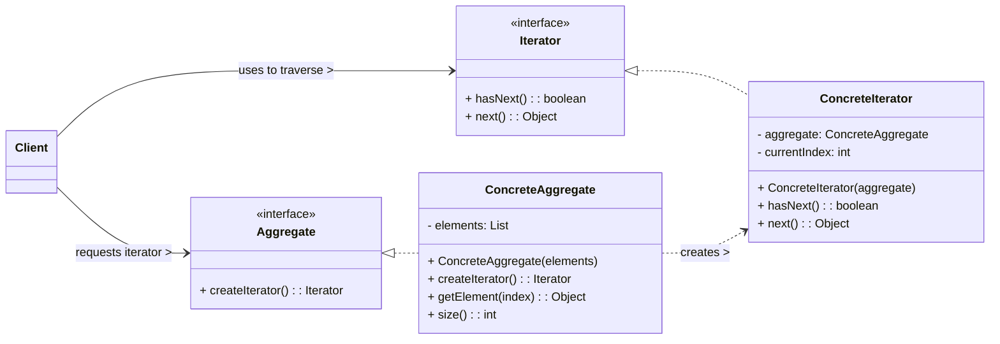

# Iterator Design Pattern

The Iterator pattern is a **behavioral design pattern** that provides a way to access the elements of an aggregate (collection) object sequentially without exposing its underlying representation (e.g., whether it's an array, a linked list, a hash table). It separates the concern of traversing a collection from the collection itself.

-----

## 1\. Problem It Solves / Intent

The Iterator pattern addresses the problem of:

  * **Exposing Internal Structure:** When you need to access the contents of an aggregate object (like a list, array, tree, or map) without exposing its internal, complex representation. Directly exposing the internal structure (e.g., making array indices public, or exposing linked list nodes) breaks encapsulation and makes the client code dependent on that specific structure.
  * **Uniform Traversal:** When you need to provide a uniform interface for traversing different aggregate structures. A client should be able to iterate over a list, a tree, or a hash map using the same `hasNext()` and `next()` methods, without knowing the specifics of each collection's implementation.
  * **Multiple Traversals:** When you need to support multiple traversals of the same aggregate object concurrently. Different iterators can maintain their own state of traversal independently.
  * **Varying Traversal Algorithms:** When the traversal algorithm needs to vary. For example, traversing a tree in pre-order, in-order, or post-order.

Essentially, it gives you a pointer to a specific element in a collection, allowing you to move through the collection without understanding its internal complexity.

## 2\. Structure & Participants

The Iterator pattern typically involves four main participants:

  * **Iterator (Interface):**
      * Declares an interface for accessing and traversing elements of the aggregate.
      * Typical methods include:
          * `hasNext()` / `isDone()`: Checks if there are more elements to traverse.
          * `next()` / `currentItem()`: Returns the next element in the traversal.
          * (Optional) `first()` / `reset()`: Resets the iterator to the beginning.
  * **ConcreteIterator:**
      * Implements the `Iterator` interface.
      * Maintains the current position in the traversal of the `ConcreteAggregate`.
      * It needs to keep a reference to the `ConcreteAggregate` it is traversing.
  * **Aggregate (Interface):**
      * Declares an interface for creating an `Iterator` object.
      * Typically includes a method like `createIterator()` or `iterator()`.
  * **ConcreteAggregate:**
      * Implements the `Aggregate` interface.
      * Returns an instance of the `ConcreteIterator` that is appropriate for its type and internal structure.
      * It contains the collection of objects that are to be traversed.

<!-- end list -->



## 3\. How It Works / Collaboration

1.  **Client Requests Iterator:** The `Client` needs to traverse the elements of a `ConcreteAggregate`. Instead of directly accessing the aggregate's internal collection, the `Client` requests an `Iterator` object from the `ConcreteAggregate` instance by calling its `createIterator()` method.
2.  **Aggregate Creates Iterator:** The `ConcreteAggregate` creates and returns a new `ConcreteIterator` instance. This iterator is configured to traverse the `ConcreteAggregate`'s specific internal data structure (e.g., an array, a linked list).
3.  **Client Traverses:** The `Client` then uses the `Iterator` (via its `hasNext()` and `next()` methods) to traverse the elements of the `Aggregate` sequentially. The `Client` remains completely unaware of the `Aggregate`'s internal structure or how the elements are actually stored.
4.  **Independent Traversal:** Because each call to `createIterator()` typically returns a new `ConcreteIterator` instance, multiple clients can traverse the same `Aggregate` concurrently without interfering with each other's traversal state.

## 4\. Applicability / When to Use

Use the Iterator pattern when:

  * **You need to access the contents of an aggregate object without exposing its internal representation.** This maintains encapsulation and allows the internal structure to change without affecting client code.
  * **You need to support multiple traversals of the same aggregate concurrently.** Each iterator instance can maintain its own independent traversal state.
  * **You need to provide a uniform interface for traversing different aggregate structures** (e.g., a list, a binary tree, a hash map, a custom collection). Clients can use the same `Iterator` interface regardless of the underlying collection type.
  * **You need to allow the traversal algorithm to vary.** By implementing different `ConcreteIterator`s, you can provide various ways to traverse the same `Aggregate` (e.g., forward, reverse, or specific filtering).

## 5\. Advantages & Disadvantages

### Advantages:

  * **Decoupling:** Decouples the traversal logic (who iterates and how) from the aggregate (collection) object (who stores the data). This makes both the aggregate and the iterator more independent and reusable.
  * **Flexibility:** Allows for multiple different traversal algorithms over the same aggregate. New traversal methods can be added by creating new `ConcreteIterator`s without modifying the `Aggregate` class.
  * **Uniform Traversal:** Provides a consistent interface (`Iterator`) for traversing different types of aggregates, simplifying client code.
  * **Concurrent Iteration:** Supports multiple simultaneous traversals over the same collection, as each iterator maintains its own state.
  * **Adherence to Single Responsibility Principle (SRP):** The aggregate manages the collection, and the iterator handles the traversal logic.

### Disadvantages:

  * **Increased Complexity:** Introduces additional classes (`Iterator` interface, `ConcreteIterator`, `Aggregate` interface) for what might seem like a simple traversal, especially for very basic collections like simple arrays where direct indexing is trivial.
  * **Overhead:** There's a slight overhead in creating and managing iterator objects, though this is usually negligible for most applications.
  * **External Iterators Can Be Cumbersome:** If the client needs to manage the iteration state explicitly (e.g., repeatedly calling `hasNext()` and `next()`), it can sometimes be more verbose than internal iterators (like Python's `for...in` syntax that hides the explicit `next()` calls).
  * **Modification Issues:** Modifying the underlying collection while an iterator is active can lead to `ConcurrentModificationException` (in Java) or other undefined behavior if the iterator is not designed to handle such changes (e.g., by making a copy of the collection, or by using specific concurrent collections).

## 6\. Real-World / Code Examples

Let's create a simple `BookCollection` and an `Iterator` for it.

### Java Implementation

Java's standard library provides the `Iterator<E>` interface and the `Iterable<E>` interface (which mandates a `iterator()` method returning an `Iterator`). The enhanced `for-each` loop syntax (`for (Type item : collection)`) works directly with `Iterable` objects.

```java
import java.util.ArrayList;
import java.util.Iterator;
import java.util.List;

// Book class (element type)
class Book {
    private String title;
    private String author;

    public Book(String title, String author) {
        this.title = title;
        this.author = author;
    }

    public String getTitle() { return title; }
    public String getAuthor() { return author; }

    @Override
    public String toString() {
        return "'" + title + "' by " + author;
    }
}

// 2. ConcreteIterator (Implementing standard Java Iterator)
class BookIterator implements Iterator<Book> {
    private List<Book> books;
    private int position = 0;

    public BookIterator(List<Book> books) {
        this.books = books;
    }

    @Override
    public boolean hasNext() {
        return position < books.size();
    }

    @Override
    public Book next() {
        if (!hasNext()) {
            throw new java.util.NoSuchElementException();
        }
        Book book = books.get(position);
        position++;
        return book;
    }

    // Optional: remove method
    @Override
    public void remove() {
        if (position <= 0) {
            throw new IllegalStateException("next() has not yet been called, or remove() has already been called.");
        }
        books.remove(position - 1);
        position--; // Adjust position after removal
    }
}

// 4. ConcreteAggregate (Implementing standard Java Iterable)
class BookCollection implements Iterable<Book> {
    private List<Book> books = new ArrayList<>();

    public void addBook(Book book) {
        books.add(book);
    }

    // The factory method to create an iterator
    @Override
    public Iterator<Book> iterator() {
        return new BookIterator(books);
    }
}

// Client Code
public class IteratorDemo {
    public static void main(String[] args) {
        BookCollection myLibrary = new BookCollection();
        myLibrary.addBook(new Book("The Hitchhiker's Guide to the Galaxy", "Douglas Adams"));
        myLibrary.addBook(new Book("1984", "George Orwell"));
        myLibrary.addBook(new Book("Brave New World", "Aldous Huxley"));
        myLibrary.addBook(new Book("Pride and Prejudice", "Jane Austen"));

        System.out.println("--- Iterating using explicit Iterator ---");
        // Client uses the Iterator directly
        Iterator<Book> iterator = myLibrary.iterator();
        while (iterator.hasNext()) {
            Book book = iterator.next();
            System.out.println("Found book: " + book);
            if (book.getTitle().equals("1984")) {
                // Demonstrate remove (careful with this!)
                // iterator.remove(); // Uncomment to see remove in action
                // System.out.println("  (Removed '1984')");
            }
        }

        System.out.println("\n--- Iterating using Java's for-each loop (syntactic sugar for Iterator) ---");
        // Client uses the enhanced for-each loop (which internally uses the Iterator)
        for (Book book : myLibrary) {
            System.out.println("Processing book: " + book);
        }
    }
}
```

### Python Implementation

Python's `for...in` loop directly leverages the Iterator pattern. Any object that implements the **iterator protocol** (`__iter__` method returning an iterator object, and the iterator object having a `__next__` method that raises `StopIteration` when done) can be iterated over.

```python
# Book class (element type)
class Book:
    def __init__(self, title: str, author: str):
        self.title = title
        self.author = author

    def __str__(self):
        return f"'{self.title}' by {self.author}"

    def __repr__(self): # For better debugging in lists
        return self.__str__()

# 2. ConcreteIterator
class BookCollectionIterator:
    def __init__(self, collection: list):
        self._collection = collection
        self._position = 0

    def __next__(self):
        # Returns the next item in the sequence
        if self._position >= len(self._collection):
            raise StopIteration
        item = self._collection[self._position]
        self._position += 1
        return item

# 4. ConcreteAggregate
class BookCollection:
    def __init__(self):
        self._books = []

    def add_book(self, book: Book):
        self._books.append(book)

    def __iter__(self):
        # This method makes the BookCollection "iterable"
        # It returns a new iterator instance each time, allowing multiple traversals
        return BookCollectionIterator(self._books)

    def get_number_of_books(self):
        return len(self._books)

# Client Code
if __name__ == "__main__":
    my_library = BookCollection()
    my_library.add_book(Book("The Hitchhiker's Guide to the Galaxy", "Douglas Adams"))
    my_library.add_book(Book("1984", "George Orwell"))
    my_library.add_book(Book("Brave New World", "Aldous Huxley"))
    my_library.add_book(Book("Pride and Prejudice", "Jane Austen"))

    print("--- Iterating using Python's for...in loop ---")
    # Client uses the for...in loop, which implicitly uses the iterator protocol
    for book in my_library:
        print(f"Reading book: {book}")

    print("\n--- Performing another iteration (separate state) ---")
    # Demonstrate multiple independent iterations
    iterator1 = iter(my_library) # Get an iterator explicitly
    iterator2 = iter(my_library) # Get another iterator explicitly

    print("Iterator 1:")
    try:
        print(next(iterator1))
        print(next(iterator1))
    except StopIteration:
        pass

    print("Iterator 2 (starts from beginning):")
    try:
        print(next(iterator2))
    except StopIteration:
        pass

    print("\n--- Iterating with a filter (conceptual, not part of core pattern) ---")
    # You could build a filtering iterator
    class FilteredBookIterator(BookCollectionIterator):
        def __init__(self, collection, author_filter):
            super().__init__(collection)
            self._author_filter = author_filter
            self._find_next_filtered()

        def _find_next_filtered(self):
            while self._position < len(self._collection):
                if self._collection[self._position].author == self._author_filter:
                    return
                self._position += 1

        def __next__(self):
            if self._position >= len(self._collection):
                raise StopIteration
            item = self._collection[self._position]
            self._position += 1
            self._find_next_filtered() # Move to next *potential* match
            return item

    class FilteredBookCollection(BookCollection):
        def __init__(self, author_filter: str):
            super().__init__()
            self._author_filter = author_filter

        def __iter__(self):
            return FilteredBookIterator(self._books, self._author_filter)

    print("\nBooks by George Orwell:")
    orwell_library = FilteredBookCollection("George Orwell")
    orwell_library.add_book(Book("Animal Farm", "George Orwell"))
    orwell_library.add_book(Book("1984", "George Orwell"))
    orwell_library.add_book(Book("Ignored Book", "Other Author"))
    for book in orwell_library:
        print(f"Filtered: {book}")

```

## 7\. Related Patterns

  * **Composite:** Iterators are frequently used to traverse `Composite` structures (like a tree of files and folders). The iterator can encapsulate the specific traversal algorithm (e.g., depth-first, breadth-first).
  * **Factory Method:** The `createIterator()` method in the `Aggregate` often acts as a Factory Method, abstracting the creation of the specific `ConcreteIterator`.
  * **Visitor:** Both Iterator and Visitor patterns are used for traversing data structures. Iterator is about providing sequential access to elements; Visitor is about performing operations on elements in a structure *without changing their classes*. They can be used together: an `Iterator` traverses the elements, and for each element, a `Visitor` performs an operation.

## 8\. Underlying Principles

The Iterator pattern strongly adheres to:

  * **Decoupling:** Separates the concerns of data storage (`Aggregate`) and data traversal (`Iterator`). The `Aggregate` is responsible for managing its elements, and the `Iterator` is responsible for the logic of iterating through them.
  * **Open/Closed Principle (OCP):** New iteration algorithms can be added by creating new `ConcreteIterator` implementations without modifying the existing `Aggregate` class.
  * **Single Responsibility Principle (SRP):** The `Aggregate` has the responsibility to manage its collection, and the `Iterator` has the responsibility for iterating over that collection.

## 9\. Variations & Idioms

  * **Internal vs. External Iterators:**
      * **External (Client-controlled):** The client explicitly controls the iteration process by calling methods like `hasNext()` and `next()`. This offers more flexibility (e.g., pausing, restarting, or iterating over subsets). This is what the GoF pattern describes and what Java's `Iterator` is.
      * **Internal (Collection-controlled):** The collection itself takes a function or callback and applies it to each element. The iteration logic is encapsulated within the collection (e.g., `forEach` in Java 8 streams, or Python's `for...in` when used with a generator or an internal loop where the client doesn't explicitly call `next()`). While simpler for the client, it's less flexible.
  * **Null Iterator:** A special `Iterator` implementation that always returns `false` for `hasNext()` and throws an exception on `next()`. Useful for handling empty collections gracefully or terminating recursive traversals in a Composite structure.
  * **Filtering Iterator:** An iterator that wraps another iterator and only returns elements that satisfy a certain condition.
  * **Skip-List Iterator:** An iterator that traverses elements in a non-sequential order (e.g., skipping every other element, or traversing only elements of a certain type).
  * **Generator Functions (Python):** Python's `yield` keyword allows creating generator functions that implicitly act as iterators, often simplifying the creation of `ConcreteIterator` classes significantly.

## 10\. When NOT to Use / Potential Misuses

  * **When the collection is extremely simple and its internal representation is unlikely to change:** For a basic array or `List` where direct indexed access (`for (int i = 0; i < array.length; i++)`) is perfectly clear and efficient, the added overhead of `Iterator` interfaces and classes might be overkill.
  * **When performance overhead is absolutely critical for very small collections in tight loops:** While generally negligible, the creation and management of `Iterator` objects can add a tiny overhead. For highly optimized, small loops, direct array access might be marginally faster.
  * **When the collection needs to be modified during iteration:** Standard iterators (like Java's `Iterator`) are often "fail-fast," meaning they throw a `ConcurrentModificationException` if the underlying collection is modified directly during iteration. While some iterators provide `remove()` methods, adding new elements or modifying existing ones (outside `set` operations if supported) usually requires careful handling or alternative iteration strategies.
  * **When the traversal logic is extremely simple and does not need to vary:** If there's only one obvious way to iterate and no future variations are expected, a simple `for` loop might be sufficient.

-----
