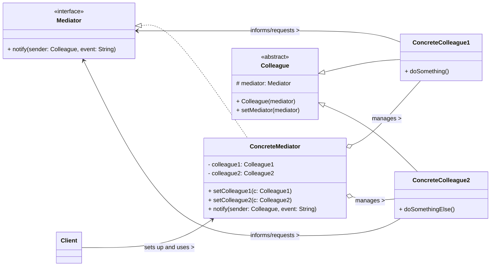

# Mediator Design Pattern

The Mediator pattern is a **behavioral design pattern** that defines an object that encapsulates how a set of objects (called "colleagues") interact. Instead of objects communicating directly with each other, they communicate through the mediator, which promotes loose coupling and simplifies the system.

-----

## 1\. Problem It Solves / Intent

The Mediator pattern addresses the problem of:

  * **Tangled Dependencies (Spaghetti Code):** When a system has many objects that need to interact with each other, leading to a complex "many-to-many" communication graph. Each object needs to know about and directly communicate with many other objects, resulting in tight coupling and difficult-to-maintain code.
  * **Reduced Reusability:** Due to tight coupling, individual objects become hard to reuse in different contexts because they carry explicit dependencies on their collaborators.
  * **Complex Control Logic:** When the interaction logic between multiple objects is complex and distributed across all participating objects, making it hard to understand, modify, and manage.
  * **Encapsulating Interaction:** To encapsulate the interaction logic within a single object (the mediator) rather than distributing it among individual objects.

Essentially, it centralizes control and communication between a group of objects, preventing them from directly referencing each other.

## 2\. Structure & Participants

The Mediator pattern typically involves four main participants:

  * **Mediator (Interface/Abstract Class):**
      * Declares an interface for communicating with `Colleague` objects.
      * It might include methods for notifying colleagues of events or for receiving notifications from colleagues.
  * **ConcreteMediator:**
      * Implements the `Mediator` interface.
      * It coordinates communication between `Colleague` objects.
      * It knows and maintains references to its `Colleague` objects.
      * It implements the central control logic, deciding how `Colleague` objects react to each other's actions.
  * **Colleague (Abstract Class/Interface):**
      * Declares an interface for communicating with its `Mediator`.
      * Each `Colleague` maintains a reference to its `Mediator`.
      * It communicates with its `Mediator` when its state changes or when it needs to interact with other `Colleague`s.
  * **ConcreteColleague:**
      * Implements the `Colleague` interface.
      * Communicates with other colleagues **only** through its `Mediator`. It never directly references or communicates with other `ConcreteColleague`s.

<!-- end list -->



## 3\. How It Works / Collaboration

1.  **Colleague State Change:** When a `ConcreteColleague`'s state changes, or it needs to interact with other colleagues, it does not communicate directly with them. Instead, it sends a notification or message to its `Mediator` (e.g., by calling `mediator.notify(this, event)`).
2.  **Mediator Receives Notification:** The `ConcreteMediator` receives the message.
3.  **Mediator Orchestrates:** Based on the type of notification, the sender, and its own internal logic, the `Mediator` decides which other `ConcreteColleague(s)` should be affected or perform an action. It then directly invokes methods on those specific `Colleague` objects.
4.  **Colleagues Respond:** The target `Colleague(s)` perform their respective actions.
5.  **Centralized Control:** This design centralizes the control logic within the `Mediator`, preventing a "mesh" of direct, hardwired dependencies between colleagues. Colleagues only know about their mediator, making them more reusable and the system easier to manage.

## 4\. Applicability / When to Use

Use the Mediator pattern when:

  * **A set of objects interact in complex ways, leading to tangled dependencies.** This is often characterized by objects having many direct references to each other, making changes difficult.
  * **You want to reuse a set of objects without the need for them to directly communicate with each other.** This allows colleagues to be more independent and portable.
  * **The distribution of behavior among several objects is complex, and it should be customizable without subclassing.** The interaction logic can be varied by creating different `ConcreteMediator` implementations.
  * **You want to centralize complex interaction logic** rather than distributing it among individual objects. This makes the system easier to understand and maintain by providing a single point of control for a given interaction.
  * **You are designing a graphical user interface (GUI):** Dialog boxes, forms, and other composite components often benefit from a mediator to coordinate their interactive elements (buttons, text fields, checkboxes).

## 5\. Advantages & Disadvantages

### Advantages:

  * **Reduced Coupling:** The primary benefit. Decouples objects, preventing them from having explicit knowledge of each other. This makes the system more flexible, easier to modify, and improves the reusability of individual components.
  * **Centralized Control:** Centralizes the control logic of complex interactions within the mediator, making it easier to understand, manage, and debug.
  * **Improved Reusability:** Individual `Colleague` objects become more reusable as they are no longer dependent on specific peer colleagues. They only depend on the generic `Mediator` interface.
  * **Simplified Colleague Design:** `Colleague` objects become simpler because they only need to communicate with the mediator, not with all other potential collaborators.
  * **Encapsulates Interaction Logic:** The logic that governs how objects interact is encapsulated in one place.

### Disadvantages:

  * **Mediator Can Become a "God Object":** The mediator itself can become overly complex, accumulating too much logic and becoming a "God Object" (a single object that knows or does too much). This can lead to a new bottleneck and make the mediator hard to maintain.
  * **Performance Overhead:** In very high-performance scenarios or with frequent, simple interactions, the indirection introduced by the mediator might add a slight overhead.
  * **Debugging Difficulty:** Centralized logic can sometimes make tracing the flow of control difficult, as it's not immediately obvious which colleague will be affected by an action initiated by another. You have to always go through the mediator.

## 6\. Real-World / Code Examples

Let's illustrate with a simple chat room example where users (colleagues) communicate through a `ChatRoom` (mediator).

### Java Implementation

```java
import java.util.Date;

// 1. Mediator Interface
interface ChatRoomMediator {
    void sendMessage(User user, String message);
    void addUser(User user);
}

// 3. Colleague Abstract Class (Optional, but often useful)
abstract class User {
    protected ChatRoomMediator mediator;
    protected String name;

    public User(ChatRoomMediator mediator, String name) {
        this.mediator = mediator;
        this.name = name;
    }

    public String getName() {
        return name;
    }

    public void send(String message) {
        System.out.println(name + " sends: " + message);
        mediator.sendMessage(this, message);
    }

    public void receive(String message) {
        System.out.println(name + " receives: " + message);
    }
}

// 2. ConcreteMediator
class ChatRoom implements ChatRoomMediator {
    // In a real app, this would be a List or Map of Users
    // For simplicity, we just simulate sending to all users except sender
    // A real chat room would maintain a collection of users and iterate
    private java.util.List<User> participants = new java.util.ArrayList<>();

    @Override
    public void sendMessage(User sender, String message) {
        System.out.println(new Date().toString() + " [" + sender.getName() + "] : " + message);
        for (User user : participants) {
            if (user != sender) { // Don't send back to the sender
                user.receive(message);
            }
        }
    }

    @Override
    public void addUser(User user) {
        participants.add(user);
        System.out.println(user.getName() + " joined the chat room.");
    }
}

// 4. ConcreteColleague
class ChatUser extends User {
    public ChatUser(ChatRoomMediator mediator, String name) {
        super(mediator, name);
    }
}

// Client Code
public class MediatorDemo {
    public static void main(String[] args) {
        ChatRoom chatRoom = new ChatRoom();

        ChatUser user1 = new ChatUser(chatRoom, "Alice");
        ChatUser user2 = new ChatUser(chatRoom, "Bob");
        ChatUser user3 = new ChatUser(chatRoom, "Charlie");

        chatRoom.addUser(user1);
        chatRoom.addUser(user2);
        chatRoom.addUser(user3);

        System.out.println("\n--- Chat Session ---");
        user1.send("Hi everyone!");
        user2.send("Hey Alice!");
        user3.send("Good morning!");
        user1.send("Bob, did you finish the report?");
    }
}
```

### Python Implementation

Using `abc` (Abstract Base Classes) for the `Mediator` and `Colleague` interfaces.

```python
from abc import ABC, abstractmethod
import datetime

# 1. Mediator Abstract Base Class
class ChatRoomMediator(ABC):
    @abstractmethod
    def send_message(self, user: 'User', message: str):
        pass

    @abstractmethod
    def add_user(self, user: 'User'):
        pass

# 3. Colleague Abstract Base Class
class User(ABC):
    def __init__(self, mediator: ChatRoomMediator, name: str):
        self._mediator = mediator
        self._name = name

    def get_name(self) -> str:
        return self._name

    def send(self, message: str):
        print(f"{self._name} sends: {message}")
        self._mediator.send_message(self, message)

    @abstractmethod
    def receive(self, message: str):
        pass

# 2. ConcreteMediator
class ChatRoom(ChatRoomMediator):
    def __init__(self):
        self._participants = []

    def send_message(self, sender: 'User', message: str):
        timestamp = datetime.datetime.now().strftime("%H:%M:%S")
        print(f"{timestamp} [{sender.get_name()}] : {message}")
        for user in self._participants:
            if user is not sender: # Don't send back to the sender
                user.receive(message)

    def add_user(self, user: User):
        self._participants.append(user)
        print(f"{user.get_name()} joined the chat room.")

# 4. ConcreteColleague
class ChatUser(User):
    def __init__(self, mediator: ChatRoomMediator, name: str):
        super().__init__(mediator, name)

    def receive(self, message: str):
        print(f"{self.get_name()} receives: {message}")

# Client Code
if __name__ == "__main__":
    chat_room = ChatRoom()

    user_alice = ChatUser(chat_room, "Alice")
    user_bob = ChatUser(chat_room, "Bob")
    user_charlie = ChatUser(chat_room, "Charlie")

    chat_room.add_user(user_alice)
    chat_room.add_user(user_bob)
    chat_room.add_user(user_charlie)

    print("\n--- Chat Session ---")
    user_alice.send("Hello everyone!")
    user_bob.send("Hi Alice!")
    user_charlie.send("Good to see you all!")
    user_alice.send("Bob, are you coming to the meeting?")
```

## 7\. Related Patterns

  * **Observer:** Mediator often uses Observer internally. Colleagues might `notify` the mediator about changes (acting as subjects), and the mediator might `observe` colleagues. The key difference is intent: Observer is about one-to-many communication where subjects don't know who their observers are. Mediator is about centralizing complex *many-to-many* communication, where the mediator explicitly knows and manages its colleagues to orchestrate their interactions.
  * **Facade:** Both centralize interaction. Facade provides a simplified interface to a *subsystem* to make it easier to use. Mediator centralizes communication between *peer* objects that would otherwise be tightly coupled, aiming to reduce inter-object dependencies. Facade aims to simplify; Mediator aims to reduce coupling.
  * **Singleton:** A `ConcreteMediator` might be implemented as a Singleton if only one instance of the mediator is required to manage a particular set of colleagues globally.
  * **Command:** A `Mediator` might encapsulate requests as `Command` objects before forwarding them to `Colleague`s, especially if the mediator needs to queue or log operations.
  * **Chain of Responsibility:** CoR distributes responsibility for a request among a chain of handlers. Mediator centralizes the decision-making process for interactions between objects. While both can manage interaction flow, CoR is about passing a request until handled, whereas Mediator is about coordinating actions among peers.

## 8\. Underlying Principles

The Mediator pattern strongly adheres to:

  * **Decoupling:** Promotes loose coupling by removing direct dependencies between interacting objects. Colleagues only depend on the abstract `Mediator` interface, not on specific `ConcreteColleague` implementations.
  * **Single Responsibility Principle (SRP):** The `Mediator` takes on the single responsibility of coordinating interactions, relieving individual `Colleague`s of that burden. Each `Colleague` then has its own, simpler responsibility.
  * **Encapsulation:** Encapsulates the complex interaction logic within the `Mediator` object, making the system easier to understand and modify.

## 9\. Variations & Idioms

  * **Base Colleague Class:** It's common to create an abstract base `Colleague` class that holds a reference to the `Mediator` and provides a way for concrete colleagues to inform the mediator (as shown in the example).
  * **Graphical User Interfaces (GUIs):** A classic and very common application. A dialog box or a form often acts as a mediator for its various widgets (buttons, text fields, checkboxes, dropdowns). When a button is clicked, it notifies the dialog (mediator), which then updates other widgets accordingly.
  * **Event Buses/Dispatchers/Pub-Sub:** A common pattern in many architectures (especially front-end frameworks). A central event bus acts as a mediator. Components "publish" events to the bus, and other components "subscribe" to events. While similar to Observer, the event bus mediates interactions without direct knowledge between publishers and subscribers.
  * **Workflow Orchestrators:** In business process management or microservices architectures, an orchestration layer can act as a mediator, coordinating the sequence and interaction of different services or tasks within a workflow.

## 10\. When NOT to Use / Potential Misuses

  * **When the interactions between objects are very simple and few:** If objects communicate directly only in a few, straightforward ways, introducing a mediator adds unnecessary complexity and overhead.
  * **When the mediator itself becomes too large and complex:** This is a common pitfall. If the `ConcreteMediator` starts accumulating too much business logic and becomes a "God Object," it can become a new bottleneck and be difficult to maintain. This often indicates that the interactions need to be further broken down, or the responsibilities of the mediator might be too broad.
  * **When the interactions are mostly one-way or don't involve complex cross-dependencies:** If objects primarily send messages without requiring complex coordination from other objects, the mediator's role might be minimal.
  * **If the primary goal is just to simplify an API:** If the complexity is mainly about a sprawling set of classes in a subsystem, consider using the Facade pattern instead, which focuses on providing a simplified interface rather than mediating internal interactions.

-----
