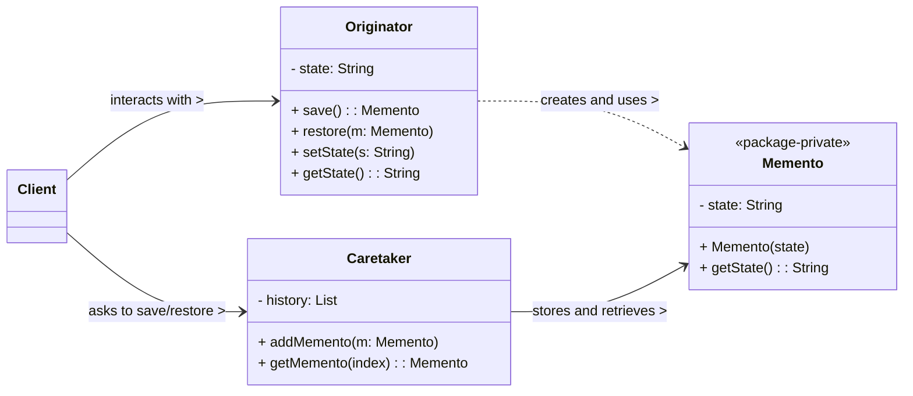

# Memento Design Pattern

The Memento pattern is a **behavioral design pattern** that allows an object's internal state to be captured and externalized without violating its encapsulation. This captured state can then be used to restore the object to its previous state at a later time. It's primarily used to implement "undo" or "rollback" functionalities.

-----

## 1\. Problem It Solves / Intent

The Memento pattern addresses the problem of:

  * **Saving and Restoring State:** When you need to save the internal state of an object so that it can be restored to that state later (e.g., for undo/redo features, checkpoints in games, transaction rollbacks).
  * **Encapsulation Violation:** Directly exposing an object's internal state to save it breaks encapsulation and leads to tight coupling between the object and the saving mechanism. The object's internal representation might change, requiring modifications everywhere its state is saved.
  * **Decoupling:** To decouple the object whose state is being saved from the object that stores that state. The storage mechanism (the "caretaker") should not need to know the internal details of the object whose state it's storing.

Essentially, it provides a way to snapshot an object's state privately and restore it, all while keeping the details of that state hidden from the outside world.

## 2\. Structure & Participants

The Memento pattern typically involves three main participants:

  * **Originator:**
      * The object whose internal state needs to be saved and restored.
      * It creates a `Memento` containing a snapshot of its current internal state.
      * It also uses a `Memento` object to restore its previous state.
      * It's often responsible for defining what state constitutes a "snapshot."
  * **Memento:**
      * A lightweight object that stores a snapshot of the `Originator`'s internal state at a particular point in time.
      * It often has two interfaces:
          * **Narrow Interface (to Caretaker):** Allows the `Caretaker` to store and retrieve the memento, but not inspect or modify its contents directly. It treats the memento as an opaque object.
          * **Wide Interface (to Originator):** Allows the `Originator` to access all internal data needed to restore its previous state. This usually means the `Memento`'s methods are declared with restricted visibility (e.g., `package-private` in Java) or the `Memento` is an inner class of the `Originator`.
  * **Caretaker:**
      * Responsible for keeping track of the `Memento`s.
      * It never operates on or examines the contents of a memento. It simply stores and retrieves mementos (e.g., in a stack for undo/redo functionality).
      * It acts as the "history manager" for one or more originators.

<!-- end list -->



## 3\. How It Works / Collaboration

1.  **Saving State:**
      * When the `Originator` needs its current state saved (e.g., before an operation that might need to be undone), it creates a new `Memento` object.
      * The `Originator` populates this `Memento` with a snapshot of its current internal state.
      * The `Originator` then hands this `Memento` object to the `Caretaker`.
2.  **Caretaker Stores:**
      * The `Caretaker` receives the `Memento` and stores it (e.g., pushes it onto a stack for undo history).
      * Crucially, the `Caretaker` treats the `Memento` as an opaque object. It does not inspect its contents, modify them, or rely on any specific details of the `Memento`'s internal structure. It only knows how to store and retrieve it.
3.  **Restoring State:**
      * At a later time, if the `Originator` needs to revert to a previous state (e.g., a user clicks "undo"), the `Caretaker` retrieves the appropriate `Memento` (e.g., pops it from the undo stack).
      * The `Caretaker` then passes this `Memento` back to the `Originator`.
      * The `Originator` receives the `Memento` and uses the state stored within it (accessed via the `Memento`'s wide interface) to restore itself to its previous condition.

## 4\. Applicability / When to Use

Use the Memento pattern when:

  * **You need to provide "undo" or "rollback" functionality** for an object's state, allowing the object to revert to previous configurations.
  * **An object's state must be saved externally** so that it can be restored later, but direct access to the object's internal representation would violate its encapsulation.
  * **A direct interface to obtain the state would expose implementation details,** leading to tighter coupling between the object and other components. The Memento allows the `Originator` to manage its own state while providing an opaque token to the `Caretaker`.

## 5\. Advantages & Disadvantages

### Advantages:

  * **Encapsulation Preserved:** This is the primary advantage. It protects the `Originator`'s encapsulation by not allowing other objects to directly access or manipulate its internal state. Only the `Originator` itself can access the `Memento`'s internal data for restoration.
  * **Simplifies Originator:** The `Originator` doesn't need to manage its own history or know how to undo operations; the `Caretaker` handles this responsibility.
  * **Easy to Implement Undo/Redo:** Provides a clear and structured mechanism for implementing rollback capabilities in applications.
  * **Decoupling:** Decouples the object whose state is being saved (`Originator`) from the object that stores the state (`Caretaker`). The `Caretaker` doesn't need to know the `Originator`'s type or internal structure.
  * **Flexibility for State Representation:** The `Originator` can change its internal state representation without affecting the `Caretaker` or other parts of the system, as long as it can still create and restore from Mementos.

### Disadvantages:

  * **High Memory Consumption:** Storing many mementos, especially for `Originator`s with large or complex states, can consume a significant amount of memory.
  * **Overhead for State Saving:** Creating mementos can be computationally expensive if the `Originator`'s state is large or involves deep copying of complex objects.
  * **Complexity for Partial State:** If only a portion of the `Originator`'s state needs to be saved/restored, or if state changes are incremental, managing this with the Memento pattern can become complicated, requiring custom logic for partial mementos.
  * **Single Originator Focus:** The pattern is typically designed for saving the state of a single `Originator` object. Managing multiple `Originator`s might require multiple `Caretaker`s or a more complex `Caretaker` that manages a collection of mementos for different originators.

## 6\. Real-World / Code Examples

Let's illustrate with a simple text editor that supports undo functionality.

### Java Implementation

In Java, the "wide interface" for the `Memento` can be achieved by making `Memento` an inner class of `Originator` or by making its state-accessing methods `package-private`. We'll use the `package-private` approach for simplicity here.

```java
import java.util.Stack;

// 1. Originator
class TextEditor {
    private String text;

    public TextEditor(String initialText) {
        this.text = initialText;
        System.out.println("Initial text: " + this.text);
    }

    public void appendText(String newText) {
        this.text += newText;
        System.out.println("Appended text. Current: " + this.text);
    }

    public void deleteLastChar() {
        if (!text.isEmpty()) {
            this.text = this.text.substring(0, this.text.length() - 1);
            System.out.println("Deleted char. Current: " + this.text);
        } else {
            System.out.println("Text is empty. Cannot delete.");
        }
    }

    public String getText() {
        return text;
    }

    // Creates a Memento (saves current state)
    public TextMemento save() {
        System.out.println("Saving state...");
        return new TextMemento(this.text);
    }

    // Restores state from a Memento
    public void restore(TextMemento memento) {
        this.text = memento.getSavedText(); // Access Memento's wide interface
        System.out.println("Restored state. Current: " + this.text);
    }

    // Memento as a package-private class (wide interface to Originator)
    static class TextMemento {
        private final String savedText; // Immutable state

        // Constructor accessible only by Originator or classes in the same package
        TextMemento(String textToSave) {
            this.savedText = textToSave;
        }

        // Getter accessible only by Originator or classes in the same package
        String getSavedText() {
            return savedText;
        }
    }
}

// 3. Caretaker
class History {
    private Stack<TextEditor.TextMemento> undoStack = new Stack<>();

    public void saveState(TextEditor editor) {
        undoStack.push(editor.save()); // Caretaker just stores the opaque Memento
    }

    public void undo(TextEditor editor) {
        if (!undoStack.isEmpty()) {
            TextEditor.TextMemento memento = undoStack.pop();
            editor.restore(memento); // Caretaker hands Memento back to Originator
        } else {
            System.out.println("No more states to undo.");
        }
    }
}

// Client Code
public class MementoDemo {
    public static void main(String[] args) {
        TextEditor editor = new TextEditor("Hello");
        History history = new History();

        history.saveState(editor); // Save 1: "Hello"
        editor.appendText(" World"); // Current: "Hello World"

        history.saveState(editor); // Save 2: "Hello World"
        editor.deleteLastChar(); // Current: "Hello Worl"

        history.saveState(editor); // Save 3: "Hello Worl"
        editor.appendText(" Done"); // Current: "Hello Worl Done"

        System.out.println("\n--- Performing Undos ---");

        history.undo(editor); // Restores to "Hello Worl"
        history.undo(editor); // Restores to "Hello World"
        history.undo(editor); // Restores to "Hello"
        history.undo(editor); // No more states
    }
}
```

### Python Implementation

In Python, the concept of a "wide interface" for the `Memento` can be achieved by:

1.  Making `Memento` an inner class of `Originator`.
2.  Using naming conventions (e.g., prefixing state attributes with `_` or `__`) and relying on the `Originator` to be the only one accessing them.
3.  Using a simple data class or named tuple for `Memento` and relying on documentation/convention that `Caretaker` shouldn't inspect it. We'll use option 3 for simplicity as it's common in Python.

<!-- end list -->

```python
from typing import List, Any

# Memento (a simple data class to hold the state)
# In Python, we rely on convention that Caretaker won't inspect this.
# For stricter encapsulation, it could be an inner class of Originator.
class EditorMemento:
    def __init__(self, content: str):
        self._content = content

    def get_saved_content(self) -> str:
        return self._content

# 1. Originator
class TextEditor:
    def __init__(self, initial_content: str = ""):
        self._content = initial_content
        print(f"Initial content: '{self._content}'")

    def append_text(self, new_text: str):
        self._content += new_text
        print(f"Appended text. Current: '{self._content}'")

    def delete_last_char(self):
        if self._content:
            self._content = self._content[:-1]
            print(f"Deleted char. Current: '{self._content}'")
        else:
            print("Content is empty. Cannot delete.")

    def get_content(self) -> str:
        return self._content

    # Creates a Memento (saves current state)
    def save(self) -> EditorMemento:
        print("Saving state...")
        return EditorMemento(self._content)

    # Restores state from a Memento
    def restore(self, memento: EditorMemento):
        self._content = memento.get_saved_content()
        print(f"Restored state. Current: '{self._content}'")

# 3. Caretaker
class History:
    def __init__(self):
        self._states: List[EditorMemento] = []

    def save_state(self, editor: TextEditor):
        self._states.append(editor.save()) # Caretaker stores the opaque Memento

    def undo(self, editor: TextEditor):
        if self._states:
            memento = self._states.pop()
            editor.restore(memento) # Caretaker hands Memento back to Originator
        else:
            print("No more states to undo.")

# Client Code
if __name__ == "__main__":
    editor = TextEditor("Hello")
    history = History()

    history.save_state(editor) # Save 1: "Hello"
    editor.append_text(" World") # Current: "Hello World"

    history.save_state(editor) # Save 2: "Hello World"
    editor.delete_last_char() # Current: "Hello Worl"

    history.save_state(editor) # Save 3: "Hello Worl"
    editor.append_text(" Done") # Current: "Hello Worl Done"

    print("\n--- Performing Undos ---")

    history.undo(editor) # Restores to "Hello Worl"
    history.undo(editor) # Restores to "Hello World"
    history.undo(editor) # Restores to "Hello"
    history.undo(editor) # No more states
```

## 7\. Related Patterns

  * **Command:** Memento is very frequently used in conjunction with the Command pattern to implement robust undo/redo functionality. A `Command` object (e.g., `TypeCharacterCommand`) saves the `Originator`'s state in a `Memento` *before* executing its operation. During its `undo()` method, it uses that stored `Memento` to revert the `Originator`'s state.
  * **Snapshot (General Concept):** Memento is essentially a specific, encapsulated way of implementing the general concept of a snapshot.
  * **Iterator:** An `Iterator` might use a memento to save and restore its traversal position, allowing for arbitrary jumps in iteration.
  * **State:** While both deal with state, `State` pattern changes an object's behavior based on its internal state; `Memento` saves and restores an object's state to revert to a previous configuration.

## 8\. Underlying Principles

The Memento pattern strongly adheres to:

  * **Encapsulation:** The core principle. It allows an object's internal state to be saved and restored without exposing its private details to other objects. Only the `Originator` can see the "guts" of the `Memento`.
  * **Decoupling:** Separates the responsibility of saving state from the object being saved (`Originator`) and the object managing the history (`Caretaker`). The `Caretaker` doesn't need to know how the state is stored or what it represents.
  * **Single Responsibility Principle (SRP):** The `Originator` manages its own state, the `Memento` stores a specific snapshot of that state, and the `Caretaker` manages the history of mementos. Each has a clear, distinct role.

## 9\. Variations & Idioms

  * **Serialization as Memento:** A very common practical implementation is to make the `Memento` class serializable (e.g., implements `Serializable` in Java, or uses Python's `pickle`). The `Originator` then simply serializes its relevant state into the memento object.
  * **Undo/Redo Stack:** The `Caretaker` almost always uses a stack (or two stacks for full undo/redo) to manage the sequence of `Memento`s.
  * **Incremental Mementos / Delta Mementos:** Instead of saving the full state of the `Originator` with each memento, this variation saves only the *changes* (diffs) needed to revert the state. This can significantly reduce memory consumption, especially for large objects that change incrementally. However, it adds complexity to the `undo`/`redo` logic, as the `Originator` might need to apply a sequence of diffs.
  * **Internal vs. External Memento:**
      * **Internal Memento:** The `Memento` class is implemented as an inner class of the `Originator`. This grants the `Memento` full access to the `Originator`'s private members, simplifying state capture and restoration but potentially making the `Memento` less reusable outside the `Originator`. (Common in Java).
      * **External Memento:** The `Memento` is a separate class. The `Originator` typically passes a copy of its relevant state data to the `Memento`'s constructor. This approach is more flexible but might require the `Originator` to expose more of its state (e.g., via getters) than strictly necessary for other purposes. (More common in Python due to less strict visibility).

## 10\. When NOT to Use / Potential Misuses

  * **When the `Originator`'s state is very small and simple:** If the state is just a few primitive values, and direct exposure of that state is acceptable (e.g., no encapsulation concerns), the overhead of creating memento objects and a caretaker might not be justified.
  * **When memory consumption is a severe constraint:** If the `Originator`'s state is very large and changes frequently, storing many full mementos can quickly exhaust memory. Consider incremental mementos, but be aware of their added complexity.
  * **When the `Originator`'s state changes extremely frequently:** The constant creation and storage of mementos for every tiny change might lead to performance bottlenecks. In such cases, a different approach (e.g., event sourcing or command logging) might be more appropriate.
  * **If only a few, specific, and simple "undo" operations are needed:** If the undo logic is trivial and can be implemented directly within the `Originator` without needing to save a full state snapshot, the Memento pattern might be overkill.

-----
