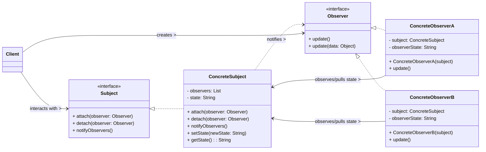

# Observer Design Pattern

The Observer pattern is a **behavioral design pattern** that defines a one-to-many dependency between objects. When one object (the "subject" or "observable") changes its state, all its dependent objects (the "observers" or "subscribers") are automatically notified and updated. This pattern promotes loose coupling between the subject and its observers.

-----

## 1\. Problem It Solves / Intent

The Observer pattern addresses the problem of:

  * **Tight Coupling for Updates:** When a change to one object requires changing others, and you want to avoid making those objects tightly coupled. If objects directly call update methods on each other, they become highly dependent, making changes and reuse difficult.
  * **Unknown Number/Type of Dependents:** When an object needs to notify an unknown number of other objects, or objects whose specific types are unknown, about a change in its state.
  * **Dynamic Dependencies:** When the set of objects that need to be notified is dynamic and can change at runtime (objects can register or unregister themselves for notifications).
  * **Event Handling:** Providing a flexible mechanism for event handling systems, where components react to events generated by other components without direct knowledge of each other.

Essentially, it's about establishing a "publish-subscribe" mechanism where a publisher broadcasts changes to a list of subscribers without knowing their concrete types.

## 2\. Structure & Participants

The Observer pattern typically involves four main participants:

  * **Subject (or Observable):**
      * Knows its `Observer`s. Any number of `Observer` objects may observe a subject.
      * Provides an interface for attaching (`attach()`/`addObserver()`) and detaching (`detach()`/`removeObserver()`) `Observer` objects.
      * Notifies its `Observer`s of changes (e.g., `notifyObservers()`).
  * **ConcreteSubject:**
      * Implements the `Subject` interface.
      * Stores the state that is of interest to `ConcreteObserver`s.
      * Notifies its `Observer`s when its state changes.
  * **Observer (or Subscriber):**
      * Defines an updating interface for objects that should be notified of changes in a subject. This usually involves a single `update()` method.
  * **ConcreteObserver:**
      * Implements the `Observer` interface.
      * Stores a reference to the `ConcreteSubject` it observes (if it needs to query the subject for state changes, i.e., in a "pull" model).
      * Implements the `update()` method to respond to changes in the subject's state.

<!-- end list -->



## 3\. How It Works / Collaboration

1.  **Registration:** `ConcreteObserver`s register themselves with a `ConcreteSubject` by calling the subject's `attach()` (or `addObserver()`) method. This adds the observer to the subject's list of dependents.
2.  **State Change:** When the state of the `ConcreteSubject` changes (e.g., a new data point arrives, a property is modified), it calls its `notifyObservers()` method.
3.  **Notification:** The `notifyObservers()` method iterates through its registered `Observer`s and calls their `update()` method.
4.  **Update/Query:** Each `ConcreteObserver`'s `update()` method is invoked. Depending on the update model:
      * **"Pull" Model:** The `Observer`, upon notification, explicitly queries the `Subject` (using a getter method) to retrieve the specific data it needs. This is more flexible for the observer but requires the observer to know how to query the subject.
      * **"Push" Model:** The `Subject` pushes the changed data (or a portion of it) directly as an argument to the `Observer`'s `update()` method. This is simpler for the observer but might send data the observer doesn't care about.
5.  **Reaction:** The `ConcreteObserver` then processes the received data or state change and updates its own state or display accordingly.

## 4\. Applicability / When to Use

Use the Observer pattern when:

  * **A change to one object requires changing others, and you don't know how many objects need to be changed or which specific ones.**
  * **An object should be able to notify other objects without making assumptions about who these other objects are** (i.e., you want loose coupling between the sender and receivers of notifications).
  * **The set of objects to be notified is dynamic and can change at runtime.** Objects can subscribe or unsubscribe as needed.
  * **For implementing event handling systems** in GUI frameworks, messaging systems, or any scenario where components react to actions or data changes in other components.
  * **In a publish-subscribe messaging architecture** where producers publish messages to a topic, and consumers subscribe to that topic.

## 5\. Advantages & Disadvantages

### Advantages:

  * **Loose Coupling:** The most significant advantage. The `Subject` and `Observer` are loosely coupled. The subject only knows about the `Observer` interface, not concrete observer types. Observers can be added, removed, or changed independently without affecting the subject or other observers.
  * **Flexibility & Extensibility:** It's easy to add new types of observers without modifying the subject or existing observers, adhering to the Open/Closed Principle.
  * **Support for Broadcast Communication:** A single change in the subject can trigger updates in multiple dependent objects simultaneously, enabling efficient one-to-many communication.
  * **Event-driven Architecture:** Naturally fits into event-driven programming paradigms, simplifying event handling and reactive systems.
  * **Reusability:** Both subjects and observers become more reusable as they have fewer hard-coded dependencies.

### Disadvantages:

  * **Unexpected Updates (Cascading Updates):** Observers might get updated with changes they don't care about, leading to wasted processing if updates are frequent and complex. This is more prevalent in the "push" model.
  * **Order of Notification Not Guaranteed:** The order in which observers are notified is generally not guaranteed, which can be an issue if there are dependencies between the observers themselves (i.g., Observer B depends on Observer A having already processed the update).
  * **Potential for Performance Issues:** If there are many observers, or if the update logic within observers is complex, the notification process can become slow, impacting performance.
  * **Memory Leaks ("Dangling Observer"):** If observers are not properly detached from the subject, the subject might hold strong references to them, preventing their garbage collection and leading to memory leaks, even if the observer object is no longer needed.
  * **Complexity for Simple Cases:** For very simple direct communications, the overhead of setting up the Observer pattern (interfaces, classes, registration) might be unnecessary.

## 6\. Real-World / Code Examples

Let's model a simple Weather Station that notifies different displays (observers) about changes in weather data.

### Java Implementation

Java's standard library used to have `java.util.Observable` and `java.util.Observer`, but these are deprecated in favor of `java.beans.PropertyChangeListener` and `java.beans.PropertyChangeSupport`, or more modern approaches like reactive streams (e.g., RxJava). However, for demonstrating the core GoF pattern, we can implement it manually or conceptually use the older API. We'll implement it manually to highlight the core concepts.

```java
import java.util.ArrayList;
import java.util.List;

// 2. Subject Interface
interface WeatherSubject {
    void registerObserver(WeatherObserver o);
    void removeObserver(WeatherObserver o);
    void notifyObservers();
}

// 3. Observer Interface
interface WeatherObserver {
    void update(float temperature, float humidity, float pressure);
}

// 4. ConcreteSubject
class WeatherData implements WeatherSubject {
    private List<WeatherObserver> observers;
    private float temperature;
    private float humidity;
    private float pressure;

    public WeatherData() {
        observers = new ArrayList<>();
    }

    @Override
    public void registerObserver(WeatherObserver o) {
        observers.add(o);
        System.out.println("Observer registered: " + o.getClass().getSimpleName());
    }

    @Override
    public void removeObserver(WeatherObserver o) {
        int i = observers.indexOf(o);
        if (i >= 0) {
            observers.remove(i);
            System.out.println("Observer removed: " + o.getClass().getSimpleName());
        }
    }

    @Override
    public void notifyObservers() {
        System.out.println("\nNotifying observers...");
        for (WeatherObserver observer : observers) {
            observer.update(temperature, humidity, pressure); // "Push" model
        }
    }

    // Method called when weather measurements change
    public void setMeasurements(float temperature, float humidity, float pressure) {
        this.temperature = temperature;
        this.humidity = humidity;
        this.pressure = pressure;
        measurementsChanged();
    }

    private void measurementsChanged() {
        notifyObservers();
    }

    // Optional: Getters for "Pull" model (if needed)
    public float getTemperature() { return temperature; }
    public float getHumidity() { return humidity; }
    public float getPressure() { return pressure; }
}

// 5. ConcreteObserver A
class CurrentConditionsDisplay implements WeatherObserver {
    private float temperature;
    private float humidity;
    private WeatherSubject weatherData; // Optional: reference to subject for pull model

    public CurrentConditionsDisplay(WeatherSubject weatherData) {
        this.weatherData = weatherData;
        weatherData.registerObserver(this);
    }

    @Override
    public void update(float temperature, float humidity, float pressure) {
        this.temperature = temperature;
        this.humidity = humidity;
        display();
    }

    public void display() {
        System.out.println("Current conditions: " + temperature + "F degrees and " + humidity + "% humidity");
    }
}

// 5. ConcreteObserver B
class StatisticsDisplay implements WeatherObserver {
    private float maxTemp = 0.0f;
    private float minTemp = 200.0f;
    private float tempSum = 0.0f;
    private int numReadings = 0;
    private WeatherSubject weatherData;

    public StatisticsDisplay(WeatherSubject weatherData) {
        this.weatherData = weatherData;
        weatherData.registerObserver(this);
    }

    @Override
    public void update(float temperature, float humidity, float pressure) {
        tempSum += temperature;
        numReadings++;

        if (temperature > maxTemp) {
            maxTemp = temperature;
        }
        if (temperature < minTemp) {
            minTemp = temperature;
        }

        display();
    }

    public void display() {
        System.out.println("Avg/Max/Min temperature = " + (tempSum / numReadings) + "/" + maxTemp + "/" + minTemp);
    }
}

// Client Code
public class ObserverDemo {
    public static void main(String[] args) {
        WeatherData weatherData = new WeatherData();

        CurrentConditionsDisplay currentDisplay = new CurrentConditionsDisplay(weatherData);
        StatisticsDisplay statisticsDisplay = new StatisticsDisplay(weatherData);

        System.out.println("\n--- First measurements ---");
        weatherData.setMeasurements(80, 65, 30.4f);

        System.out.println("\n--- Second measurements ---");
        weatherData.setMeasurements(82, 70, 29.2f);

        weatherData.removeObserver(statisticsDisplay);
        System.out.println("\n--- Third measurements (Statistics Display removed) ---");
        weatherData.setMeasurements(78, 90, 29.2f);
    }
}
```

### Python Implementation

Python's inherent dynamic nature and first-class functions can simplify Observer implementations, but we'll stick to a more explicit class-based approach to clearly demonstrate the pattern's components.

```python
from abc import ABC, abstractmethod
from typing import List

# 2. Subject Abstract Base Class
class WeatherSubject(ABC):
    def __init__(self):
        self._observers: List['WeatherObserver'] = []

    def register_observer(self, observer: 'WeatherObserver'):
        if observer not in self._observers:
            self._observers.append(observer)
            print(f"Observer registered: {observer.__class__.__name__}")

    def remove_observer(self, observer: 'WeatherObserver'):
        if observer in self._observers:
            self._observers.remove(observer)
            print(f"Observer removed: {observer.__class__.__name__}")

    @abstractmethod
    def notify_observers(self):
        pass

# 3. Observer Abstract Base Class
class WeatherObserver(ABC):
    @abstractmethod
    def update(self, temperature: float, humidity: float, pressure: float):
        pass

# 4. ConcreteSubject
class WeatherData(WeatherSubject):
    def __init__(self):
        super().__init__()
        self._temperature: float = 0.0
        self._humidity: float = 0.0
        self._pressure: float = 0.0

    def notify_observers(self):
        print("\nNotifying observers...")
        for observer in self._observers:
            observer.update(self._temperature, self._humidity, self._pressure) # "Push" model

    # Method called when weather measurements change
    def set_measurements(self, temperature: float, humidity: float, pressure: float):
        self._temperature = temperature
        self._humidity = humidity
        self._pressure = pressure
        self._measurements_changed()

    def _measurements_changed(self):
        self.notify_observers()

    # Optional: Getters for "Pull" model (if needed)
    def get_temperature(self) -> float: return self._temperature
    def get_humidity(self) -> float: return self._humidity
    def get_pressure(self) -> float: return self._pressure

# 5. ConcreteObserver A
class CurrentConditionsDisplay(WeatherObserver):
    def __init__(self, weather_data: WeatherData):
        self._temperature: float = 0.0
        self._humidity: float = 0.0
        self._weather_data = weather_data # Keep reference if using pull model
        self._weather_data.register_observer(self)

    def update(self, temperature: float, humidity: float, pressure: float):
        self._temperature = temperature
        self._humidity = humidity
        self.display()

    def display(self):
        print(f"Current conditions: {self._temperature}°F degrees and {self._humidity}% humidity")

# 5. ConcreteObserver B
class StatisticsDisplay(WeatherObserver):
    def __init__(self, weather_data: WeatherData):
        self._max_temp: float = 0.0
        self._min_temp: float = 200.0 # Unlikely low temp
        self._temp_sum: float = 0.0
        self._num_readings: int = 0
        self._weather_data = weather_data
        self._weather_data.register_observer(self)

    def update(self, temperature: float, humidity: float, pressure: float):
        self._temp_sum += temperature
        self._num_readings += 1

        if temperature > self._max_temp:
            self._max_temp = temperature
        if temperature < self._min_temp:
            self._min_temp = temperature

        self.display()

    def display(self):
        if self._num_readings > 0:
            print(f"Avg/Max/Min temperature = {self._temp_sum / self._num_readings:.1f}/"
                  f"{self._max_temp:.1f}/{self._min_temp:.1f}")
        else:
            print("No readings yet.")

# Client Code
if __name__ == "__main__":
    weather_data = WeatherData()

    current_display = CurrentConditionsDisplay(weather_data)
    statistics_display = StatisticsDisplay(weather_data)

    print("\n--- First measurements ---")
    weather_data.set_measurements(80.0, 65.0, 30.4)

    print("\n--- Second measurements ---")
    weather_data.set_measurements(82.0, 70.0, 29.2)

    weather_data.remove_observer(statistics_display)
    print("\n--- Third measurements (Statistics Display removed) ---")
    weather_data.set_measurements(78.0, 90.0, 29.2)
```

## 7\. Related Patterns

  * **Mediator:** While both deal with communication between objects, Observer is a one-to-many notification mechanism where the subject doesn't care who or how many are listening. Mediator centralizes complex many-to-many interactions, where the mediator actively orchestrates the actions between specific colleagues. A Mediator can internally use the Observer pattern.
  * **Publish/Subscribe (Pub/Sub):** Pub/Sub is a messaging pattern that is a common architectural style that builds on the Observer pattern. The key distinction is often the presence of an explicit "event channel" or "message broker" between subjects (publishers) and observers (subscribers) in Pub/Sub, further decoupling them. In Observer, the subject directly manages and notifies its observers.
  * **Singleton:** A `ConcreteSubject` (e.g., a global event bus or a central data store) might be implemented as a Singleton if only one instance should ever exist in the application.
  * **Command:** An `Observer`'s `update()` method could encapsulate the received notification into a `Command` object, which is then executed. This can be useful for deferring or queuing actions.
  * **Strategy:** An `Observer` might change its `Strategy` (how it behaves or processes data) based on the notification received from the `Subject`.

## 8\. Underlying Principles

The Observer pattern strongly adheres to:

  * **Loose Coupling:** This is the core principle. The `Subject` and `Observer` interact through a common interface without knowing each other's concrete types or implementation details. This makes the system more flexible and maintainable.
  * **Open/Closed Principle (OCP):** New observers can be added to the system (extending functionality) without requiring modifications to the existing `Subject` code (closing for modification).
  * **Single Responsibility Principle (SRP):** The `Subject` has the responsibility to manage its state and notify its observers. The `Observer`'s responsibility is to react to those notifications and update its own state or display.

## 9\. Variations & Idioms

  * **Push vs. Pull Model:**
      * **Push Model:** The `Subject` sends all necessary data (often as arguments to the `update()` method) to the `Observer`. This is simpler for the observer but might send data that the observer doesn't need.
      * **Pull Model:** The `Subject` sends a minimal notification (e.g., just `update()`). The `Observer`, upon receiving the notification, then queries (pulls) the specific data it needs from the `Subject` using the subject's public interface. This is more flexible for the observer but requires the observer to know how to query the subject.
  * **Specific Update vs. Generic Update:**
      * **Generic Update:** The `update()` method has no parameters or just a generic `Object` (requiring a pull).
      * **Specific Update:** The `update(data)` method receives specific data relevant to the change (push).
  * **Guaranteed vs. Best-Effort Notification:** In some asynchronous or distributed systems, notifications might be "best-effort" (not guaranteed delivery). In others, robust delivery mechanisms are essential.
  * **Event Listeners/Handlers:** Common terminology in GUI frameworks (e.g., `ActionListener`, `ClickListener`). The event source is the subject, and the listeners are the observers.
  * **Reactive Programming (RxJava, RxJS, Python's RxPy):** Modern variations that heavily leverage and extend the Observer pattern. They treat data streams as "observables" that can be subscribed to, transformed, and processed, with built-in support for asynchronous operations, error handling, and completion.
  * **Typed Observers:** Using generics or type hints to ensure `Observer`s only receive updates for a specific type of data.

## 10\. When NOT to Use / Potential Misuses

  * **When the number of observers is very small and static:** If there are only a few fixed dependents and their relationship is simple, direct communication or a simpler callback mechanism might be clearer and less complex.
  * **When the notification order is critical and complex to manage:** The Observer pattern, by itself, doesn't inherently guarantee the order in which observers are notified. If a strict order is required, you might need additional logic within the `notifyObservers()` method or external orchestration.
  * **When updates are extremely frequent and there are many observers:** The overhead of iterating through and notifying a large number of observers for every tiny state change can lead to performance bottlenecks. Consider throttling updates or using a different pattern.
  * **If there are tight interdependencies between observers:** If one observer's correct functioning heavily relies on another observer having already processed its update, the loose coupling of the Observer pattern might lead to subtle bugs. This indicates a need for more centralized control (like a Mediator) or a different design.
  * **When the state changes are very granular, and observers only care about aggregated or specific changes:** If observers are only interested in certain types of changes or summary data, a more specific event system or a "fat" event object (which contains all relevant change data) might be better than always pushing/pulling the entire state.

-----
