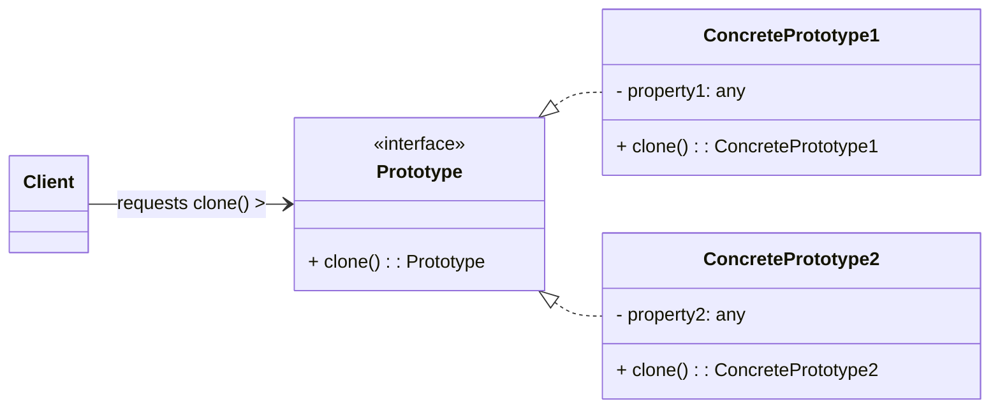

# Prototype Design Pattern

The Prototype pattern is a **creational design pattern** that creates new objects by copying an existing object, known as the "prototype." It's particularly useful when the cost of creating a new object is high, or when you need to create objects without knowing their concrete types.

-----

## 1\. Problem It Solves / Intent

The Prototype pattern addresses several challenges in object creation:

  * **Expensive Object Creation:** When creating new instances of an object is computationally intensive, resource-heavy, or time-consuming (e.g., objects that load data from a database, perform complex calculations during initialization).
  * **Avoiding Direct Instantiation (`new` keyword):** To decouple the client code from concrete product classes and avoid relying on specific constructors. This makes the client code more generic and extensible.
  * **Reducing Subclassing of Creators:** Unlike Factory Method or Abstract Factory, which often require parallel hierarchies of creators and products, Prototype allows you to create new objects based on *existing instances*, reducing the need for explicit creator classes for each product variation.
  * **Dynamic Configuration of Objects:** When objects are configured dynamically at runtime, and you need to create new objects based on these configured prototypes.
  * **Many Similar Objects with Minor Differences:** When you have many objects that are largely identical but differ slightly in their initial state (e.g., multiple monster types in a game, each with unique starting health or attributes).

## 2\. Structure & Participants

The Prototype pattern typically involves three main participants:

  * **Prototype (Interface/Abstract Class):** Declares an interface for cloning itself. This interface typically contains a `clone()` method.
  * **Concrete Prototype:** Implements the `Prototype` interface. It defines how to create a new object by copying its own state. The `clone()` method returns a new object that is a copy of the current object.
  * **Client:** Creates a new object by asking a prototype to clone itself. The client interacts with the `Prototype` interface, not with concrete classes.

<!-- end list -->



## 3\. How It Works / Collaboration

1.  **Client holds a prototype:** The client code has access to an existing object (the prototype) that implements the `Prototype` interface. This prototype can be pre-configured or created using other means.
2.  **Clone Request:** When the client needs a new object, instead of using `new` operator, it simply calls the `clone()` method on the prototype object.
3.  **Self-Copying:** The `Concrete Prototype`'s `clone()` method creates a new instance of itself. It then copies its own internal state (attributes, properties) to this newly created instance.
4.  **Return New Object:** The `clone()` method returns the newly created, copied object to the client. The client receives a distinct object that is a copy of the original prototype, ready for further modification if needed.

The key idea is that objects create other objects that are copies of themselves, rather than relying on a separate factory or constructor for each new instance.

## 4\. Applicability / When to Use

Use the Prototype pattern when:

  * **The classes to instantiate are specified at runtime:** For instance, by dynamic loading, or when an application needs to create objects from a set of classes that aren't known until runtime.
  * **You want to avoid direct calls to constructors (`new`)**: Especially when the object's creation process is complex or when the client should be decoupled from the specific concrete types.
  * **Object creation is expensive or complex:** If instantiating an object from scratch involves heavy resource usage (e.g., database queries, network calls), cloning an existing object might be more efficient.
  * **You have many objects that are largely identical, but differ slightly in their initial state:** Instead of subclassing for each minor variation, you can create a few prototype instances, configure them, and then clone them as needed.

## 5\. Advantages & Disadvantages

### Advantages:

  * **Flexible Object Creation:** Allows creating new objects without knowing their concrete classes or the details of their construction. This improves flexibility and reduces coupling.
  * **Reduces Subclassing:** Eliminates the need for creating new subclasses of creators (like in Factory Method or Abstract Factory) for each specific product variation. New product types can be introduced just by adding new `ConcretePrototype` implementations.
  * **Efficiency:** Can be more efficient than creating objects from scratch, especially if the object's construction is complex or resource-intensive.
  * **Dynamic Configuration:** Enables the creation of new objects based on existing objects that were configured dynamically at runtime. You can create "template" objects and clone them.
  * **Clean Client Code:** Client code is simplified as it only interacts with the `Prototype` interface and doesn't need to know about concrete classes or their constructors.

### Disadvantages:

  * **Complexity of Cloning:** Implementing the `clone()` method can be tricky, especially for deep copies (when objects contain references to other objects). Handling nested objects, circular references, and external resources (like file handles or database connections) correctly can be challenging.
  * **Coupling to Implementation:** The `clone()` operation, by its nature, often requires access to the concrete class's internal state. This can sometimes tightly couple the clone logic to the class's implementation details.
  * **Not Always Applicable:** Not all objects are easily clonable. Objects holding unique identifiers, external system resources, or network connections might require special handling or might not be suitable for cloning.
  * **Shallow vs. Deep Copy:** A common source of errors if not clearly understood. Shallow copies can lead to unintended shared state between the original and cloned objects.

## 6\. Real-World / Code Examples

Let's illustrate with a simple example of cloning `Shape` objects.

### Java Implementation

In Java, the `Cloneable` interface is a marker interface that indicates a class can be cloned. You must override the `Object.clone()` method and handle `CloneNotSupportedException`. Be mindful of shallow vs. deep copies.

```java
import java.util.HashMap;
import java.util.Map;

// 1. Prototype Interface
interface Shape extends Cloneable {
    void draw();
    Shape clone(); // Returns a Shape type
}

// 2. Concrete Prototypes
class Circle implements Shape {
    private String color;
    private int radius;

    public Circle(String color, int radius) {
        this.color = color;
        this.radius = radius;
        System.out.println("Circle created: " + color + " " + radius);
    }

    @Override
    public void draw() {
        System.out.println("Drawing a " + color + " Circle with radius " + radius);
    }

    // Implementing clone() for shallow copy
    @Override
    public Shape clone() {
        try {
            // Object.clone() performs a shallow copy
            return (Shape) super.clone();
        } catch (CloneNotSupportedException e) {
            System.err.println("Cloning not supported for Circle: " + e.getMessage());
            return null;
        }
    }

    // Setter to modify cloned object
    public void setColor(String color) {
        this.color = color;
    }
}

class Rectangle implements Shape {
    private String color;
    private int width;
    private int height;

    public Rectangle(String color, int width, int height) {
        this.color = color;
        this.width = width;
        this.height = height;
        System.out.println("Rectangle created: " + color + " " + width + "x" + height);
    }

    @Override
    public void draw() {
        System.out.println("Drawing a " + color + " Rectangle with dimensions " + width + "x" + height);
    }

    @Override
    public Shape clone() {
        try {
            return (Shape) super.clone();
        } catch (CloneNotSupportedException e) {
            System.err.println("Cloning not supported for Rectangle: " + e.getMessage());
            return null;
        }
    }

    public void setColor(String color) {
        this.color = color;
    }
}

// Client Code / Prototype Registry (Optional, but common)
class ShapeCache {
    private static Map<String, Shape> shapeMap = new HashMap<>();

    static {
        // Populate the cache with prototype instances
        shapeMap.put("circle1", new Circle("Red", 10));
        shapeMap.put("rectangle1", new Rectangle("Blue", 20, 30));
    }

    public static Shape getShape(String shapeName) {
        Shape cachedShape = shapeMap.get(shapeName);
        if (cachedShape == null) {
            throw new IllegalArgumentException("Shape with name " + shapeName + " not found in cache.");
        }
        return cachedShape.clone(); // Return a clone, not the original
    }
}

public class PrototypeDemo {
    public static void main(String[] args) {
        // Get and draw a prototype circle
        Shape originalCircle = ShapeCache.getShape("circle1");
        originalCircle.draw();

        // Clone the circle and modify its color
        Circle clonedCircle = (Circle) ShapeCache.getShape("circle1");
        clonedCircle.setColor("Green");
        clonedCircle.draw(); // Now green
        originalCircle.draw(); // Original is still red

        System.out.println("\n---");

        // Get and draw a prototype rectangle
        Shape originalRectangle = ShapeCache.getShape("rectangle1");
        originalRectangle.draw();

        // Clone the rectangle and modify its color
        Rectangle clonedRectangle = (Rectangle) ShapeCache.getShape("rectangle1");
        clonedRectangle.setColor("Yellow");
        clonedRectangle.draw(); // Now yellow
        originalRectangle.draw(); // Original is still blue
    }
}
```

### Python Implementation

Python's `copy` module provides `copy.copy()` for shallow copies and `copy.deepcopy()` for deep copies. For custom cloning, classes can implement `__copy__` and `__deepcopy__` methods.

```python
import copy

# 1. Prototype Base Class (optional, but good practice for common interface)
class Prototype:
    def clone(self):
        """Perform a shallow copy."""
        return copy.copy(self)

    def deep_clone(self):
        """Perform a deep copy."""
        return copy.deepcopy(self)

# 2. Concrete Prototypes
class Circle(Prototype):
    def __init__(self, color: str, radius: int):
        self.color = color
        self.radius = radius
        print(f"Circle created: {color} {radius}")

    def draw(self):
        print(f"Drawing a {self.color} Circle with radius {self.radius}")

    def __copy__(self):
        # Custom shallow copy if needed, otherwise default copy.copy() is fine
        new_instance = self.__class__(self.color, self.radius)
        # Copy mutable attributes here if any. For simple types, default copy is okay.
        return new_instance

    def __deepcopy__(self, memo):
        # Custom deep copy for nested objects if any
        # memo is a dictionary of already copied objects to prevent infinite recursion
        new_instance = self.__class__(copy.deepcopy(self.color, memo),
                                      copy.deepcopy(self.radius, memo))
        return new_instance

class Rectangle(Prototype):
    def __init__(self, color: str, width: int, height: int):
        self.color = color
        self.width = width
        self.height = height
        print(f"Rectangle created: {color} {width}x{height}")

    def draw(self):
        print(f"Drawing a {self.color} Rectangle with dimensions {self.width}x{self.height}")

    # __copy__ and __deepcopy__ can be omitted if default copy module behavior is sufficient

# Client Code / Prototype Registry
class ShapeCache:
    _shape_map = {}

    @classmethod
    def load_cache(cls):
        # Populate the cache with prototype instances
        cls._shape_map["circle1"] = Circle("Red", 10)
        cls._shape_map["rectangle1"] = Rectangle("Blue", 20, 30)

    @classmethod
    def get_shape(cls, shape_name: str, deep: bool = False) -> Prototype:
        cached_shape = cls._shape_map.get(shape_name)
        if cached_shape is None:
            raise ValueError(f"Shape with name {shape_name} not found in cache.")
        return cached_shape.deep_clone() if deep else cached_shape.clone() # Return a clone

if __name__ == "__main__":
    ShapeCache.load_cache()

    # Get and draw a prototype circle
    original_circle = ShapeCache.get_shape("circle1")
    original_circle.draw()

    # Clone the circle and modify its color
    cloned_circle = ShapeCache.get_shape("circle1", deep=True)
    cloned_circle.color = "Green" # Modify the copy
    cloned_circle.draw() # Now green
    original_circle.draw() # Original is still red

    print("\n---")

    # Get and draw a prototype rectangle
    original_rectangle = ShapeCache.get_shape("rectangle1")
    original_rectangle.draw()

    # Clone the rectangle and modify its color
    cloned_rectangle = ShapeCache.get_shape("rectangle1", deep=True)
    cloned_rectangle.color = "Yellow" # Modify the copy
    cloned_rectangle.draw() # Now yellow
    original_rectangle.draw() # Original is still blue
```

## 7\. Related Patterns

  * **Abstract Factory / Factory Method:** These patterns are alternatives to Prototype, especially if creation is more about choosing a class from a hierarchy than copying an instance. However, they can sometimes be used together: an Abstract Factory might return a pre-configured `Prototype` instance, which is then cloned by the client.
  * **Composite:** If the `Product` being built by cloning is a complex, hierarchical object, it might itself be designed using the Composite pattern.
  * **Memento:** This pattern is used to save and restore an object's state. It often involves creating a "snapshot" of an object, which shares conceptual similarities with cloning, though Memento usually focuses on internal state representation for rollback, not full object duplication for new instances.

## 8\. Underlying Principles

The Prototype pattern primarily upholds:

  * **Open/Closed Principle (OCP):** New concrete prototype types can be added without modifying the client code (as long as the client interacts with the `Prototype` interface). The system is open for extension with new clonable objects.
  * **Dependency Inversion Principle (DIP):** The client depends on the `Prototype` interface (abstraction) rather than concrete classes (concretions), promoting loose coupling.

## 9\. Variations & Idioms

  * **Prototype Registry:** A very common variation. This is a map (or dictionary in Python) that stores various prototype objects, allowing the client to retrieve a specific prototype by a key (e.g., name or ID) and then clone it. This centralizes the management of available prototypes.
  * **Shallow vs. Deep Copy:** This is a crucial distinction.
      * **Shallow Copy:** Creates a new object, but inserts references to the *same* nested objects found in the original. Changes to mutable nested objects in the copy will affect the original.
      * **Deep Copy:** Creates a new object and recursively inserts copies of *all* nested objects. Changes in the copy will not affect the original.
      * The choice depends heavily on the object's structure and behavior requirements.
  * **Clone with Configuration:** Prototypes can be configured before being placed in a registry, or directly by the client after cloning, to create slight variations.

## 10\. When NOT to Use / Potential Misuses

  * **When objects are simple and easily created with a constructor:** The overhead of implementing `clone()` and managing prototypes is unnecessary for simple objects.
  * **When objects have complex internal structures that make deep cloning difficult or impractical:** Objects with circular references, unique identifiers that shouldn't be copied, or external resource handles (like file descriptors, network sockets) can make correct cloning very challenging.
  * **When the benefits of cloning (performance, avoiding `new`) are minimal:** If creating an object from scratch is already fast and simple, the added complexity of the Prototype pattern isn't worth it.
  * **When you rely heavily on inheritance for behavioral changes:** While Prototype can reduce creator hierarchies, if your object variations are primarily about behavioral differences implemented through complex inheritance, other patterns might be more suitable.

-----
