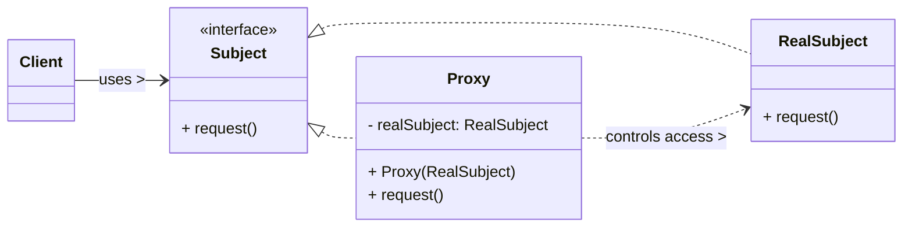

# Proxy Design Pattern

The Proxy pattern is a **structural design pattern** that provides a surrogate or placeholder for another object to control access to it. This "proxy" object has the same interface as the real object, allowing clients to interact with it transparently, while the proxy itself adds an additional layer of control, lazy initialization, security, logging, caching, or remote access.

-----

## 1\. Problem It Solves / Intent

The Proxy pattern addresses the problem of:

  * **Controlled Access:** When you need to control access to an object. This control might involve:
      * **Lazy Initialization (Virtual Proxy):** Delaying the creation and initialization of an expensive object until it's actually needed (e.g., loading a large image only when it's displayed).
      * **Security (Protection Proxy):** Checking permissions before allowing access to certain methods or data (e.g., controlling access to sensitive financial data).
      * **Remote Access (Remote Proxy):** Providing a local representative for an object that resides in a different address space (e.g., a proxy for a web service or an RMI object).
      * **Logging/Monitoring:** Logging method calls, measuring execution times, or auditing usage.
      * **Caching (Cache Proxy):** Storing results of expensive operations and returning cached data if available.
  * **Adding Functionality Transparently:** To enhance an object's behavior without modifying its core code, while maintaining the same interface so clients don't notice the change.
  * **Resource Management:** To manage heavy resources, like network connections or large files, by controlling when they are opened or closed.

Essentially, a proxy acts as a stand-in for another object, intercepting requests and adding value-added services before or after forwarding the request to the real object.

## 2\. Structure & Participants

The Proxy pattern typically involves three main participants:

  * **Subject (Interface/Abstract Class):**
      * Defines the common interface for both the `RealSubject` and the `Proxy`.
      * This ensures that the `Proxy` can be used interchangeably wherever the `RealSubject` is expected, maintaining transparency for the client.
  * **RealSubject:**
      * The object that the `Proxy` represents.
      * It contains the core business logic or the actual resource that the client ultimately wants to interact with.
  * **Proxy:**
      * Maintains a reference to the `RealSubject`.
      * Implements the same `Subject` interface as the `RealSubject`.
      * It controls access to the `RealSubject` and performs additional tasks (like lazy initialization, access control, logging, caching, etc.) *before* or *after* forwarding a request to the `RealSubject`.
  * **Client:**
      * Interacts with the `Subject` through the `Proxy`. It does not typically know whether it's dealing with the real object or a proxy.

<!-- end list -->



## 3\. How It Works / Collaboration

1.  **Client Request:** The `Client` calls methods on the `Proxy` as if it were the `RealSubject`. Because both `Proxy` and `RealSubject` implement the `Subject` interface, this interaction is seamless.
2.  **Proxy Intercepts:** The `Proxy` intercepts these method calls.
3.  **Proxy Performs Additional Logic:** Depending on the type and purpose of the proxy, it performs its specific additional functionality. This might include:
      * **Virtual Proxy:** Checks if the `RealSubject` has been instantiated. If not, it creates and initializes it.
      * **Protection Proxy:** Checks if the `Client` has sufficient permissions to access the requested method/data.
      * **Logging Proxy:** Records information about the method call (e.g., time, arguments, caller).
      * **Caching Proxy:** Checks if the result of the operation is already in the cache.
4.  **Delegation to RealSubject:** After performing its additional tasks, the `Proxy` typically forwards the original request to the `RealSubject` (if necessary) to execute the actual business logic.
5.  **Result Return:** The `RealSubject` performs the operation, and its result is returned (possibly through the `Proxy`, which might perform post-processing like caching the result) to the `Client`.

## 4\. Applicability / When to Use

Use the Proxy pattern when:

  * **Lazy Initialization (Virtual Proxy):** To defer the creation and initialization of an expensive or resource-intensive object until it's actually needed. This improves startup time and conserves resources.
  * **Access Control (Protection Proxy):** To control access to the `RealSubject` based on different permissions, roles, or security checks (e.g., ensuring only authorized users can modify data).
  * **Logging/Monitoring:** To log method calls, measure performance, or audit usage of the `RealSubject` without embedding logging code directly into the `RealSubject`.
  * **Caching (Cache Proxy):** To cache results of expensive operations. The proxy checks the cache first; if the data is available, it returns it directly, avoiding the need to invoke the `RealSubject`.
  * **Remote Proxy:** To provide a local representative or "stub" for an object that lives in a different address space (e.g., on a remote server, used in technologies like Java RMI, web services). The proxy handles the network communication.
  * **Smart Reference:** To perform additional actions whenever an object is referenced (e.g., reference counting for advanced garbage collection, locking to control concurrent access, lazy loading of data related to the object).

## 5\. Advantages & Disadvantages

### Advantages:

  * **Control over Access:** Provides a controlled and flexible way to manage access to the `RealSubject`, enabling various value-added services.
  * **Lazy Loading:** Improves performance and conserves resources by deferring object creation and initialization until truly necessary.
  * **Enhanced Functionality:** Can add various responsibilities (security, logging, caching, etc.) to the `RealSubject` transparently without modifying the `RealSubject` itself.
  * **Separation of Concerns:** Keeps the core business logic of the `RealSubject` clean and separates infrastructural or cross-cutting concerns (like security or logging) into the `Proxy`.
  * **Decoupling:** Decouples the client from the complexities of resource management, security checks, or remote communication.

### Disadvantages:

  * **Increased Complexity:** Introduces an extra layer of indirection (an additional class and method calls), which can make the code more complex to understand and debug, especially with multiple proxies chained.
  * **Potential Performance Overhead:** A slight performance overhead due to the extra method call and any additional logic performed by the proxy before delegating to the `RealSubject`. This is usually negligible but can be a concern in very high-performance scenarios.
  * **Maintenance Overhead:** An additional class (`Proxy`) needs to be maintained for each `RealSubject` that requires proxying, potentially leading to more classes in the system.
  * **Transparency Issues:** While generally transparent, if the proxy adds significant delays or side effects, it might subtly break the client's assumption of direct interaction.

## 6\. Real-World / Code Examples

Let's use an example of a `Virtual Proxy` for loading a large image file. The `RealImage` loads the image from disk, which is an expensive operation. The `ProxyImage` delays this loading until the `display()` method is actually called.

### Java Implementation

```java
// 1. Subject Interface
interface Image {
    void display(); // This method might be expensive
}

// 2. RealSubject
class RealImage implements Image {
    private String fileName;

    public RealImage(String fileName) {
        this.fileName = fileName;
        loadFromDisk(fileName); // Simulate expensive loading
    }

    @Override
    public void display() {
        System.out.println("Displaying " + fileName);
    }

    private void loadFromDisk(String fileName) {
        System.out.println("Loading " + fileName + " from disk...");
        try {
            Thread.sleep(2000); // Simulate heavy operation
        } catch (InterruptedException e) {
            Thread.currentThread().interrupt();
        }
    }
}

// 3. Proxy
class ProxyImage implements Image {
    private String fileName;
    private RealImage realImage; // Reference to RealSubject (can be null initially)

    public ProxyImage(String fileName) {
        this.fileName = fileName;
        // realImage is null here; it will be created only when display() is called
    }

    @Override
    public void display() {
        if (realImage == null) {
            // Lazy initialization: Create RealImage only when needed
            realImage = new RealImage(fileName);
        }
        realImage.display(); // Delegate to the RealSubject
    }
}

// Client Code
public class ProxyDemo {
    public static void main(String[] args) {
        // Image object is created, but RealImage is NOT loaded yet
        Image image1 = new ProxyImage("photo_high_res_1.jpg");
        Image image2 = new ProxyImage("photo_high_res_2.jpg");

        System.out.println("Proxy objects created, RealImage not loaded.");

        // Image will be loaded from disk ONLY when display is called
        System.out.println("\nCalling display() for image1 for the first time:");
        image1.display(); // Loads from disk

        System.out.println("\nCalling display() for image1 again (should be fast):");
        image1.display(); // Does not load from disk again

        System.out.println("\nCalling display() for image2 for the first time:");
        image2.display(); // Loads from disk
    }
}
```

**Common Java Library Examples:**

  * **`java.rmi.*`:** The Remote Method Invocation (RMI) mechanism heavily uses remote proxies. When you obtain a remote object, you get a local proxy that handles network communication to the actual object on a different JVM.
  * **JDBC connection pooling:** While not a pure GoF Proxy, connection pools often provide "proxies" to database connections, controlling their lifecycle and reusability without the client knowing it's getting a pooled, rather than a fresh, connection.
  * **Lazy Loading in ORMs (e.g., Hibernate, JPA):** When you fetch an entity with related entities that are expensive to load (e.g., a list of orders for a customer), the ORM might return a proxy for the related list. The actual database query to load the orders is only executed when you first try to access the list.

### Python Implementation

Using `abc` (Abstract Base Classes) for the `Subject` interface.

```python
from abc import ABC, abstractmethod
import time

# 1. Subject Abstract Base Class
class Image(ABC):
    @abstractmethod
    def display(self):
        """Displays the image."""
        pass

# 2. RealSubject
class RealImage(Image):
    def __init__(self, file_name: str):
        self._file_name = file_name
        self._load_from_disk(file_name) # Simulate expensive loading

    def display(self):
        print(f"Displaying {self._file_name}")

    def _load_from_disk(self, file_name: str):
        print(f"Loading {file_name} from disk...")
        time.sleep(2) # Simulate heavy operation
        print(f"Finished loading {file_name}.")

# 3. Proxy
class ProxyImage(Image):
    def __init__(self, file_name: str):
        self._file_name = file_name
        self._real_image = None # Reference to RealSubject, initially None

    def display(self):
        if self._real_image is None:
            # Lazy initialization: Create RealImage only when needed
            print(f"Proxy: Instantiating RealImage for {self._file_name}...")
            self._real_image = RealImage(self._file_name)
        self._real_image.display() # Delegate to the RealSubject

# Client Code
if __name__ == "__main__":
    # Image object is created, but RealImage is NOT loaded yet
    image1 = ProxyImage("photo_high_res_1.jpg")
    image2 = ProxyImage("photo_high_res_2.jpg")

    print("Proxy objects created, RealImage not loaded.")

    # Image will be loaded from disk ONLY when display is called
    print("\nCalling display() for image1 for the first time:")
    image1.display() # Loads from disk

    print("\nCalling display() for image1 again (should be fast):")
    image1.display() # Does not load from disk again

    print("\nCalling display() for image2 for the first time:")
    image2.display() # Loads from disk
```

## 7\. Related Patterns

  * **Adapter:** Both wrap objects. Adapter *changes the interface* of an object to match a *different* expected interface. Proxy *provides the same interface* but controls *access* to the wrapped object. Adapter is about incompatibility; Proxy is about control.
  * **Decorator:** Both wrap objects and implement the same interface. Decorator *adds new behavior or responsibilities* to an object dynamically. Proxy *controls access* to an object and can add behavior related to that control (e.g., lazy loading, security checks, logging). The line can sometimes blur, but the intent is different: Decorator for extending *what* an object does, Proxy for controlling *when and how* it's accessed.
  * **Facade:** Both simplify interaction. Facade provides a *simplified, high-level interface to an entire subsystem*. Proxy provides a *controlled interface to a single object*. A Facade might internally use proxies for some of its complex components.
  * **Singleton:** A `Proxy` might be used to control access to a `Singleton` instance, particularly if the singleton's creation is expensive and needs to be lazily initialized, or if access needs to be secured.
  * **Factory Method / Abstract Factory:** These patterns might be used to create instances of the `Proxy` or `RealSubject` depending on configuration or runtime conditions.

## 8\. Underlying Principles

The Proxy pattern strongly adheres to:

  * **Single Responsibility Principle (SRP):** The `RealSubject` focuses solely on its core business logic. The `Proxy` takes on the separate responsibility of access control or other supplemental concerns (lazy loading, security, logging).
  * **Open/Closed Principle (OCP):** New types of proxies (e.g., adding a caching proxy, a logging proxy) can be introduced without modifying the client code (as long as they adhere to the `Subject` interface). The system is open for extension with new proxy functionalities but closed for modification of existing client code.
  * **Liskov Substitution Principle (LSP):** Clients can use `Proxy` objects anywhere a `RealSubject` is expected because both implement the common `Subject` interface.

## 9\. Variations & Idioms

The Proxy pattern has several well-known variations based on its purpose:

  * **Virtual Proxy:** Controls access to an object that is expensive to create, deferring its instantiation until it is actually needed (lazy loading). (As shown in the example.)
  * **Protection Proxy:** Controls access to the `RealSubject` based on different access rights or permissions (e.g., user roles). It performs security checks before allowing a request to pass through.
  * **Remote Proxy:** Provides a local representation (a "stub" or "proxy object") for an object that resides in a different address space (e.g., on a remote server). It handles the network communication details transparently.
  * **Smart Reference:** A replacement for a bare pointer that performs additional actions whenever the `RealSubject` is referenced. Examples include:
      * **Reference counting:** To manage object lifetime.
      * **Loading persistent objects:** When an object is faulted in from disk.
      * **Locking:** To ensure that only one thread can access the `RealSubject` at a time.
  * **Logging Proxy:** Intercepts method calls and logs details such as caller, method name, arguments, and return values.
  * **Caching Proxy:** Stores the results of `RealSubject` operations and returns cached data for subsequent identical requests, avoiding redundant execution.

## 10\. When NOT to Use / Potential Misuses

  * **When the overhead of an extra layer of indirection is not justified:** For simple objects or scenarios where there are no significant performance, security, or resource management concerns, the added complexity of a proxy might be unnecessary.
  * **When the `Proxy` becomes overly complex:** If the `Proxy` starts to include too much business logic or becomes responsible for too many concerns beyond just controlling access, it can become a "God Object" and violate SRP, blurring the lines with the `RealSubject`.
  * **When transparency is not required:** If the client explicitly needs to know that it's dealing with a different object that controls access (e.g., explicitly calling a "loader" object), then a proxy might not be the most direct solution.
  * **If the proxy functionality can be easily achieved with simpler means:** Sometimes, a straightforward wrapper class or even simple inheritance can achieve similar goals without needing the full pattern structure.

-----
