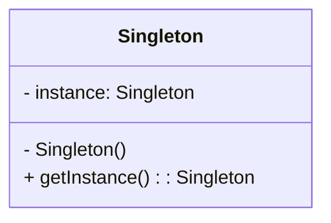

# Singleton Design Pattern

The Singleton pattern is a **creational design pattern** that ensures a class has only one instance and provides a global point of access to that instance.

-----

## 1\. Problem It Solves / Intent

The core problem the Singleton pattern addresses is the need to:

  * **Ensure a class has exactly one instance.** This is crucial for resources like configuration managers, logging services, or a single database connection pool, where multiple instances would lead to inconsistencies or resource wastage.
  * **Provide a global point of access to that instance.** Clients need a well-known and convenient way to retrieve this unique instance without violating encapsulation.
  * **Control over instantiation.** Prevent other parts of the application from creating additional instances of the class.

## 2\. Structure & Participants

The Singleton pattern typically involves a single class that takes on all the responsibilities:

  * **Singleton:**
      * **Private Constructor:** Prevents direct instantiation of the class from outside.
      * **Private Static Instance:** Holds the single instance of the class itself.
      * **Public Static Method (e.g., `getInstance()`):** Provides the global access point to the unique instance. It's responsible for creating the instance if it doesn't already exist, and returning the existing one otherwise.

<!-- end list -->



## 3\. How It Works / Collaboration

1.  The `Singleton` class has a private constructor, making it impossible to create an instance directly using `new Singleton()`.
2.  It holds a static, private reference to its sole instance.
3.  The public static `getInstance()` method is the only way to get an instance of the `Singleton`.
4.  The first time `getInstance()` is called, it checks if the instance is null. If it is, it creates the single instance and assigns it to the static reference.
5.  Subsequent calls to `getInstance()` will find the existing instance and simply return it.

## 4\. Applicability / When to Use

Use the Singleton pattern when:

  * **There must be exactly one instance of a class, and it must be accessible to clients from a well-known access point.** Examples include a logging utility, a configuration manager, a printer spooler, or a single database connection.
  * **The sole instance should be extensible by subclassing**, and clients should be able to use an extended instance without modifying their code. (Though this is less common and often indicates potential issues with the pattern's use).

## 5\. Advantages & Disadvantages

### Advantages:

  * **Controlled Access to Sole Instance:** Ensures that no other objects can instantiate a class, guaranteeing a single point of access.
  * **Reduces Namespace Pollution:** Unlike global variables, the Singleton encapsulates its single instance within a class, making it less prone to naming conflicts.
  * **Lazy Initialization:** The instance can be created only when it's first needed, saving resources if the instance is complex to create and not always required.
  * **Allows Refined Control over Creation:** The `getInstance()` method can control when and how the instance is created, offering more flexibility than simple static variables.

### Disadvantages:

  * **Violates Single Responsibility Principle (SRP):** The class is responsible for its own creation *and* its business logic, which can lead to tight coupling.
  * **Difficult to Test:** Introduces global state, making unit testing challenging. Tests can become dependent on the order in which they are run, and mocking singletons is often difficult.
  * **Can Hide Dependencies:** Because the singleton is accessed globally, it's not immediately obvious from a class's interface that it depends on the singleton. This can lead to hidden coupling.
  * **Concurrency Issues (if not careful):** Naive implementations in multi-threaded environments can lead to multiple instances being created.
  * **Often Overused (Anti-pattern):** Developers sometimes apply Singleton where a simple static class or dependency injection would be more appropriate, leading to less flexible and harder-to-test code.

## 6\. Real-World / Code Examples

### Java Implementations

#### 1\. Eager Initialization (Thread-Safe)

The instance is created at the time of class loading. Simple and thread-safe.

```java
// Eagerly Initialized Singleton
public class EagerSingleton {
    private static final EagerSingleton INSTANCE = new EagerSingleton();

    // Private constructor to prevent direct instantiation
    private EagerSingleton() {
        System.out.println("EagerSingleton instance created!");
    }

    public static EagerSingleton getInstance() {
        return INSTANCE;
    }

    public void showMessage() {
        System.out.println("Hello from EagerSingleton!");
    }

    public static void main(String[] args) {
        EagerSingleton s1 = EagerSingleton.getInstance();
        EagerSingleton s2 = EagerSingleton.getInstance();

        System.out.println("Are s1 and s2 the same instance? " + (s1 == s2));
        s1.showMessage();
    }
}
```

#### 2\. Lazy Initialization (Thread-Safe - Synchronized Method)

Instance is created only when needed. `synchronized` ensures thread-safety but can be a performance bottleneck.

```java
// Lazy Initialized Singleton (Thread-Safe with synchronized method)
public class LazySingletonSynchronized {
    private static LazySingletonSynchronized instance;

    private LazySingletonSynchronized() {
        System.out.println("LazySingletonSynchronized instance created!");
    }

    public static synchronized LazySingletonSynchronized getInstance() {
        if (instance == null) {
            instance = new LazySingletonSynchronized();
        }
        return instance;
    }

    public void showMessage() {
        System.out.println("Hello from LazySingletonSynchronized!");
    }

    public static void main(String[] args) {
        // Simulate concurrent access (e.g., using ExecutorService)
        new Thread(() -> {
            LazySingletonSynchronized s1 = LazySingletonSynchronized.getInstance();
            System.out.println("Thread 1: " + s1.hashCode());
        }).start();

        new Thread(() -> {
            LazySingletonSynchronized s2 = LazySingletonSynchronized.getInstance();
            System.out.println("Thread 2: " + s2.hashCode());
        }).start();
    }
}
```

#### 3\. Double-Checked Locking (More Performant Thread-Safe)

Improves performance by reducing synchronization overhead. Requires `volatile` keyword for `instance` to ensure visibility across threads.

```java
// Double-Checked Locking Singleton (Thread-Safe & Performant)
public class DCLSingleton {
    private static volatile DCLSingleton instance; // 'volatile' ensures visibility

    private DCLSingleton() {
        System.out.println("DCLSingleton instance created!");
        // Simulate some initialization work
        try { Thread.sleep(100); } catch (InterruptedException e) {}
    }

    public static DCLSingleton getInstance() {
        if (instance == null) { // First check: no lock needed if instance exists
            synchronized (DCLSingleton.class) {
                if (instance == null) { // Second check: only lock if instance is still null
                    instance = new DCLSingleton();
                }
            }
        }
        return instance;
    }

    public void showMessage() {
        System.out.println("Hello from DCLSingleton!");
    }
}
```

#### 4\. Bill Pugh Singleton (Inner Static Helper Class - Recommended)

Leverages Java's class loading mechanism to achieve lazy initialization and thread-safety without explicit synchronization.

```java
// Bill Pugh Singleton (Inner Static Helper Class) - Highly Recommended
public class BillPughSingleton {
    private BillPughSingleton() {
        System.out.println("BillPughSingleton instance created!");
    }

    private static class SingletonHelper {
        private static final BillPughSingleton INSTANCE = new BillPughSingleton();
    }

    public static BillPughSingleton getInstance() {
        return SingletonHelper.INSTANCE;
    }

    public void showMessage() {
        System.out.println("Hello from BillPughSingleton!");
    }
}
```

#### 5\. Enum Singleton (Most Robust & Recommended)

Simplest, inherently thread-safe, handles serialization and reflection attacks automatically.

```java
// Enum Singleton - Most Robust and Recommended
public enum EnumSingleton {
    INSTANCE;

    private String configuration;

    // Enum constructors are implicitly private
    private EnumSingleton() {
        System.out.println("EnumSingleton instance created!");
        this.configuration = "Default Config";
    }

    public String getConfiguration() {
        return configuration;
    }

    public void setConfiguration(String configuration) {
        this.configuration = configuration;
    }

    public void showMessage() {
        System.out.println("Hello from EnumSingleton! Config: " + configuration);
    }

    public static void main(String[] args) {
        EnumSingleton s1 = EnumSingleton.INSTANCE;
        EnumSingleton s2 = EnumSingleton.INSTANCE;

        System.out.println("Are s1 and s2 the same instance? " + (s1 == s2));
        s1.showMessage();

        s2.setConfiguration("New Config");
        s1.showMessage(); // Shows "New Config"
    }
}
```

-----

### Python Implementations

In Python, the concept of a "true" Singleton can be achieved in several ways, often leveraging Python's module system or `__new__` method.

#### 1\. Module-Level Singleton (Pythonic Way)

The simplest and often most "Pythonic" way to implement a Singleton is to just use a module. When a module is imported, its code is executed only once, and subsequent imports return the already loaded module object.

**`my_singleton_module.py`:**

```python
# my_singleton_module.py

class _MySingletonClass:
    def __init__(self):
        print("MySingletonClass instance created!")
        self.value = "Initial Value"

    def do_something(self):
        print(f"Doing something with value: {self.value}")

# Create the single instance when the module is imported
# The underscore prefix traditionally indicates it's meant for internal use within the module
instance = _MySingletonClass()
```

**`main.py`:**

```python
# main.py
import my_singleton_module as sm1
import my_singleton_module as sm2

print(f"Are sm1.instance and sm2.instance the same? {sm1.instance is sm2.instance}")

sm1.instance.do_something()
sm2.instance.value = "Updated Value"
sm1.instance.do_something()
```

#### 2\. Using `__new__` Method

This approach overrides the `__new__` method, which is responsible for creating a new instance of the class *before* `__init__` is called.

```python
class ClassicPythonSingleton:
    _instance = None

    def __new__(cls):
        if cls._instance is None:
            print("ClassicPythonSingleton instance created!")
            cls._instance = super().__new__(cls)
            # Put any initialization that should only happen once here
            # or ensure __init__ handles re-initialization gracefully.
        return cls._instance

    def __init__(self):
        # __init__ will be called every time you call MySingleton()
        # So put truly one-time init logic in __new__ or guard it here.
        if not hasattr(self, '_initialized'): # Guard against re-initialization
            print("ClassicPythonSingleton __init__ called!")
            self._initialized = True
            self.data = "My Initial Data"

    def show_data(self):
        print(f"Data: {self.data}")

# Usage
s1 = ClassicPythonSingleton()
s1.show_data()

s2 = ClassicPythonSingleton() # __init__ will be called again here if not guarded
s2.show_data()

print(f"Are s1 and s2 the same instance? {s1 is s2}")

s2.data = "New Data"
s1.show_data() # s1 also shows "New Data"
```

#### 3\. Using a Decorator

A decorator is a function that takes another function as an argument and extends or replaces its behavior without explicitly modifying it.

```python
def singleton(cls):
    instances = {}
    def get_instance(*args, **kwargs):
        if cls not in instances:
            instances[cls] = cls(*args, **kwargs)
        return instances[cls]
    return get_instance

@singleton
class DecoratedSingleton:
    def __init__(self, value):
        print(f"DecoratedSingleton instance created with value: {value}!")
        self.value = value

    def display(self):
        print(f"Displaying: {self.value}")

# Usage
s1 = DecoratedSingleton("First value")
s1.display()

s2 = DecoratedSingleton("Second value (ignored)") # __init__ is only called once
s2.display()

print(f"Are s1 and s2 the same instance? {s1 is s2}")
print(f"Value of s1: {s1.value}") # Still "First value"
```

## 7\. Related Patterns

  * **Abstract Factory, Builder, Factory Method:** These creational patterns can use Singletons in their implementation (e.g., a Factory might be a Singleton).
  * **Facade:** A Facade object (providing a simplified interface to a complex subsystem) could itself be implemented as a Singleton if only one such facade is needed globally.
  * **Monostate (Borg) Pattern:** Conceptually similar in that all instances share the same state, but syntactically different. Instead of enforcing a single instance, it ensures all instances share the same underlying state.

## 8\. Underlying Principles

While the Singleton pattern can be useful, it often comes with a trade-off regarding core design principles:

  * **Violates Single Responsibility Principle (SRP):** A Singleton class is responsible for its own creation and for its primary business logic. This dual responsibility makes it less cohesive.
  * **Reduced Testability:** Introduces global state, which makes unit testing harder. Tests become coupled to the order of execution and might have side effects on each other. Dependency Injection is often preferred for testability.
  * **Open/Closed Principle (Indirectly):** While the Singleton itself isn't directly related to OCP, its global access point can make it harder to extend or modify behavior without touching the Singleton itself.

## 9\. Variations & Idioms

  * **Thread-Safety:** This is the most critical consideration for Singletons in concurrent environments. Various techniques exist (synchronization, double-checked locking, inner static helper class, enums in Java; module-level, `__new__` with locks in Python).
  * **Lazy vs. Eager Initialization:** Deciding whether to create the instance at class load time or only on first request.
  * **Reflection & Serialization (Java):** Naive Singleton implementations can be broken by Java Reflection (calling the private constructor) or by deserializing multiple instances. The Enum Singleton pattern naturally handles both.
  * **Subclassing:** While possible, subclassing a Singleton often indicates a design smell, as it complicates the "single instance" guarantee.

## 10\. When NOT to Use / Potential Misuses

  * **When global state is not truly necessary:** If the uniqueness constraint isn't absolute, avoid the Singleton.
  * **When testability is a high priority:** The global nature of Singletons makes them difficult to mock or replace in unit tests. Dependency Injection frameworks are often a better alternative.
  * **When the class does not strictly need to have only one instance.** Do not use Singleton just to save memory; there are better ways.
  * **As a "catch-all" for utility classes:** Simple static methods or classes are often sufficient for stateless utility functions.
  * **When considering dependency injection frameworks:** Modern frameworks (like Spring in Java, FastAPI/Flask with dependency injection in Python) manage object lifecycles and provide singletons (or similar scopes) as part of their feature set, often in a more testable and flexible way.

-----
