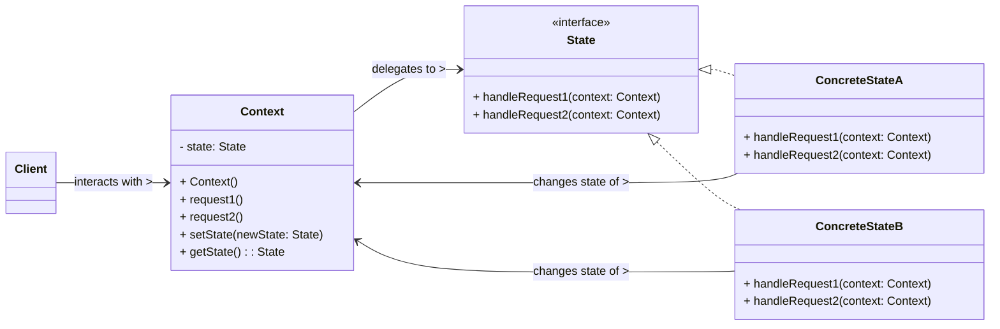

# State Design Pattern

The State pattern is a **behavioral design pattern** that allows an object to alter its behavior when its internal state changes. The object will appear to change its class, as its behavior is encapsulated in separate state-specific objects. This pattern is particularly useful for avoiding large, complex conditional statements that would otherwise govern an object's behavior based on its current state.

-----

## 1\. Problem It Solves / Intent

The State pattern addresses the problem of:

  * **Complex Conditional Logic:** When an object's behavior depends heavily on its internal state, leading to large, monolithic conditional statements (e.g., `if/else if` cascades or `switch` statements) within its methods. These statements become difficult to maintain, extend, and understand as more states or behaviors are added.
  * **Encapsulation of State-Dependent Behavior:** To encapsulate different behaviors associated with different states into separate, well-defined classes. This prevents the object from becoming a "God Object" responsible for all state-related logic.
  * **Runtime Behavior Change:** When an object needs to change its behavior dynamically at runtime, depending on its internal state. The pattern allows the object to effectively change its "class" (behavior) without changing its actual class type.
  * **Difficulty in Adding New States:** Without the pattern, adding a new state or modifying behavior for an existing state would require modifying multiple conditional blocks across various methods, leading to ripple effects and potential bugs.

Essentially, it turns state-specific conditions into separate classes, allowing an object to cleanly change its behavior as its internal state changes.

## 2\. Structure & Participants

The State pattern typically involves three main participants:

  * **Context:**
      * Defines the interface of interest to clients. Clients interact with the `Context` object, unaware of the internal state changes or the delegation to `State` objects.
      * Maintains an instance of a `ConcreteState` subclass that defines the current state.
      * Delegates state-specific requests to the current `State` object. It often has methods to change its current state.
  * **State (Interface/Abstract Class):**
      * Defines an interface for encapsulating the behavior associated with a particular state of the `Context`.
      * Each method in this interface corresponds to a state-dependent behavior that the `Context` can perform.
      * It typically takes the `Context` object as an argument to allow state classes to interact with the `Context` (e.g., change its state).
  * **ConcreteState:**
      * Implements the `State` interface.
      * Implements the specific behavior associated with a particular state of the `Context`.
      * Crucially, a `ConcreteState` can decide to transition the `Context` to another `ConcreteState` (by setting the `Context`'s current state reference).

<!-- end list -->



## 3\. How It Works / Collaboration

1.  **Client Interaction:** Clients interact with the `Context` object as if it were a regular object. They call methods on the `Context` that represent the state-dependent behaviors.
2.  **Delegation to State:** The `Context` object, instead of directly implementing its state-dependent behavior within large conditional blocks, delegates these requests to its current `State` object.
3.  **State-Specific Behavior:** Each `ConcreteState` object implements the specific behavior associated with that particular state. For example, if a `Context` is in `StateA`, its requests will be handled by the `handleRequest()` method of `ConcreteStateA`.
4.  **State Transitions:** When the `Context`'s state needs to change, the current `ConcreteState` (or, less commonly, the `Context` itself) sets the `Context`'s internal `State` reference to a new `ConcreteState` object. This is typically done by calling a `setState()` method on the `Context` from within a `ConcreteState`'s method.
5.  **Behavioral Change:** From the client's perspective, the `Context` appears to change its behavior dynamically, even though it's merely delegating to a different underlying `State` object.

## 4\. Applicability / When to Use

Use the State pattern when:

  * **An object's behavior depends on its state, and it must change its behavior at runtime depending on that state.**
  * **Operations have large, multipart conditional statements** (e.g., `if/else if/switch` statements) that depend on the object's state. These conditions can become difficult to maintain and extend.
  * **You need to add new states and behaviors easily without modifying existing code.** The pattern aligns with the Open/Closed Principle.
  * **You want to define a clean, object-oriented way of dealing with state transitions,** moving state-specific logic out of the `Context` and into dedicated classes.
  * **The state transitions are clearly defined** and can be modeled as a finite state machine.

## 5\. Advantages & Disadvantages

### Advantages:

  * **Eliminates Conditional Logic:** The most significant advantage. It replaces large, monolithic conditional statements that make code complex and hard to maintain with polymorphic method calls.
  * **Encapsulates State-Specific Behavior:** Each state's behavior is encapsulated in its own distinct class. This makes it easier to add new states or modify existing ones without affecting other parts of the `Context`.
  * **Improved Maintainability:** Changes to one state's behavior typically only affect its `ConcreteState` class, reducing ripple effects across the codebase.
  * **Clearer Code:** The code becomes more organized and understandable, as each state is represented by a distinct class with its specific responsibilities.
  * **Open/Closed Principle (OCP):** New states can be added to the system by creating new `ConcreteState` classes without modifying the existing `Context` or `State` interface.
  * **Better Readability:** The flow of state transitions is often more explicit and easier to follow.

### Disadvantages:

  * **Increased Number of Classes:** For every state, a new `ConcreteState` class is introduced. For systems with many states, this can lead to a proliferation of classes, potentially making the codebase seem more complex at a high level.
  * **Complexity for Simple Cases:** For objects with very few, simple states where behavior changes are minimal, the pattern might introduce unnecessary complexity and boilerplate code. Direct conditional logic might be simpler and more readable in such cases.
  * **State Transition Logic Distribution:** If the state transition logic is very complex or depends on many external factors, distributing this logic across multiple `ConcreteState` classes might sometimes make it harder to get an overall view of the state machine. (Though this is often considered a trade-off for better encapsulation).

## 6\. Real-World / Code Examples

Let's consider a simple Vending Machine that handles different states: `NoCoin`, `HasCoin`, `Sold`, and `SoldOut`.

### Java Implementation

```java
// 1. State Interface
interface VendingMachineState {
    void insertCoin(VendingMachine machine);
    void pressButton(VendingMachine machine);
    void dispense(VendingMachine machine);
    void refill(VendingMachine machine);
}

// 2. Context
class VendingMachine {
    private VendingMachineState noCoinState;
    private VendingMachineState hasCoinState;
    private VendingMachineState soldState;
    private VendingMachineState soldOutState;

    private VendingMachineState currentState;
    private int count = 0; // Number of items in the machine

    public VendingMachine(int initialCount) {
        noCoinState = new NoCoinState();
        hasCoinState = new HasCoinState();
        soldState = new SoldState();
        soldOutState = new SoldOutState();

        this.count = initialCount;
        if (initialCount > 0) {
            currentState = noCoinState;
        } else {
            currentState = soldOutState;
        }
        System.out.println("Vending Machine initialized with " + count + " items.");
        System.out.println("Current state: " + currentState.getClass().getSimpleName());
    }

    // Methods delegated to the current state
    public void insertCoin() {
        currentState.insertCoin(this);
    }

    public void pressButton() {
        currentState.pressButton(this);
    }

    public void dispense() {
        currentState.dispense(this);
    }

    public void refill(int numItems) {
        currentState.refill(this);
        this.count += numItems;
        System.out.println("Machine refilled. Current items: " + count);
        // Special case: if refilled from SoldOut, transition to NoCoin
        if (currentState instanceof SoldOutState && this.count > 0) {
            setState(noCoinState);
        }
    }

    // Method to change the current state (called by ConcreteStates)
    public void setState(VendingMachineState newState) {
        this.currentState = newState;
        System.out.println("State changed to: " + newState.getClass().getSimpleName());
    }

    // Getters for states (for ConcreteStates to access other states)
    public VendingMachineState getNoCoinState() { return noCoinState; }
    public VendingMachineState getHasCoinState() { return hasCoinState; }
    public VendingMachineState getSoldState() { return soldState; }
    public VendingMachineState getSoldOutState() { return soldOutState; }

    public int getCount() { return count; }
    public void decrementCount() { count--; }
}

// 3. ConcreteState A: NoCoinState
class NoCoinState implements VendingMachineState {
    @Override
    public void insertCoin(VendingMachine machine) {
        System.out.println("Coin inserted.");
        machine.setState(machine.getHasCoinState());
    }

    @Override
    public void pressButton(VendingMachine machine) {
        System.out.println("Please insert a coin first.");
    }

    @Override
    public void dispense(VendingMachine machine) {
        System.out.println("No coin, nothing to dispense.");
    }

    @Override
    public void refill(VendingMachine machine) {
        System.out.println("Refilling machine.");
    }
}

// 3. ConcreteState B: HasCoinState
class HasCoinState implements VendingMachineState {
    @Override
    public void insertCoin(VendingMachine machine) {
        System.out.println("Coin already inserted.");
    }

    @Override
    public void pressButton(VendingMachine machine) {
        System.out.println("Button pressed. Processing...");
        if (machine.getCount() > 0) {
            machine.setState(machine.getSoldState());
            machine.dispense(); // Auto-dispense after button press if item available
        } else {
            System.out.println("No items left. Returning coin.");
            machine.setState(machine.getSoldOutState());
        }
    }

    @Override
    public void dispense(VendingMachine machine) {
        System.out.println("Press button to dispense.");
    }

    @Override
    public void refill(VendingMachine machine) {
        System.out.println("Refilling machine while coin is present.");
    }
}

// 3. ConcreteState C: SoldState
class SoldState implements VendingMachineState {
    @Override
    public void insertCoin(VendingMachine machine) {
        System.out.println("Dispensing item, please wait.");
    }

    @Override
    public void pressButton(VendingMachine machine) {
        System.out.println("Dispensing item, already pressed.");
    }

    @Override
    public void dispense(VendingMachine machine) {
        System.out.println("Dispensing item...");
        machine.decrementCount();
        System.out.println("Item dispensed!");
        if (machine.getCount() > 0) {
            machine.setState(machine.getNoCoinState());
        } else {
            machine.setState(machine.getSoldOutState());
        }
    }

    @Override
    public void refill(VendingMachine machine) {
        System.out.println("Cannot refill during dispense operation.");
    }
}

// 3. ConcreteState D: SoldOutState
class SoldOutState implements VendingMachineState {
    @Override
    public void insertCoin(VendingMachine machine) {
        System.out.println("Machine is sold out. Coin returned.");
    }

    @Override
    public void pressButton(VendingMachine machine) {
        System.out.println("Machine is sold out.");
    }

    @Override
    public void dispense(VendingMachine machine) {
        System.out.println("Machine is sold out, no item to dispense.");
    }

    @Override
    public void refill(VendingMachine machine) {
        System.out.println("Machine refilled! Items available now.");
        // State change handled within VendingMachine.refill()
    }
}

// Client Code
public class StateDemo {
    public static void main(String[] args) {
        VendingMachine machine = new VendingMachine(2); // 2 items initially

        System.out.println("\n--- Scenario 1: Successful purchase ---");
        machine.insertCoin(); // NoCoin -> HasCoin
        machine.pressButton(); // HasCoin -> Sold -> NoCoin (dispenses 1 item)
        System.out.println("Items left: " + machine.getCount());

        System.out.println("\n--- Scenario 2: Another successful purchase ---");
        machine.insertCoin(); // NoCoin -> HasCoin
        machine.pressButton(); // HasCoin -> Sold -> SoldOut (dispenses last item)
        System.out.println("Items left: " + machine.getCount());

        System.out.println("\n--- Scenario 3: Attempt to buy from sold out ---");
        machine.insertCoin(); // SoldOut (coin returned)
        machine.pressButton(); // SoldOut

        System.out.println("\n--- Scenario 4: Refill and buy again ---");
        machine.refill(5); // SoldOut -> NoCoin (after refill)
        machine.insertCoin(); // NoCoin -> HasCoin
        machine.pressButton(); // HasCoin -> Sold -> NoCoin
        System.out.println("Items left: " + machine.getCount());
    }
}
```

### Python Implementation

```python
from abc import ABC, abstractmethod

# 1. State Abstract Base Class
class VendingMachineState(ABC):
    @abstractmethod
    def insert_coin(self, machine: 'VendingMachine'):
        pass

    @abstractmethod
    def press_button(self, machine: 'VendingMachine'):
        pass

    @abstractmethod
    def dispense(self, machine: 'VendingMachine'):
        pass

    @abstractmethod
    def refill(self, machine: 'VendingMachine'):
        pass

# 2. Context
class VendingMachine:
    def __init__(self, initial_count: int):
        self._no_coin_state = NoCoinState()
        self._has_coin_state = HasCoinState()
        self._sold_state = SoldState()
        self._sold_out_state = SoldOutState()

        self._count = initial_count
        if initial_count > 0:
            self._current_state: VendingMachineState = self._no_coin_state
        else:
            self._current_state: VendingMachineState = self._sold_out_state
        print(f"Vending Machine initialized with {self._count} items.")
        print(f"Current state: {self._current_state.__class__.__name__}")

    # Methods delegated to the current state
    def insert_coin(self):
        self._current_state.insert_coin(self)

    def press_button(self):
        self._current_state.press_button(self)

    def dispense(self):
        self._current_state.dispense(self)

    def refill(self, num_items: int):
        self._current_state.refill(self) # Allow current state to react to refill
        self._count += num_items
        print(f"Machine refilled. Current items: {self._count}")
        # Special case: if refilled from SoldOut, transition to NoCoin
        if isinstance(self._current_state, SoldOutState) and self._count > 0:
            self.set_state(self._no_coin_state)


    # Method to change the current state (called by ConcreteStates)
    def set_state(self, new_state: VendingMachineState):
        self._current_state = new_state
        print(f"State changed to: {self._current_state.__class__.__name__}")

    # Getters for states (for ConcreteStates to access other states)
    def get_no_coin_state(self) -> VendingMachineState: return self._no_coin_state
    def get_has_coin_state(self) -> VendingMachineState: return self._has_coin_state
    def get_sold_state(self) -> VendingMachineState: return self._sold_state
    def get_sold_out_state(self) -> VendingMachineState: return self._sold_out_state

    def get_count(self) -> int: return self._count
    def decrement_count(self): self._count -= 1

# 3. ConcreteState A: NoCoinState
class NoCoinState(VendingMachineState):
    def insert_coin(self, machine: VendingMachine):
        print("Coin inserted.")
        machine.set_state(machine.get_has_coin_state())

    def press_button(self, machine: VendingMachine):
        print("Please insert a coin first.")

    def dispense(self, machine: VendingMachine):
        print("No coin, nothing to dispense.")

    def refill(self, machine: VendingMachine):
        print("Refilling machine.") # No state change for NoCoinState on refill

# 3. ConcreteState B: HasCoinState
class HasCoinState(VendingMachineState):
    def insert_coin(self, machine: VendingMachine):
        print("Coin already inserted.")

    def press_button(self, machine: VendingMachine):
        print("Button pressed. Processing...")
        if machine.get_count() > 0:
            machine.set_state(machine.get_sold_state())
            machine.dispense() # Auto-dispense after button press if item available
        else:
            print("No items left. Returning coin.")
            machine.set_state(machine.get_sold_out_state())

    def dispense(self, machine: VendingMachine):
        print("Press button to dispense.")

    def refill(self, machine: VendingMachine):
        print("Refilling machine while coin is present.")

# 3. ConcreteState C: SoldState
class SoldState(VendingMachineState):
    def insert_coin(self, machine: VendingMachine):
        print("Dispensing item, please wait.")

    def press_button(self, machine: VendingMachine):
        print("Dispensing item, already pressed.")

    def dispense(self, machine: VendingMachine):
        print("Dispensing item...")
        machine.decrement_count()
        print("Item dispensed!")
        if machine.get_count() > 0:
            machine.set_state(machine.get_no_coin_state())
        else:
            machine.set_state(machine.get_sold_out_state())

    def refill(self, machine: VendingMachine):
        print("Cannot refill during dispense operation.")

# 3. ConcreteState D: SoldOutState
class SoldOutState(VendingMachineState):
    def insert_coin(self, machine: VendingMachine):
        print("Machine is sold out. Coin returned.")

    def press_button(self, machine: VendingMachine):
        print("Machine is sold out.")

    def dispense(self, machine: VendingMachine):
        print("Machine is sold out, no item to dispense.")

    def refill(self, machine: VendingMachine):
        print("Machine refilled! Items available now.")
        # State change from SoldOut to NoCoin is handled by VendingMachine.refill()
        # if items become available.
        # This state just acknowledges the refill operation.

# Client Code
if __name__ == "__main__":
    machine = VendingMachine(2) # 2 items initially

    print("\n--- Scenario 1: Successful purchase ---")
    machine.insert_coin() # NoCoin -> HasCoin
    machine.press_button() # HasCoin -> Sold -> NoCoin (dispenses 1 item)
    print(f"Items left: {machine.get_count()}")

    print("\n--- Scenario 2: Another successful purchase ---")
    machine.insert_coin() # NoCoin -> HasCoin
    machine.press_button() # HasCoin -> Sold -> SoldOut (dispenses last item)
    print(f"Items left: {machine.get_count()}")

    print("\n--- Scenario 3: Attempt to buy from sold out ---")
    machine.insert_coin() # SoldOut (coin returned)
    machine.press_button() # SoldOut

    print("\n--- Scenario 4: Refill and buy again ---")
    machine.refill(5) # SoldOut -> NoCoin (after refill within refill method)
    machine.insert_coin() # NoCoin -> HasCoin
    machine.press_button() # HasCoin -> Sold -> NoCoin
    print(f"Items left: {machine.get_count()}")
```

## 7\. Related Patterns

  * **Strategy:** The State pattern is structurally similar to the Strategy pattern, as both rely on composition and delegate behavior to helper objects. However, their intents differ significantly:
      * **State:** The *Context* changes its *behavior* by changing its *current state object*. The state objects are responsible for defining the behavior *and* often for managing transitions to other states. States are typically fixed and exhaustive for a given context.
      * **Strategy:** The *Context* uses a *Strategy* to perform an algorithm. The Context or client decides *which* strategy to use, and the strategy is usually set by the client or configured, not changed by the strategies themselves. Strategies are interchangeable algorithms that are typically independent of each other.
  * **Singleton:** `ConcreteState` instances are often stateless (meaning they don't hold instance-specific data) and can be shared across multiple `Context` instances. In such cases, `ConcreteState` objects can be implemented as Singletons to save memory and avoid redundant object creation.
  * **Factory Method:** Could be used by the `Context` or a `ConcreteState` to create new `ConcreteState` objects during transitions, especially if the creation process is complex.

## 8\. Underlying Principles

The State pattern strongly adheres to:

  * **Encapsulation:** Encapsulates state-specific behavior within separate, dedicated classes, rather than spreading it across the `Context` object.
  * **Decoupling:** Decouples state-specific behavior from the `Context` object. The `Context` just delegates, and the `State` classes implement the specific actions.
  * **Open/Closed Principle (OCP):** New states can be added to the system by creating new `ConcreteState` classes without requiring modifications to the existing `Context` or `State` interface. This makes the system extensible.
  * **Single Responsibility Principle (SRP):** Each `ConcreteState` class is responsible for the behavior of a single state and for handling transitions from that state. This keeps classes focused and manageable.

## 9\. Variations & Idioms

  * **State Transitions by Context vs. State (Common Debate):**
      * **Context-Managed Transitions:** The `Context` is solely responsible for all state transitions. `ConcreteState` methods would return the `nextState` or signal the `Context` to change its state. This centralizes transition logic but might lead to a larger `Context` if transition rules are complex.
      * **State-Managed Transitions (most common and shown in example):** `ConcreteState` objects are responsible for deciding and executing transitions to other states (e.g., `context.setState(machine.getHasCoinState())` from within `NoCoinState`). This distributes transition logic among states, which often feels more natural for modeling state machines, but can make it harder to see the overall state flow without looking at all state classes.
  * **Stateless vs. Stateful ConcreteStates:**
      * **Stateless:** `ConcreteState` instances do not hold any instance variables specific to a particular `Context` instance. They define only behavior. In this case, `ConcreteState` objects can be shared (e.g., using the Singleton pattern) across multiple `Context` instances that are in the same state. This is common when the state primarily defines behavior, not data.
      * **Stateful:** `ConcreteState` instances might hold data that is specific to a particular `Context` instance or a specific transaction occurring within that state. In such cases, each `Context` instance might require its own `ConcreteState` object.
  * **Using an Enum/Constant for State Type (Anti-pattern often):** While the State pattern's goal is to eliminate large `switch` or `if-else` blocks, sometimes a very small `switch` or `if-else` within the `Context`'s state-setting method (e.g., to map an enum to a `ConcreteState` instance) might be used if the state transitions are simple and purely based on the next state type, not complex behavior. However, relying on `enum` constants for state logic *inside* the behavior methods is a direct violation of the pattern.
  * **Table-Driven State Machines:** For very complex state machines with many states and transitions, a table-driven approach (where a data structure defines transitions and actions) can be combined with the State pattern, or used as an alternative.

## 10\. When NOT to Use / Potential Misuses

  * **When an object has very few, simple states:** If the object's behavior doesn't change significantly with state, and the conditional logic is minimal (e.g., a simple `if/else`), introducing multiple classes for the State pattern might be overkill and add unnecessary complexity.
  * **When state transitions are trivial and do not involve complex behavior or interactions:** If states simply represent flags and don't dictate substantial changes in method logic, the pattern might be too heavy.
  * **If the primary goal is just to vary an algorithm:** If you primarily need to switch between different algorithms to perform an operation, and the object's *behavior* (its set of methods) doesn't fundamentally change, the Strategy pattern is a more appropriate choice.
  * **When the number of states is extremely high and dynamically changing:** While the pattern handles adding new states well, an excessive number of `ConcreteState` classes could lead to class proliferation, making the system harder to navigate and manage if the states are very granular and numerous.

-----
