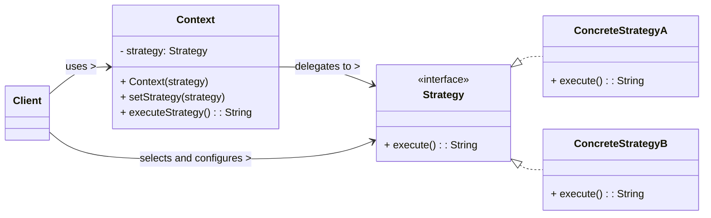

# Strategy Design Pattern

The Strategy pattern is a **behavioral design pattern** that defines a family of algorithms, encapsulates each one, and makes them interchangeable. This allows the algorithm to vary independently from the clients that use it. It's particularly useful for avoiding complex conditional logic (like large `if/else if` or `switch` statements) that would otherwise be used to select between different algorithms.

-----

## 1\. Problem It Solves / Intent

The Strategy pattern addresses the problem of:

  * **Algorithm Selection with Complex Conditionals:** When an object (the "context") needs to choose among several related algorithms at runtime, and this choice is currently handled by large, cumbersome conditional statements (`if/else if` or `switch`).
  * **Tight Coupling of Algorithm to Client:** When you have many classes that differ only in their behavior (algorithm), and you want to avoid duplicating code or tightly coupling the client to specific algorithm implementations.
  * **Exposing Implementation Details:** When an algorithm uses data that clients shouldn't know about, or when the implementation details of the algorithm should be hidden from the client.
  * **Lack of Flexibility:** When it's difficult to add new algorithms or modify existing ones without altering the client code that uses them.

Essentially, it turns a set of algorithms into interchangeable objects, allowing the client to pick one at runtime without altering its own structure.

## 2\. Structure & Participants

The Strategy pattern typically involves three main participants:

  * **Context:**
      * Maintains a reference to a `Strategy` object.
      * Is configured with a `ConcreteStrategy` object, typically by the client.
      * Delegates algorithm-specific requests to its current `Strategy` object.
  * **Strategy (Interface/Abstract Class):**
      * Declares an interface common to all supported algorithms. This interface is what the `Context` uses to call the specific algorithm.
      * The `Context` interacts with this interface, making it independent of concrete algorithm implementations.
  * **ConcreteStrategy:**
      * Implements the `Strategy` interface.
      * Implements a specific algorithm.

<!-- end list -->



## 3\. How It Works / Collaboration

1.  **Client Configuration:** The `Client` creates a `Context` object and configures it with a specific `ConcreteStrategy` object. This configuration can happen at initialization or dynamically at runtime (e.g., by calling a `setStrategy()` method on the `Context`).
2.  **Delegation:** When the `Context` needs to perform an algorithm, it does not implement the algorithm itself. Instead, it delegates the call to its currently associated `Strategy` object (e.g., `strategy.execute()`).
3.  **Algorithm Execution:** The `ConcreteStrategy` object performs the actual algorithm. The `Context` usually passes any necessary data to the `Strategy` method.
4.  **Interchangeability:** Because all `ConcreteStrategy` objects implement the same `Strategy` interface, the `Context` remains unaware of which specific strategy it's using. This allows the client to swap strategies easily.

## 4\. Applicability / When to Use

Use the Strategy pattern when:

  * **An object needs to choose among several related algorithms at runtime.** For example, different sorting algorithms, different payment methods, or different validation rules.
  * **You have many classes that differ only in their behavior (algorithm).** Instead of duplicating code in each class or using large conditional statements, you can encapsulate the varying algorithms into separate strategy classes.
  * **You want to isolate complex, algorithm-specific data from the rest of the code.** By putting the algorithm and its related data into a dedicated class, the `Context` remains simpler.
  * **You want to avoid large conditional statements** (e.g., `if/else if/switch` statements) that select different behaviors based on some condition.
  * **An algorithm uses data that clients shouldn't know about.** The Strategy can hide internal implementation details.

## 5\. Advantages & Disadvantages

### Advantages:

  * **Flexible Algorithm Exchange:** Allows for easy changing of algorithms at runtime, providing great flexibility.
  * **Eliminates Conditional Logic:** Replaces complex `if/else if` or `switch` statements with simpler delegation, making the `Context` class cleaner and easier to maintain.
  * **Encapsulates Algorithms:** Each algorithm is in its own class, making it easier to understand, test, debug, and modify individually.
  * **Improved Reusability:** Strategies can be reused across different contexts or in different parts of the application.
  * **Adherence to Open/Closed Principle (OCP):** New algorithms can be added by creating new `ConcreteStrategy` classes without modifying the existing `Context` or `Strategy` interface.
  * **Adherence to Single Responsibility Principle (SRP):** Each `ConcreteStrategy` has a single responsibility: implementing a specific algorithm.

### Disadvantages:

  * **Increased Number of Classes:** For every algorithm, a new `ConcreteStrategy` class is introduced. This can lead to a proliferation of classes, potentially increasing the overall complexity of the codebase for very simple scenarios.
  * **Client Must Know Strategies:** The client typically needs to know the different `ConcreteStrategy` classes and when to use them to configure the `Context`. This shifts the conditional logic from the `Context` to the `Client`. (Though sometimes a Factory or Builder can help abstract this choice).
  * **Communication Overhead:** In some cases, if strategies need to frequently communicate with the context or access its internal state, there might be slight overhead or the need to pass a lot of data, potentially making the `Strategy` interface's method signatures cumbersome.
  * **Overkill for Simple Algorithms:** For very simple algorithms that are unlikely to change or require variations, the pattern might be over-engineering, and a direct implementation within the `Context` might be clearer.

## 6\. Real-World / Code Examples

Let's imagine a shopping cart application where customers can choose different payment methods.

### Java Implementation

```java
import java.math.BigDecimal;

// 1. Strategy Interface
interface PaymentStrategy {
    void pay(BigDecimal amount);
}

// 3. ConcreteStrategy A
class CreditCardPayment implements PaymentStrategy {
    private String name;
    private String cardNumber;
    private String cvv;
    private String dateOfExpiry;

    public CreditCardPayment(String name, String cardNumber, String cvv, String dateOfExpiry) {
        this.name = name;
        this.cardNumber = cardNumber;
        this.cvv = cvv;
        this.dateOfExpiry = dateOfExpiry;
    }

    @Override
    public void pay(BigDecimal amount) {
        System.out.println(amount + " paid with Credit Card (Card No: " +
                           cardNumber.substring(cardNumber.length() - 4) + ")");
        // In a real app, this would involve integrating with a payment gateway
    }
}

// 3. ConcreteStrategy B
class PayPalPayment implements PaymentStrategy {
    private String emailId;
    private String password; // In a real app, this would be secured

    public PayPalPayment(String emailId, String password) {
        this.emailId = emailId;
        this.password = password;
    }

    @Override
    public void pay(BigDecimal amount) {
        System.out.println(amount + " paid using PayPal (Email: " + emailId + ")");
        // In a real app, this would involve PayPal API integration
    }
}

// 2. Context
class ShoppingCart {
    private BigDecimal totalAmount = BigDecimal.ZERO;
    private PaymentStrategy paymentStrategy; // Reference to the strategy

    public void addItem(String item, BigDecimal price) {
        totalAmount = totalAmount.add(price);
        System.out.println("Added " + item + " for " + price);
    }

    // Client sets the strategy
    public void setPaymentStrategy(PaymentStrategy strategy) {
        this.paymentStrategy = strategy;
        System.out.println("Payment strategy set to: " + strategy.getClass().getSimpleName());
    }

    // Context delegates payment to the strategy
    public void checkout() {
        if (paymentStrategy == null) {
            System.out.println("Please select a payment strategy first.");
            return;
        }
        System.out.println("Proceeding to checkout for total: " + totalAmount);
        paymentStrategy.pay(totalAmount);
        System.out.println("Checkout complete.");
    }
}

// Client Code
public class StrategyDemo {
    public static void main(String[] args) {
        ShoppingCart cart = new ShoppingCart();
        cart.addItem("Laptop", new BigDecimal("1200.00"));
        cart.addItem("Mouse", new BigDecimal("25.50"));

        System.out.println("\n--- Paying with Credit Card ---");
        PaymentStrategy creditCard = new CreditCardPayment("John Doe", "1234567890123456", "123", "12/25");
        cart.setPaymentStrategy(creditCard);
        cart.checkout();

        System.out.println("\n--- Paying with PayPal ---");
        PaymentStrategy payPal = new PayPalPayment("john.doe@example.com", "mysecretpw");
        cart.setPaymentStrategy(payPal);
        cart.checkout();

        System.out.println("\n--- Trying to checkout without setting strategy ---");
        ShoppingCart emptyCart = new ShoppingCart();
        emptyCart.addItem("Keyboard", new BigDecimal("75.00"));
        emptyCart.checkout(); // Will show "Please select a payment strategy first."
    }
}
```

### Python Implementation

```python
from abc import ABC, abstractmethod
from decimal import Decimal

# 1. Strategy Abstract Base Class
class PaymentStrategy(ABC):
    @abstractmethod
    def pay(self, amount: Decimal):
        pass

# 3. ConcreteStrategy A
class CreditCardPayment(PaymentStrategy):
    def __init__(self, name: str, card_number: str, cvv: str, expiry_date: str):
        self._name = name
        self._card_number = card_number
        self._cvv = cvv
        self._expiry_date = expiry_date

    def pay(self, amount: Decimal):
        print(f"{amount:.2f} paid with Credit Card (Card No: XXXX-XXXX-XXXX-{self._card_number[-4:]})")
        # In a real app, this would involve integrating with a payment gateway

# 3. ConcreteStrategy B
class PayPalPayment(PaymentStrategy):
    def __init__(self, email_id: str, password: str):
        self._email_id = email_id
        self._password = password # In a real app, this would be secured

    def pay(self, amount: Decimal):
        print(f"{amount:.2f} paid using PayPal (Email: {self._email_id})")
        # In a real app, this would involve PayPal API integration

# 2. Context
class ShoppingCart:
    def __init__(self):
        self._total_amount: Decimal = Decimal('0.00')
        self._payment_strategy: PaymentStrategy = None # Reference to the strategy

    def add_item(self, item: str, price: Decimal):
        self._total_amount += price
        print(f"Added {item} for {price:.2f}")

    # Client sets the strategy
    def set_payment_strategy(self, strategy: PaymentStrategy):
        self._payment_strategy = strategy
        print(f"Payment strategy set to: {strategy.__class__.__name__}")

    # Context delegates payment to the strategy
    def checkout(self):
        if self._payment_strategy is None:
            print("Please select a payment strategy first.")
            return

        print(f"Proceeding to checkout for total: {self._total_amount:.2f}")
        self._payment_strategy.pay(self._total_amount)
        print("Checkout complete.")

# Client Code
if __name__ == "__main__":
    cart = ShoppingCart()
    cart.add_item("Laptop", Decimal('1200.00'))
    cart.add_item("Mouse", Decimal('25.50'))

    print("\n--- Paying with Credit Card ---")
    credit_card = CreditCardPayment("John Doe", "1234567890123456", "123", "12/25")
    cart.set_payment_strategy(credit_card)
    cart.checkout()

    print("\n--- Paying with PayPal ---")
    paypal = PayPalPayment("john.doe@example.com", "mysecretpw")
    cart.set_payment_strategy(paypal)
    cart.checkout()

    print("\n--- Trying to checkout without setting strategy ---")
    empty_cart = ShoppingCart()
    empty_cart.add_item("Keyboard", Decimal('75.00'))
    empty_cart.checkout() # Will show "Please select a payment strategy first."

    # Pythonic alternative: Using functions as strategies for simple cases
    print("\n--- Using a function as a simple strategy ---")
    def crypto_payment_strategy(amount: Decimal):
        print(f"{amount:.2f} paid with Cryptocurrency (simulated, very fast!)")

    another_cart = ShoppingCart()
    another_cart.add_item("Monitor", Decimal('300.00'))
    # Assign the function directly as the strategy
    another_cart.set_payment_strategy(crypto_payment_strategy)
    another_cart.checkout()
```

## 7\. Related Patterns

  * **State:** The Strategy pattern is structurally very similar to the State pattern. Both rely on composition and delegate behavior to helper objects. However, their intents are different:
      * **Strategy:** The `Context` changes its *algorithm* (how it performs an action) by changing its *current strategy object*. The `Client` usually decides *which* strategy to use, and strategies are typically independent of each other.
      * **State:** The *Context* changes its *behavior* (what actions it can perform or how its methods behave) by changing its *current state object*. The `State` objects themselves are usually responsible for handling transitions to other states. States typically represent fixed, exhaustive conditions within a context.
  * **Template Method:** Strategy uses composition to vary entire algorithms or parts of an algorithm. Template Method uses inheritance to vary specific steps within a fixed algorithmic skeleton.
  * **Factory Method:** Can be used to create `ConcreteStrategy` objects, especially if the creation process of strategies is complex or depends on runtime conditions.
  * **Bridge:** Can be seen as a way to combine the benefits of both Strategy (changing algorithms) and Bridge (separating abstraction from implementation). A Bridge might use strategies to implement its operations.

## 8\. Underlying Principles

The Strategy pattern strongly adheres to:

  * **Encapsulation:** Encapsulates different algorithms into separate, distinct classes, hiding their implementation details from the `Context` and clients.
  * **Decoupling:** Decouples the client and the `Context` from the specific algorithm implementation. They only interact with the `Strategy` interface.
  * **Open/Closed Principle (OCP):** New algorithms can be added by creating new `ConcreteStrategy` classes without requiring modifications to the existing `Context` or `Strategy` interface.
  * **Single Responsibility Principle (SRP):** Each `ConcreteStrategy` class has a single responsibility: implementing a specific algorithm. The `Context` has the responsibility of using a strategy.
  * **"Program to an interface, not an an implementation."**: The `Context` works with the generic `Strategy` interface, not specific `ConcreteStrategy` implementations.

## 9\. Variations & Idioms

  * **Strategy as a Parameter:** In simpler cases, the strategy object can be passed directly as an argument to a specific method of the `Context`, rather than being held as an instance variable by the `Context`.
  * **Context Owns Strategy:** The `Context` holds a reference to the strategy object, and the client (or another part of the system) is responsible for setting or changing this strategy. This is the classic GoF approach.
  * **Stateless Strategies:** `ConcreteStrategy` instances are often stateless (meaning they don't hold instance variables specific to a particular `Context` instance). In such cases, `ConcreteStrategy` objects can be implemented as Singletons to save memory and avoid redundant object creation, as they define only behavior.
  * **Configurable Strategy:** The strategy is chosen and configured at runtime based on configuration files, user input, or dynamic conditions.
  * **Lambda/Function as Strategy (Functional Programming):** In languages that support first-class functions (like Python, JavaScript, or Java 8+ with lambdas), a lambda expression or a simple function can directly serve as a simple strategy, avoiding the boilerplate of creating separate `ConcreteStrategy` classes for very straightforward algorithms. This is often called a "Functional Strategy."

## 10\. When NOT to Use / Potential Misuses

  * **When there's only one algorithm, and it's unlikely to change or need variations:** If you foresee no alternative algorithms, the overhead of creating a separate `Strategy` interface and `ConcreteStrategy` class might be unnecessary. Direct implementation in the `Context` is simpler.
  * **When algorithms are very simple and short:** If the algorithms are just one or two lines of code, and the benefits of abstraction (loose coupling, extensibility) are not critical, the pattern might be over-engineering.
  * **When the primary goal is to manage an object's behavior based on its internal state:** While structurally similar, if the "algorithm" selection is intrinsically tied to the `Context`'s internal state (e.g., a traffic light changing from Red to Green), the State pattern is a more appropriate and semantically clearer choice.
  * **When the algorithms are very tightly coupled to the context's internal data:** If abstracting an algorithm into a separate strategy class would require passing a large amount of internal `Context` data (or the `Context` itself) to the strategy, it might indicate that the algorithm is too specific to the `Context`'s inner workings. In such cases, refactoring the `Context` or reconsidering the design might be needed.

-----
