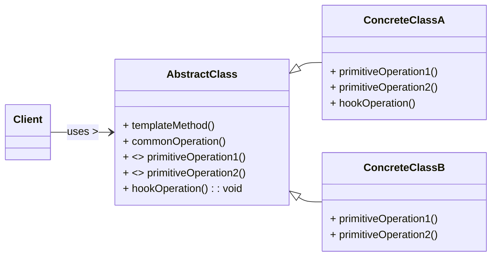

# Template Method Design Pattern

The Template Method pattern is a **behavioral design pattern** that defines the skeleton of an algorithm in a method, deferring some steps to subclasses. It allows subclasses to redefine certain steps of an algorithm without changing the algorithm's overall structure. This pattern is fundamental for code reuse and for ensuring that a specific process or workflow remains consistent, while allowing for variations in individual steps.

-----

## 1\. Problem It Solves / Intent

The Template Method pattern addresses the problem of:

  * **Code Duplication:** When multiple subclasses implement similar algorithms with only minor variations in certain steps. Without the pattern, common steps would be duplicated across these subclasses.
  * **Maintaining Algorithm Structure:** When you want to ensure that a specific algorithm's overall structure (the sequence of steps) remains constant, but allow individual steps to be implemented differently by subclasses.
  * **Controlling Customization Points:** To dictate the exact points at which subclasses can customize behavior, preventing them from altering the fundamental flow of the algorithm.
  * **Inversion of Control:** To give control of the algorithm's flow to the abstract base class, letting it "call back" to specific steps implemented by subclasses (the "Hollywood Principle": "Don't call us, we'll call you.").

Essentially, it provides a blueprint for an operation, allowing specific details to be filled in by specialized implementations.

## 2\. Structure & Participants

The Template Method pattern typically involves two main participants:

  * **AbstractClass:**
      * Defines the **template method**. This is the method that defines the skeleton of the algorithm. It calls various "primitive operations" (abstract or concrete methods) to implement its steps.
      * Can contain concrete operations that are common to all implementations and used by the template method.
      * Can contain **abstract primitive operations** that must be implemented by subclasses. These are the "hooks" that subclasses *must* fill in.
      * Can contain **hook operations** (concrete methods that do nothing by default or provide a default implementation, but can be overridden by subclasses to inject optional, custom behavior).
  * **ConcreteClass:**
      * Implements the abstract primitive operations inherited from the `AbstractClass` to carry out subclass-specific steps of the algorithm.
      * Can optionally override hook operations to provide additional or specialized behavior.

<!-- end list -->



## 3\. How It Works / Collaboration

1.  **Template Method Definition:** The `AbstractClass` defines the `templateMethod()`. This method contains the invariant parts of the algorithm and outlines the fixed sequence of steps.
2.  **Delegation to Primitive Operations:** Within the `templateMethod()`, the `AbstractClass` calls various "primitive operations."
      * Some of these primitive operations are `abstract` methods, forcing `ConcreteClass`es to provide their specific implementations for these varying steps.
      * Other primitive operations might be concrete methods in the `AbstractClass` (common steps for all).
      * Still others might be "hook methods" that have a default (often empty) implementation in the `AbstractClass` but can be overridden by `ConcreteClass`es for optional customization.
3.  **Subclass Implementation:** Each `ConcreteClass` provides concrete implementations for the abstract primitive operations, thereby customizing those specific parts of the algorithm. They can also override hook methods to inject additional behavior.
4.  **Fixed Structure:** The overall algorithm structure (the sequence of steps defined in the `templateMethod()`) is fixed in the `AbstractClass`. This ensures consistency across all concrete implementations while allowing for flexibility in the details.
5.  **Client Usage:** Clients interact with instances of `ConcreteClass` by calling the `templateMethod()`. The client doesn't need to know the internal steps or how individual primitive operations are implemented.

## 4\. Applicability / When to Use

Use the Template Method pattern when:

  * **You want to implement the invariant parts of an algorithm once** (in the `AbstractClass`) and let subclasses implement the behavior for the variant parts. This promotes code reuse and reduces duplication.
  * **Subclasses need to extend the functionality of an algorithm without changing its overall structure.** The pattern provides well-defined "holes" for customization.
  * **You want to control the exact points at which subclasses can customize behavior.** The template method explicitly defines the sequence and allows customization only for the primitive operations it calls.
  * **You are designing a framework or library** where common algorithms are defined, but specific steps need to be adapted by framework users.
  * **To centralize the control flow** of an algorithm in one place, making it easier to maintain and understand the overall process.

## 5\. Advantages & Disadvantages

### Advantages:

  * **Code Reuse:** Centralizes the invariant parts of an algorithm in the abstract base class, reducing code duplication across concrete implementations.
  * **Control over Customization:** The abstract class dictates the overall flow, limiting subclasses to customizing only specific "primitive operations" and "hook methods." This ensures the core algorithm structure remains intact.
  * **Enforced Structure:** Guarantees that the algorithm's core sequence of steps is consistent across all concrete implementations.
  * **Easier Maintenance:** Changes to the overall algorithm structure (the sequence of steps) are made in one place (the template method in the `AbstractClass`), simplifying maintenance.
  * **Adherence to Open/Closed Principle (OCP):** New concrete implementations (subclasses) can be added (open for extension) without modifying the abstract algorithm skeleton (closed for modification).

### Disadvantages:

  * **Restricted Customization:** Subclasses are limited to customizing only the predefined "primitive operations" and "hook methods." If a subclass needs to alter the sequence or add steps not envisioned by the abstract class, the pattern can become rigid.
  * **Increased Inheritance Hierarchy:** Requires an inheritance relationship, which can lead to deep class hierarchies if not managed well, potentially increasing coupling between parent and child classes.
  * **Violation of Liskov Substitution Principle (LSP):** If abstract methods are designed poorly or if a subclass has no meaningful implementation for a required primitive operation, it might provide a "do-nothing" implementation, which can violate LSP (where a subclass should be substitutable for its superclass without altering correctness).
  * **Potentially Complex Abstract Class:** If the template method has many steps, or if there are many primitive operations and hooks, the `AbstractClass` can become large and less clear.
  * **Tight Coupling (via Inheritance):** Changes to the `AbstractClass` (e.g., changing the order of steps in the template method, or signature of primitive operations) can affect all `ConcreteClass`es.

## 6\. Real-World / Code Examples

Let's illustrate with a simple example of making different types of beverages (e.g., Coffee, Tea). The general steps are similar, but specific details differ.

### Java Implementation

```java
// 1. AbstractClass
abstract class BeverageMaker {

    // This is the Template Method
    // Defines the skeleton of the algorithm
    public final void prepareBeverage() {
        System.out.println("--- Starting beverage preparation ---");
        boilWater();
        brew(); // Abstract step
        pourInCup();
        addCondiments(); // Hook method
        System.out.println("--- Beverage ready! ---");
    }

    // Common concrete step for all beverages
    private void boilWater() {
        System.out.println("Boiling water.");
    }

    // Abstract methods (Primitive Operations) - must be implemented by subclasses
    protected abstract void brew();
    protected abstract void addCondiments(); // This is also a hook, but enforced abstract for example

    // Concrete method (Primitive Operation) - common for all beverages
    private void pourInCup() {
        System.out.println("Pouring into cup.");
    }
}

// 2. ConcreteClass A
class CoffeeMaker extends BeverageMaker {
    @Override
    protected void brew() {
        System.out.println("Dripping coffee through filter.");
    }

    @Override
    protected void addCondiments() {
        System.out.println("Adding sugar and milk.");
    }
}

// 2. ConcreteClass B
class TeaMaker extends BeverageMaker {
    @Override
    protected void brew() {
        System.out.println("Steeping the tea bag.");
    }

    @Override
    protected void addCondiments() {
        System.out.println("Adding lemon.");
    }

    // Optional: Example of overriding a hook (if `addCondiments` was initially non-abstract)
    // Here, we made it abstract to show required customization.
    // If it was: protected void addCondiments() { /* default empty */ }
    // Then this override would be optional.
}

// Client Code
public class TemplateMethodDemo {
    public static void main(String[] args) {
        System.out.println("Making Coffee:");
        BeverageMaker coffeeMaker = new CoffeeMaker();
        coffeeMaker.prepareBeverage();

        System.out.println("\nMaking Tea:");
        BeverageMaker teaMaker = new TeaMaker();
        teaMaker.prepareBeverage();
    }
}
```

### Python Implementation

Using Python's `abc` (Abstract Base Classes) module for the abstract class and methods.

```python
from abc import ABC, abstractmethod

# 1. AbstractClass
class BeverageMaker(ABC):

    # This is the Template Method
    # Defines the skeleton of the algorithm
    def prepare_beverage(self):
        print("--- Starting beverage preparation ---")
        self._boil_water()
        self._brew() # Abstract step
        self._pour_in_cup()
        self._add_condiments() # Hook method
        print("--- Beverage ready! ---")

    # Common concrete step for all beverages
    def _boil_water(self):
        print("Boiling water.")

    # Abstract methods (Primitive Operations) - must be implemented by subclasses
    @abstractmethod
    def _brew(self):
        pass

    @abstractmethod # This is also a hook, but enforced abstract for example
    def _add_condiments(self):
        pass

    # Concrete method (Primitive Operation) - common for all beverages
    def _pour_in_cup(self):
        print("Pouring into cup.")

# 2. ConcreteClass A
class CoffeeMaker(BeverageMaker):
    def _brew(self):
        print("Dripping coffee through filter.")

    def _add_condiments(self):
        print("Adding sugar and milk.")

# 2. ConcreteClass B
class TeaMaker(BeverageMaker):
    def _brew(self):
        print("Steeping the tea bag.")

    def _add_condiments(self):
        print("Adding lemon.")

# Client Code
if __name__ == "__main__":
    print("Making Coffee:")
    coffee_maker = CoffeeMaker()
    coffee_maker.prepare_beverage()

    print("\nMaking Tea:")
    tea_maker = TeaMaker()
    tea_maker.prepare_beverage()
```

## 7\. Related Patterns

  * **Strategy:** Both Template Method and Strategy define ways to vary algorithms. The key difference lies in *how* the variation is achieved and the primary intent:
      * **Template Method:** Uses **inheritance** to vary *parts* of an algorithm. The `AbstractClass` controls the overall flow, and subclasses fill in the blanks. It defines "how to do it."
      * **Strategy:** Uses **composition** to vary *entire* algorithms. The `Context` delegates to an interchangeable `Strategy` object. It defines "what to do."
  * **Factory Method:** Can be used within a Template Method to create objects required by the algorithm. For example, a `prepareBeverage()` template method might use `createMug()` as a factory method to produce the specific type of mug needed.
  * **Hook Method:** A specific kind of method within the Template Method pattern that provides optional customization points (methods in the `AbstractClass` with default or empty implementations that can be overridden).
  * **Builder:** The Template Method can be used to define the fixed order of steps in a Builder's construction process, while allowing subclasses to define the specific parts built at each step.
  * **Observer:** While not directly related in structure, the steps in a Template Method could potentially involve notifying observers about progress or changes during the algorithm's execution.

## 8\. Underlying Principles

The Template Method pattern strongly adheres to:

  * **Inversion of Control (Hollywood Principle: "Don't call us, we'll call you."):** The `AbstractClass` controls the overall flow and calls the subclass-specific implementations at appropriate points. The subclasses don't directly call the common steps.
  * **Code Reuse:** Centralizes the common, invariant steps of an algorithm in the abstract base class, avoiding duplication.
  * **Open/Closed Principle (OCP):** New concrete implementations can be added (open for extension) by creating new subclasses without modifying the abstract algorithm skeleton (closed for modification).
  * **Single Responsibility Principle (SRP):** The `AbstractClass` is responsible for defining the algorithm's skeleton and invariant parts. `ConcreteClass`es are responsible for implementing the specific varying steps.

## 9\. Variations & Idioms

  * **Hook Methods (Concrete Defaults):** `protected` or `public` methods in the `AbstractClass` that provide a default (often empty or a basic) implementation. Subclasses can override these if they need to inject custom behavior at that point, but they are not required to do so. This is common when a step is optional. (e.g., `doSomethingOptional()` in `AbstractClass` that does nothing by default).
  * **Required vs. Optional Steps:** Primitive operations are usually `abstract` (required customization); hook methods are typically concrete with a default implementation (optional customization).
  * **Parameterized Template Methods:** The template method itself might take parameters that influence the behavior of its steps, allowing for some external configuration without changing the algorithm's structure.
  * **Non-Abstract Template Classes:** In some languages, or if all primitive operations have reasonable default implementations (making them hooks rather than truly abstract), the "abstract" class might not technically be abstract. However, this dilutes the core intent of enforcing specific implementations.
  * **Constructor in Abstract Class:** An `AbstractClass` constructor can be used to initialize common state needed by the template method and its primitive operations.

## 10\. When NOT to Use / Potential Misuses

  * **When the algorithm is very simple and doesn't have many varying steps:** If the common steps are minimal and the customization points are few or trivial, the overhead of creating an inheritance hierarchy might be unnecessary. Direct implementation or a simpler function might suffice.
  * **When the steps of the algorithm are highly interdependent and cannot be easily isolated into distinct primitive operations:** The pattern works best when the varying parts can be cleanly separated. If steps are too intertwined, making them abstract can lead to complex method signatures or unclear responsibilities.
  * **When there's no clear, fixed sequence of steps, or the order itself needs to vary significantly:** The Template Method enforces a rigid sequence. If the order of operations can change drastically based on context, a different pattern (like Strategy or Builder with more flexible orchestration) might be more suitable.
  * **If subclasses require too much control over the algorithm's flow:** If a subclass needs to significantly alter the overall structure or skip many core steps, the Template Method can become a straitjacket. This might indicate that the "common algorithm" isn't as common as initially thought, and a more flexible pattern is needed.
  * **If only one or two subclasses exist and are unlikely to grow:** The benefits of code reuse and enforced structure are less apparent with a very small, static number of implementations.

-----
