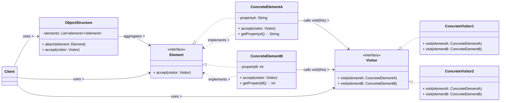

# Visitor Design Pattern

The Visitor pattern is a **behavioral design pattern** that represents an operation to be performed on elements of an object structure. It allows you to define a new operation (a "visitor") without changing the classes of the elements on which it operates (the "visitable elements"). This pattern is particularly useful when you have a stable class hierarchy for your data (elements) but frequently need to add new operations that act on these elements.

-----

## 1\. Problem It Solves / Intent

The Visitor pattern addresses the problem of:

  * **Adding New Operations Without Modifying Classes:** When you have a fixed set of classes representing an object structure (e.g., a hierarchy of financial accounts, AST nodes in a compiler), but you frequently need to add new operations (like printing, exporting, calculating taxes, optimizing) that act differently depending on the concrete type of each object in the structure. Directly adding these operations to each class would violate the Open/Closed Principle and make the classes large and less cohesive.
  * **Scattering Related Behavior:** Without Visitor, a single operation might require conditional logic (`if/else if` or `switch`) spread across multiple classes to handle different types, making the operation hard to understand and maintain.
  * **Breaking Encapsulation (Alternative Approach):** If you try to perform operations externally without direct access to element internals, you might need to make element internals public, which breaks encapsulation. Visitor allows the operation to be external while still providing access when granted via the `accept` method.
  * **Gathering Information Across a Structure:** When you need to gather information or perform an algorithm that spans across an entire heterogeneous object structure (e.g., calculating the total salary for all types of employees in a company).

Essentially, it provides a way to separate an algorithm from the object structure on which it operates, allowing new operations to be added without modifying the structure.

## 2\. Structure & Participants

The Visitor pattern typically involves five main participants:

  * **Visitor (Interface/Abstract Class):**
      * Declares a `visit()` operation for each `ConcreteElement` type in the object structure. This typically involves method overloading, where a distinct `visit` method is defined for each concrete element type (e.g., `visit(ConcreteElementA element)`, `visit(ConcreteElementB element)`).
  * **ConcreteVisitor:**
      * Implements the `Visitor` interface.
      * Implements the `visit()` methods, providing the specific operation for each `ConcreteElement` it can visit.
      * Can maintain state specific to the traversal or the overall operation (e.g., a total sum, a list of errors).
  * **Element (Interface/Abstract Class / "Visitable"):**
      * Declares an `accept()` operation that takes a `Visitor` as an argument. This is the entry point for the visitor to interact with the element.
  * **ConcreteElement:**
      * Implements the `Element` interface.
      * Implements the `accept()` operation by calling the corresponding `visit()` method on the passed `Visitor`, passing `itself` as the argument (i.e., `visitor.visit(this)` or `visitor.visit(self)`). This is the key mechanism of "double dispatch."
  * **ObjectStructure:**
      * A collection or composite of `Element` objects (e.g., a list, a tree, a graph).
      * Can provide an interface to iterate through its elements and allow the visitor to visit them (e.g., `accept(Visitor visitor)` method that iterates and calls `element.accept(visitor)` on each child).

<!-- end list -->



## 3\. How It Works / Collaboration

The core mechanism of the Visitor pattern is **double dispatch**. This means that the specific operation executed depends on *two* types: the type of the `Element` being visited and the type of the `Visitor` performing the operation.

1.  **Initiation:** A client wants to perform an operation (defined by a `Visitor`) on an `Element` (or on all elements within an `ObjectStructure`). The client typically calls `element.accept(visitor)`.
2.  **First Dispatch (Polymorphism on Element):** The `accept(visitor)` method is called on an `Element`. Because `Element` is an interface or abstract class, polymorphism ensures that the specific `accept()` method of the `ConcreteElement` (e.g., `ConcreteElementA`) is executed.
3.  **Second Dispatch (Callback to Visitor):** Inside `ConcreteElementA`'s `accept()` method, it calls back to the `visitor` by invoking `visitor.visit(this)`. At this point:
      * The `visitor` reference is known at runtime (e.g., it could be `ConcreteVisitor1`).
      * The `this` (or `self` in Python) reference refers to the *concrete type* of the element (`ConcreteElementA`).
      * Because `ConcreteVisitor1` (or any `ConcreteVisitor`) implements overloaded `visit()` methods for each `ConcreteElement` type, the correct `visit()` method (e.g., `visit(ConcreteElementA element)`) on `ConcreteVisitor1` is invoked.
4.  **Operation Execution:** The specific `visit()` method within the `ConcreteVisitor` now has access to the concrete `Element` object and can perform its specific operation, often by accessing the element's public interface or by using methods specifically designed for the visitor.

This "callback" mechanism allows the `Visitor` to perform an operation that depends on both the specific algorithm (the `ConcreteVisitor`) and the specific data type (the `ConcreteElement`) it's currently processing, without forcing the `Element` classes to know about all possible operations.

## 4\. Applicability / When to Use

Use the Visitor pattern when:

  * **An object structure contains many classes of objects with differing interfaces, and you want to perform operations on these objects that depend on their concrete classes.** This pattern helps centralize the logic for a particular operation, which would otherwise be scattered across many classes.
  * **You need to perform new operations on an object structure frequently, but you don't want to modify the classes of the elements themselves.** This is the core strength: adding new behaviors (visitors) is easy.
  * **You want to gather data or perform complex algorithms across an entire heterogeneous object structure.** For example, traversing an Abstract Syntax Tree (AST) to perform syntax checking, code generation, or optimization in a compiler.
  * **The classes forming the object structure are stable and unlikely to change.** This is a crucial precondition, as adding new `ConcreteElement` types requires modifying all `Visitor` interfaces and concrete implementations.
  * **You need to provide operations that access the internal (even private) state of elements, but you want to control this access.** The `accept` method can be designed to grant specific access to the visitor.

## 5\. Advantages & Disadvantages

### Advantages:

  * **Adding New Operations Easily:** New `Visitor` classes can be added to perform entirely new operations on the existing object structure without modifying the `Element` classes. This promotes the **Open/Closed Principle** for operations.
  * **Separation of Concerns:** Separates the algorithm (the `Visitor`) from the object structure (the `Elements`). Elements focus on their structure and state, while visitors focus on operations.
  * **Accumulating State:** Visitors can accumulate state as they traverse the object structure, making it easy to perform complex calculations or aggregations (e.g., a `TotalSalaryVisitor` could sum salaries).
  * **Stronger Type Checking:** In statically typed languages (like Java), the double dispatch mechanism ensures the correct `visit()` method is called at compile time, providing type safety.
  * **Encapsulation of Operations:** Related operations are grouped into a single `Visitor` class, improving the cohesion of these operations.

### Disadvantages:

  * **Adding New Element Types is Hard:** This is the most significant drawback. If new `ConcreteElement` types are introduced, the `Visitor` interface (and consequently, *all* existing `ConcreteVisitor`s) must be updated to include a new `visit()` method for the new element. This violates the Open/Closed Principle for elements.
  * **Breaking Encapsulation of Elements:** To perform meaningful operations, visitors often need to access the internal (even private) state of `ConcreteElement`s. This means that `ConcreteElement` classes might need to expose getters or specific visitor-friendly methods that they wouldn't otherwise expose, potentially compromising their encapsulation.
  * **Increased Complexity:** Can introduce many new classes (for each visitor and element combination), leading to a larger codebase and potentially making it harder to understand the overall architecture for simple cases.
  * **Circularity:** The `Visitor` interface and the `Element` interface often have a mutual dependency (`Visitor` needs `Element` types for its `visit` methods, and `Element` needs `Visitor` for its `accept` method). This can sometimes complicate compilation or understanding.

## 6\. Real-World / Code Examples

Let's consider a simple organizational structure with different types of employees (Manager, Developer). We want to perform various operations on them like calculating annual salaries, generating performance reviews, or exporting their details.

### Java Implementation

```java
import java.util.ArrayList;
import java.util.List;

// 1. Visitor Interface
interface EmployeeVisitor {
    void visit(Manager manager);
    void visit(Developer developer);
    // If more employee types are added, this interface needs to change
}

// 2. Element Interface ("Visitable")
interface Employee {
    void accept(EmployeeVisitor visitor);
}

// 3. ConcreteElement A
class Manager implements Employee {
    private String name;
    private double salary;
    private List<Employee> subordinates = new ArrayList<>();

    public Manager(String name, double salary) {
        this.name = name;
        this.salary = salary;
    }

    public String getName() { return name; }
    public double getSalary() { return salary; }
    public List<Employee> getSubordinates() { return subordinates; }

    public void addSubordinate(Employee emp) {
        subordinates.add(emp);
    }

    @Override
    public void accept(EmployeeVisitor visitor) {
        visitor.visit(this); // Double dispatch: calls specific visit method for Manager
        // Also visit subordinates if the visitor needs to traverse the hierarchy
        for (Employee sub : subordinates) {
            sub.accept(visitor);
        }
    }
}

// 4. ConcreteElement B
class Developer implements Employee {
    private String name;
    private double salary;
    private int linesOfCodeWritten;

    public Developer(String name, double salary, int linesOfCodeWritten) {
        this.name = name;
        this.salary = salary;
        this.linesOfCodeWritten = linesOfCodeWritten;
    }

    public String getName() { return name; }
    public double getSalary() { return salary; }
    public int getLinesOfCodeWritten() { return linesOfCodeWritten; }

    @Override
    public void accept(EmployeeVisitor visitor) {
        visitor.visit(this); // Double dispatch: calls specific visit method for Developer
    }
}

// 5. ConcreteVisitor A: Calculates total salary
class SalaryCalculatorVisitor implements EmployeeVisitor {
    private double totalSalary = 0;

    @Override
    public void visit(Manager manager) {
        totalSalary += manager.getSalary();
        System.out.println("Calculated salary for Manager " + manager.getName() + ": " + manager.getSalary());
    }

    @Override
    public void visit(Developer developer) {
        totalSalary += developer.getSalary();
        System.out.println("Calculated salary for Developer " + developer.getName() + ": " + developer.getSalary());
    }

    public double getTotalSalary() {
        return totalSalary;
    }
}

// 6. ConcreteVisitor B: Generates performance review
class PerformanceReviewVisitor implements EmployeeVisitor {
    @Override
    public void visit(Manager manager) {
        System.out.println("--- Performance Review for Manager " + manager.getName() + " ---");
        System.out.println("Managerial skills: Excellent, leads " + manager.getSubordinates().size() + " subordinates.");
    }

    @Override
    public void visit(Developer developer) {
        System.out.println("--- Performance Review for Developer " + developer.getName() + " ---");
        System.out.println("Coding performance: " + (developer.getLinesOfCodeWritten() > 1000 ? "High" : "Average"));
    }
}

// 7. ObjectStructure (optional, but common for traversing hierarchies)
class CompanyOrganization {
    private List<Employee> employees = new ArrayList<>();

    public void addEmployee(Employee emp) {
        employees.add(emp);
    }

    public void accept(EmployeeVisitor visitor) {
        for (Employee emp : employees) {
            emp.accept(visitor); // Each employee accepts the visitor
        }
    }
}


// Client Code
public class VisitorDemo {
    public static void main(String[] args) {
        CompanyOrganization company = new CompanyOrganization();

        Manager ceo = new Manager("Alice", 150000.0);
        Manager devLead = new Manager("Bob", 100000.0);
        Developer dev1 = new Developer("Charlie", 70000.0, 1200);
        Developer dev2 = new Developer("David", 65000.0, 800);

        ceo.addSubordinate(devLead);
        devLead.addSubordinate(dev1);
        devLead.addSubordinate(dev2);

        // Add top-level employees (CEO) to the company's structure for full traversal
        company.addEmployee(ceo);

        // Scenario 1: Calculate total salary
        System.out.println("\n--- Calculating Total Salaries ---");
        SalaryCalculatorVisitor salaryVisitor = new SalaryCalculatorVisitor();
        company.accept(salaryVisitor); // Visit all employees in the structure
        System.out.println("Total company salary: $" + salaryVisitor.getTotalSalary());

        // Scenario 2: Generate performance reviews
        System.out.println("\n--- Generating Performance Reviews ---");
        PerformanceReviewVisitor reviewVisitor = new PerformanceReviewVisitor();
        company.accept(reviewVisitor); // Visit all employees again for reviews
    }
}
```

### Python Implementation

```python
from abc import ABC, abstractmethod
from typing import List, Any

# 1. Visitor Abstract Base Class
class EmployeeVisitor(ABC):
    @abstractmethod
    def visit_manager(self, manager: 'Manager'):
        pass

    @abstractmethod
    def visit_developer(self, developer: 'Developer'):
        pass

    # If more employee types are added, this ABC needs to change
    # and all concrete visitors must implement the new visit method.

# 2. Element Abstract Base Class ("Visitable")
class Employee(ABC):
    @abstractmethod
    def accept(self, visitor: EmployeeVisitor):
        pass

# 3. ConcreteElement A
class Manager(Employee):
    def __init__(self, name: str, salary: float):
        self._name = name
        self._salary = salary
        self._subordinates: List[Employee] = []

    def get_name(self) -> str: return self._name
    def get_salary(self) -> float: return self._salary
    def get_subordinates(self) -> List[Employee]: return self._subordinates

    def add_subordinate(self, emp: Employee):
        self._subordinates.append(emp)

    def accept(self, visitor: EmployeeVisitor):
        visitor.visit_manager(self) # Double dispatch
        # Also visit subordinates if the visitor needs to traverse the hierarchy
        for sub in self._subordinates:
            sub.accept(visitor)

# 4. ConcreteElement B
class Developer(Employee):
    def __init__(self, name: str, salary: float, lines_of_code_written: int):
        self._name = name
        self._salary = salary
        self._lines_of_code_written = lines_of_code_written

    def get_name(self) -> str: return self._name
    def get_salary(self) -> float: return self._salary
    def get_lines_of_code_written(self) -> int: return self._lines_of_code_written

    def accept(self, visitor: EmployeeVisitor):
        visitor.visit_developer(self) # Double dispatch

# 5. ConcreteVisitor A: Calculates total salary
class SalaryCalculatorVisitor(EmployeeVisitor):
    def __init__(self):
        self._total_salary: float = 0.0

    def visit_manager(self, manager: Manager):
        self._total_salary += manager.get_salary()
        print(f"Calculated salary for Manager {manager.get_name()}: {manager.get_salary():.2f}")

    def visit_developer(self, developer: Developer):
        self._total_salary += developer.get_salary()
        print(f"Calculated salary for Developer {developer.get_name()}: {developer.get_salary():.2f}")

    def get_total_salary(self) -> float:
        return self._total_salary

# 6. ConcreteVisitor B: Generates performance review
class PerformanceReviewVisitor(EmployeeVisitor):
    def visit_manager(self, manager: Manager):
        print(f"--- Performance Review for Manager {manager.get_name()} ---")
        print(f"Managerial skills: Excellent, leads {len(manager.get_subordinates())} subordinates.")

    def visit_developer(self, developer: Developer):
        print(f"--- Performance Review for Developer {developer.get_name()} ---")
        performance = "High" if developer.get_lines_of_code_written() > 1000 else "Average"
        print(f"Coding performance: {performance} (Lines of code: {developer.get_lines_of_code_written()})")

# 7. ObjectStructure (optional, but common for traversing hierarchies)
class CompanyOrganization:
    def __init__(self):
        self._employees: List[Employee] = []

    def add_employee(self, emp: Employee):
        self._employees.append(emp)

    def accept(self, visitor: EmployeeVisitor):
        for emp in self._employees:
            emp.accept(visitor) # Each employee accepts the visitor

# Client Code
if __name__ == "__main__":
    company = CompanyOrganization()

    ceo = Manager("Alice", 150000.0)
    dev_lead = Manager("Bob", 100000.0)
    dev1 = Developer("Charlie", 70000.0, 1200)
    dev2 = Developer("David", 65000.0, 800)

    ceo.add_subordinate(dev_lead)
    dev_lead.add_subordinate(dev1)
    dev_lead.add_subordinate(dev2)

    # Add top-level employees (CEO) to the company's structure for full traversal
    company.add_employee(ceo)

    # Scenario 1: Calculate total salary
    print("\n--- Calculating Total Salaries ---")
    salary_visitor = SalaryCalculatorVisitor()
    company.accept(salary_visitor) # Visit all employees in the structure
    print(f"Total company salary: ${salary_visitor.get_total_salary():.2f}")

    # Scenario 2: Generate performance reviews
    print("\n--- Generating Performance Reviews ---")
    review_visitor = PerformanceReviewVisitor()
    company.accept(review_visitor) # Visit all employees again for reviews
```

## 7\. Related Patterns

  * **Composite:** The Visitor pattern is most frequently used with Composite structures. The `ObjectStructure` often is a `Composite` of `Element` objects, and the visitor traverses the composite structure, visiting each component.
  * **Interpreter:** Can use the Visitor pattern to interpret the elements of an abstract syntax tree (AST). Each node in the AST would be an `Element`, and different interpretation operations (e.g., semantic analysis, code generation) would be `Visitor`s.
  * **Iterator:** A `Visitor` often traverses an `ObjectStructure` using an `Iterator` to access each `Element`.
  * **Command:** The `visit` methods can be seen as encapsulating commands that operate on the elements.

## 8\. Underlying Principles

The Visitor pattern strongly adheres to:

  * **Open/Closed Principle (OCP) (for Operations):** It makes it easy to add new operations (new `Visitor`s) to an existing object structure without modifying the `Element` classes themselves.
  * **Separation of Concerns:** Clearly separates the algorithms (defined in `Visitor`s) from the data structure (defined by `Elements`).
  * **Double Dispatch:** The core mechanism of the pattern, where the method to be executed is determined by the runtime types of *two* objects (the `Element` and the `Visitor`). This provides powerful polymorphic behavior that is not natively available via single dispatch.
  * **Encapsulation (with a trade-off):** While visitors often need access to elements' internal state (which can be a drawback), the pattern groups related operations into one place, improving the encapsulation of these operations.

## 9\. Variations & Idioms

  * **Acyclic Visitor:** A more complex variation that attempts to address the problem of adding new `Element` types by breaking the circular dependency between `Visitor` and `ConcreteElement` interfaces. It typically involves dynamic casts (`instanceof` in Java, `isinstance` in Python) within the `visit` method to check the actual type, making the base `Visitor` interface not require a `visit` method for every `ConcreteElement` (though specific `ConcreteVisitor`s still need to handle them). This can reduce the number of changes when a new element is added, but it sacrifices some compile-time safety and can be more complex to implement.
  * **Reflective Visitor:** Uses reflection to find appropriate `visit` methods (e.g., a `visit(Object obj)` method that uses `obj.getClass()` to dynamically find `visit` methods with matching signatures). This drastically reduces the need for explicit `visit` method declarations for each element type but sacrifices compile-time safety and can be slower.
  * **Visitor with Accumulators:** Visitors often carry state (e.g., a total sum, a list of errors, a generated string) that accumulates during traversal of the object structure.
  * **Visitor for Tree Traversal:** A very common use case for the Visitor pattern is traversing and performing operations on tree-like structures (e.g., Abstract Syntax Trees in compilers, XML/HTML DOM trees, file system structures). The `accept` method of composite elements often recursively calls `accept` on its children.
  * **Data-Driven Visitor:** Sometimes, the `visit` methods might be very thin, simply calling into a data-driven logic that uses maps or configurations to decide the actual behavior based on the element type.

## 10\. When NOT to Use / Potential Misuses

  * **When the `Element` hierarchy (the object structure) is unstable and frequently changes:** This is the biggest drawback. If new `ConcreteElement` types are added often, you will constantly need to modify the `Visitor` interface and *all* existing `ConcreteVisitor` implementations, leading to significant maintenance overhead. In such scenarios, adding operations directly to elements or using another pattern might be better.
  * **When the operations are simple and can be naturally placed within the `Element` classes without making them too complex or violating SRP:** For very simple operations that don't need to be separated, the overhead of introducing the Visitor pattern might be unnecessary.
  * **When the `Visitor` needs to modify the `Element`'s structure significantly:** While visitors can access elements, if the operation involves major structural changes to the element itself (e.g., adding/removing children in a composite), it might indicate that the logic belongs more naturally within the `Element` or `Composite` pattern itself.
  * **When there are only one or two operations on the `Element` hierarchy, and adding more is unlikely:** The benefits of extensibility outweigh the initial complexity only when many future operations are anticipated.
  * **When `Visitor`s need deep access to `Element`s' private state:** While `accept` can grant access, if it leads to `Element`s exposing too many internal details just for the sake of visitors, it can compromise encapsulation. This is a trade-off to consider carefully.

-----
